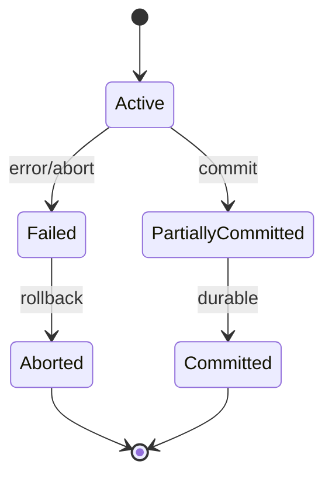
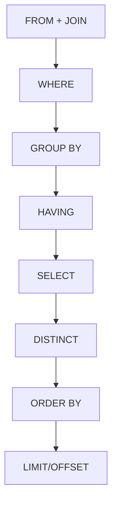
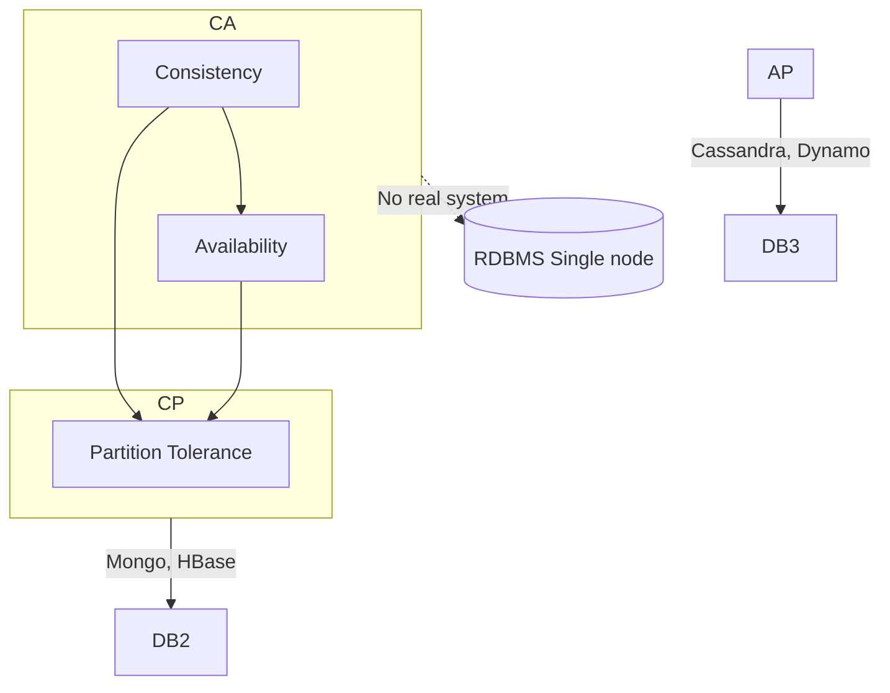

# ⚡ DBMS Cheat Sheet & Quick Revision Guide

A high-density revision reference designed to be reviewed in 10–15 minutes before an interview.

---

## 🚀 Core Syntax & Execution Order

### SQL Logical Processing Order
$$\text{FROM} \longrightarrow \text{ON} \longrightarrow \text{JOIN} \longrightarrow \text{WHERE} \longrightarrow \text{GROUP BY} \longrightarrow \text{HAVING} \longrightarrow \text{SELECT} \longrightarrow \text{DISTINCT} \longrightarrow \text{ORDER BY} \longrightarrow \text{LIMIT/OFFSET}$$

### Key SQL Snippets

```sql
-- 1. Keyset Pagination (Faster than OFFSET)
SELECT * FROM orders 
WHERE (created_at, id) < ('2026-07-20 10:00:00', 45021)
ORDER BY created_at DESC, id DESC LIMIT 20;

-- 2. CTE with Window Function (Top N per Group)
WITH RankedSalaries AS (
  SELECT emp_id, dept_id, salary,
         DENSE_RANK() OVER(PARTITION BY dept_id ORDER BY salary DESC) as rnk
  FROM employees
)
SELECT emp_id, dept_id, salary FROM RankedSalaries WHERE rnk <= 3;

-- 3. Pessimistic Row Lock
SELECT balance FROM accounts WHERE account_id = 101 FOR UPDATE;

-- 4. Optimistic Concurrency Update
UPDATE accounts 
SET balance = balance - 50, version = version + 1 
WHERE account_id = 101 AND version = 4;
```

---

## 📊 High-Value Comparison Tables

### 1. ACID vs. BASE

| Property | ACID (Relational) | BASE (NoSQL) |
| :--- | :--- | :--- |
| **A** | **A**tomicity | **B**asically **A**vailable |
| **C** | **C**onsistency (strong) | **S**oft state (eventually consistent) |
| **I** | **I**solation | (no guarantee) |
| **D** | **D**urability | **E**ventual consistency |

### 2. Isolation Levels & Anomalies

| Isolation Level | Dirty Read | Non-Repeatable Read | Phantom Read |
| :--- | :---: | :---: | :---: |
| **Read Uncommitted** | Yes | Yes | Yes |
| **Read Committed** | No | Yes | Yes |
| **Repeatable Read** | No | No | Maybe (in some DBs) |
| **Serializable** | No | No | No |

### 3. Storage Engine Comparison: B-Tree vs. LSM-Tree

| Property | B-Tree Engine (InnoDB, PostgreSQL) | LSM-Tree Engine (RocksDB, Cassandra) |
| :--- | :--- | :--- |
| **Primary Workload** | Read-Heavy (OLTP, point lookups) | Write-Heavy (Time-series, logs, events) |
| **Disk Operations** | Random I/O (In-place updates) | Sequential I/O (Append-only SSTables) |
| **Write Amplification** | Moderate to High (Page rewriting) | High during background compaction |
| **Data Structure** | Balanced Tree with Linked Leaves | Memtable (RAM) + SSTables (Disk) |

### 4. Join Algorithms Comparison

| Algorithm | When Used | Pros | Cons |
| :--- | :--- | :--- | :--- |
| **Nested Loop** | Small tables, indexed join | Simple, no extra memory | $O(N \times M)$ worst |
| **Hash Join** | Large unsorted data, equality joins | Efficient for large sets | Memory for hash table |
| **Merge Join** | Both inputs sorted on join key | Efficient, streaming | Need sorted data |

### 5. Index Types Quick Guide

| Type | Use Case | Example Engine |
| :--- | :--- | :--- |
| **B-tree** | General purpose, range queries | Most common (Postgres, MySQL) |
| **Hash** | Equality only (`=`) | Lookup by exact key |
| **GIN** | Full-text search, JSONB, arrays | PostgreSQL |
| **GiST** | Geospatial, custom data types | PostGIS |
| **BRIN** | Very large tables with physical correlation | Log data, time series |
| **Bitmap** | Low cardinality columns, data warehousing | Star schema (Oracle) |

---

## 🎨 Mermaid Diagrams

### 1. Transaction States



### 2. SQL Execution Order (Logical)



### 3. CAP Theorem Visualization



### 4. B+tree Structure

```mermaid
graph TD
    Root[Root Node: keys | pointers] --> Internal1[Internal Node]
    Root --> Internal2[Internal Node]
    Internal1 --> Leaf1[Leaf: key+data | next]
    Internal1 --> Leaf2[Leaf: key+data | next]
    Internal2 --> Leaf3[Leaf: key+data | next]
    Internal2 --> Leaf4[Leaf: key+data | next]
    Leaf1 -.- Leaf2 -.- Leaf3 -.- Leaf4
```

---

## 🧠 Memory Tricks & Quick Interview Notes

> [!TIP]
> - **ACID**: **A**ll or nothing (Atomicity), **C**onstraints preserved (Consistency), **I**solation from others, **D**urable on disk.
> - **WAL Rule**: **Write Log BEFORE Writing Data**. Never flush a dirty page to disk without flushing its corresponding WAL record first!
> - **SARGable Rule**: **Keep indexed columns raw/naked** on the left side of comparisons (`col >= val`, not `FUNCTION(col) = val`).
> - **Indexing Formula**: Selective columns first in composite index: `(high_cardinality_col, low_cardinality_col)`.
> - **CAP Theorem**: In the presence of a **Network Partition (P)**, you MUST choose between **Consistency (C)** or **Availability (A)**.

---

## 🎯 Interview Day Strategy

1. **Start with fundamentals**: Show you know ACID, normalization, indexing.
2. **Speak in trade-offs**: "If we need high write throughput, we might use an LSM tree, but reads may suffer."
3. **Draw on real experience**: "In my last project, we chose PostgreSQL because of its rich indexing and MVCC model for a multi-tenant app."
4. **Walk through execution plans**: When asked to optimize, simulate `EXPLAIN`.
5. **Connect concepts**: "This isolation level will prevent phantom reads, but might cause more locking."
6. **Distributed thinking**: Always consider CAP, latency, and partition tolerance for global systems.
7. **Use proper terminology**: "We can add a covering index to avoid key lookups," not "just add an index."
8. **Be ready to code SQL and DDL live**: Practice window functions, recursion, pivot.
9. **Ask clarifying questions**: "What is the read/write ratio? Is eventual consistency acceptable?"
10. **Stay calm under fire**: If you don't know an internal, say "I'd look at the documentation/explain plan," showing problem-solving mindset.

> 🚨 **Warning**: Never say "I would just use a NoSQL database" without explaining why. Always back decisions with technical reasoning.

---

*Now proceed to master the core questions in [`Top_Questions.md`](file:///s:/Interview_Guide/DBMS/Top_Questions.md)!*
