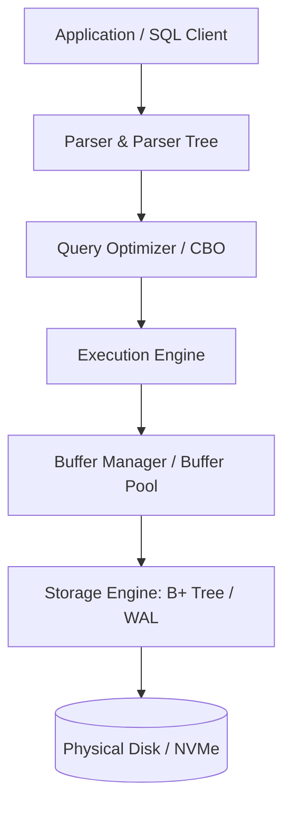
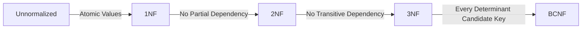

# 🧠 The Master DBMS Interview Guide (2026–2027)

This comprehensive guide is divided strictly into **3 Levels**: **Beginner**, **Intermediate**, and **Advanced**, followed by an exhaustive **150+ Theory Questions** section categorized across 8 core database domains.

---

# 🟢 LEVEL 1: BEGINNER

---

## 1. Core Topics & Concepts

### Database Architecture & The Relational Model
A **Database Management System (DBMS)** is software that manages stored data, enforcing integrity, security, concurrency, and crash recovery. The **Relational Database Management System (RDBMS)** structures data into relations (tables) consisting of tuples (rows) and attributes (columns).



### Relational Keys
- **Super Key**: Any set of attributes that uniquely identifies a row in a relation.
- **Candidate Key**: Minimal super key with no redundant attributes.
- **Primary Key (PK)**: A candidate key chosen by the database designer to uniquely identify each tuple. Must be `UNIQUE` and `NOT NULL`.
- **Foreign Key (FK)**: An attribute or set of attributes in one table that references the Primary Key of another table, enforcing **Referential Integrity**.
- **Surrogate Key**: An artificially generated key (e.g., auto-incrementing integer or UUID) with no business meaning.
- **Natural Key**: A key derived from existing data attributes (e.g., SSN, ISBN).

### SQL Logical Execution Order
Unlike procedural code, SQL is declarative. The database engine executes clauses in a specific logical order, **not** in the order they are written:

```sql
SELECT department_id, COUNT(*) AS emp_count -- 5. Projection & Aggregation
FROM employees                               -- 1. Source table
WHERE salary > 50000                        -- 2. Filter rows
GROUP BY department_id                       -- 3. Group remaining rows
HAVING COUNT(*) > 5                         -- 4. Filter groups
ORDER BY emp_count DESC                      -- 6. Sort output
LIMIT 10;                                    -- 7. Paginate / limit output
```

### SQL Join Types
- **INNER JOIN**: Returns rows with matching values in both tables.
- **LEFT (OUTER) JOIN**: Returns all rows from the left table and matched rows from the right table. Fills `NULL` for missing right matches.
- **RIGHT (OUTER) JOIN**: Returns all rows from the right table and matched rows from the left table.
- **FULL (OUTER) JOIN**: Returns all rows when there is a match in either left or right table.
- **CROSS JOIN**: Returns the Cartesian product of two tables ($N \times M$ rows).

```sql
-- Inner Join Example
SELECT e.emp_id, e.name, d.department_name
FROM employees e
INNER JOIN departments d ON e.dept_id = d.dept_id;
```

---

## 2. Normalization (1NF to BCNF)

Normalization reduces data redundancy and eliminates insertion, update, and deletion anomalies.



| Normal Form | Rule Requirement | Example Violation & Fix |
| :--- | :--- | :--- |
| **1NF (First Normal Form)** | Multi-valued attributes or repeating groups must be atomic. Each cell contains a single value. | **Violation**: `Skills = "Java, SQL, Python"`. <br>**Fix**: Split into separate rows or separate `EmployeeSkills` table. |
| **2NF (Second Normal Form)** | Must be in 1NF + **No Partial Dependency** (non-key attributes must depend on the *entire* candidate key, not a subset). Applies to composite PKs. | **Violation**: PK is `(StudentID, CourseID)`. Attribute `CourseTeacher` depends only on `CourseID`. <br>**Fix**: Separate into `Courses(CourseID, CourseTeacher)` table. |
| **3NF (Third Normal Form)** | Must be in 2NF + **No Transitive Dependency** (non-key attributes must not depend on other non-key attributes: $A \rightarrow B \rightarrow C$). | **Violation**: PK is `EmpID`. `ZipCode` determines `City`. `EmpID -> ZipCode -> City`. <br>**Fix**: Move `ZipCode -> City` to a separate `ZipCodes` table. |
| **BCNF (Boyce-Codd NF)** | Strict version of 3NF. For every functional dependency $X \rightarrow Y$, $X$ **must** be a Candidate Key. | Resolves edge cases in 3NF where composite overlapping candidate keys exist. |

---

## 3. Common Beginner Mistakes

> [!WARNING]
> 1. **Confusing `WHERE` and `HAVING`**: `WHERE` filters individual rows *before* aggregation. `HAVING` filters groups *after* `GROUP BY`.
> 2. **Assuming `DELETE` resets Identity Counters**: `DELETE FROM table` keeps auto-increment values. `TRUNCATE TABLE` resets identity counters and bypasses row-level logging.
> 3. **Treating `NULL` as a value**: `NULL = NULL` evaluates to `UNKNOWN` (neither `TRUE` nor `FALSE`). Always use `IS NULL` or `IS NOT NULL`.
> 4. **Over-normalizing OLAP systems**: Applying 3NF/BCNF to analytical warehouses causes join bottlenecks. OLAP requires Star Schema / Denormalization.

---

# 🟡 LEVEL 2: INTERMEDIATE

---

## 1. Indexing & Storage Engine Internals

### B-Tree vs. B+ Tree Indexing
Relational databases (MySQL InnoDB, PostgreSQL) use **B+ Trees** as their default indexing data structure rather than Binary Search Trees (BST) or standard B-Trees.

```
       [ 50 | 100 ]            <-- Root / Internal Nodes (Keys only)
      /     |      \
 [10|20]  [60|80]  [120|150]
   |        |          |
 [Leaf1] <-> [Leaf2] <-> [Leaf3] <-- Leaf Nodes (Keys + Data/Pointers, Linked List)
```

#### Why B+ Trees over B-Trees?
1. **Higher Fan-Out & Shallower Tree**: Internal nodes store *only keys and child pointers* (no row data). This allows thousands of keys per page (e.g., 16KB page size), keeping tree height low ($h \le 3$ or $4$ for millions of rows), minimizing expensive Disk I/Os.
2. **Sequential Leaf Scanning**: All leaf nodes are linked via double-linked lists. Range queries (`WHERE age BETWEEN 20 AND 30`) seek once to the starting leaf and traverse sequentially without traversing parent nodes.

### Clustered vs. Non-Clustered Indexes
- **Clustered Index**: Determines the **physical storage order** of data rows on disk. There can be **only one** clustered index per table (typically the Primary Key). In MySQL InnoDB, the table *is* the clustered index (Index-Organized Table).
- **Non-Clustered (Secondary) Index**: A separate structure containing indexed columns and a **row locator** (pointer to physical disk address or Primary Key value). A table can have multiple non-clustered indexes.

> [!TIP]
> **Covering Index**: An index that contains all columns requested in a query. If a query selects only `emp_id` and `email`, and a secondary index exists on `(email, emp_id)`, the DB engine performs an **Index-Only Scan**, completely eliminating secondary index bookmark lookups!

---

## 2. Transactions & Concurrency Control

### ACID Properties
- **Atomicity**: "All or Nothing". All operations in a transaction complete successfully, or all are rolled back. Guaranteed via **Undo Logs**.
- **Consistency**: Database transitions from one valid state to another, preserving schema constraints, FKs, and check invariants.
- **Isolation**: Concurrent transactions execute without cross-interference. Managed via **Locking** or **MVCC**.
- **Durability**: Once committed, changes survive system crashes/power failure. Guaranteed via **Write-Ahead Logging (WAL)** / **Redo Logs**.

### Transaction Isolation Levels & Anomalies

| Isolation Level | Dirty Read | Non-Repeatable Read | Phantom Read | Serialization Anomaly |
| :--- | :---: | :---: | :---: | :---: |
| **Read Uncommitted** | ❌ Allowed | ❌ Allowed | ❌ Allowed | ❌ Allowed |
| **Read Committed** (Default PG/Oracle) | ✅ Prevented | ❌ Allowed | ❌ Allowed | ❌ Allowed |
| **Repeatable Read** (Default MySQL) | ✅ Prevented | ✅ Prevented | ❌/✅ (DB Dependent) | ❌ Allowed |
| **Serializable** | ✅ Prevented | ✅ Prevented | ✅ Prevented | ✅ Prevented |

---

# 🔴 LEVEL 3: ADVANCED

---

## 1. Storage Engine Internals: B-Tree vs. LSM-Tree

```
B-Tree Storage Engine (Read-Optimized, In-Place Updates)
[ Disk Page 16KB ] <-- In-Place Overwrites via Buffer Pool & WAL

LSM-Tree Storage Engine (Write-Optimized, Append-Only)
Client Write --> [ MemTable (RAM) ] --> [ WAL File (Disk) ]
                        | (Flush)
                        v
               [ SSTable Level 0 ] --> [ SSTable Level 1 ] (Compaction)
```

| Feature | B-Tree Engine (MySQL InnoDB, Postgres) | LSM-Tree Engine (RocksDB, Cassandra, LevelDB) |
| :--- | :--- | :--- |
| **Write Strategy** | In-place updates on fixed 16KB pages. | Append-only sequential writes to Memtable & SSTables. |
| **Write Performance** | Random disk I/O for page updates (High write amplification). | Extremely high write throughput (Sequential disk I/O). |
| **Read Performance** | Fast $O(\log N)$ index lookup directly to page. | Multi-table lookup (MemTable + SSTables) requiring Bloom Filters. |
| **Compaction Overhead** | Low (Internal node splitting/merging). | High background CPU/Disk I/O for Leveled/Size-Tiered Compaction. |

---

## 2. Multi-Version Concurrency Control (MVCC) Internals

MVCC allows **readers to never block writers, and writers to never block readers**. Instead of updating data in-place, modifying a tuple creates a new physical version of that row.

### VACUUM & Transaction ID Wraparound
Because old tuple versions accumulate over time (bloat), PostgreSQL requires background **VACUUM** processes to:
1. Reclaim space occupied by dead tuples (`xmax < oldest_active_tx`).
2. Update visibility maps and table statistics.
3. Prevent **Transaction ID Wraparound**: PostgreSQL uses 32-bit transaction IDs ($\approx 4 \text{ billion}$ IDs). To prevent modulo overflow where old transactions appear in the future, VACUUM "freezes" old tuples, converting `xmin` to a special `FrozenTransactionId`.

---

# 📚 THEORY QUESTIONS (150+)

---

<details>
<summary><b>🗄️ Module 1: Database Fundamentals (30 Questions)</b></summary>

| # | Question | Core Answer Summary |
|---|----------|---------------------|
| 1 | What is a DBMS? Primary functions? | Software managing data storage, retrieval, security, concurrency, and crash recovery. |
| 2 | What is the Three-Schema Architecture? | Physical (Internal), Conceptual (Logical), and External (View) levels. |
| 3 | What is Logical vs Physical Data Independence? | Logical: Schema changes don't break applications. Physical: Storage changes don't break logical schema. |
| 4 | Compare Relational, Hierarchical, Network, and Document Data Models. | Relational (tables/FKs), Hierarchical (tree), Network (graph), Document (JSON/BSON). |
| 5 | Define Relation, Tuple, Attribute, and Domain in relational algebra. | Relation = Table, Tuple = Row, Attribute = Column, Domain = Permitted data values. |
| 6 | Differentiate Super Key, Candidate Key, Primary Key, and Alternate Key. | Super = Unique set; Candidate = Minimal super key; Primary = Selected candidate key; Alternate = Unchosen candidate key. |
| 7 | What is Entity Integrity vs Referential Integrity? | Entity: Primary Key cannot be NULL. Referential: Foreign key must match existing parent PK or be NULL. |
| 8 | Compare Natural Key vs Surrogate Key. | Natural: Business-derived (SSN); Surrogate: System-generated ID (UUID/Auto-increment). |
| 9 | What is Relational Algebra? Name fundamental operators. | Mathematical query language: Selection ($\sigma$), Projection ($\pi$), Union ($\cup$), Set Difference ($-$), Cartesian Product ($\times$), Rename ($\rho$). |
| 10 | What is Tuple Relational Calculus (TRC) vs Domain Relational Calculus (DRC)? | Non-procedural declarative query formalisms based on first-order logic. |
| 11 | Explain standard Data Types and byte size considerations. | `INT` (4B), `BIGINT` (8B), `VARCHAR(N)` (Variable + length overhead), `TEXT` (LOB). |
| 12 | What is a Database Cursor? Implicit vs Explicit cursors? | Pointer to query result set. Implicit: Auto-created by DB; Explicit: Programmer defined for row-by-row processing. |
| 13 | Explain Data Dictionary / System Catalog. | System metadata tables storing schema definitions, tables, columns, indexes, and user privileges. |
| 14 | What is metadata and why is it crucial for CBO? | Statistics on table sizes, null counts, distinct values, and histograms used by query optimizers. |
| 15 | What is Database Denormalization and when is it justified? | Intentional redundancy to eliminate expensive joins in read-heavy/analytical workloads. |
| 16 | Differentiate OLTP and OLAP systems. | OLTP: Operational, low latency, high concurrent writes; OLAP: Analytical, complex queries, columnar storage. |
| 17 | What is a Data Warehouse, Data Mart, and Data Lake? | Warehouse: Structured enterprise store; Mart: Departmental subset; Lake: Raw unstructured/semi-structured store. |
| 18 | What is Database Connection Pooling? | Reuse of pre-established DB connections to avoid TCP/authentication handshake overhead. |
| 19 | What is Object-Relational Mapping (ORM)? Impedance mismatch? | Framework mapping OOP objects to SQL tables. Mismatch: Difference between object graphs and relational tables. |
| 20 | What is a Stored Procedure vs User-Defined Function (UDF)? | Stored Proc: Executable code block with side effects/transactions; UDF: Returns computed value/table without DDL. |
| 21 | Explain Database Triggers (BEFORE, AFTER, INSTEAD OF). | Automated procedures triggered on `INSERT`/`UPDATE`/`DELETE` events. |
| 22 | What is a Database View? | Virtual table defined by a saved SQL `SELECT` query. |
| 23 | Differentiate Simple View vs Complex View vs Materialized View. | Simple: Single table; Complex: Multi-table/Aggregates; Materialized: Physically cached query result set. |
| 24 | What is Schema evolution and Migration management? | Version-controlled changes to database schema over time without data loss. |
| 25 | What is Spatial / Geographic Data in DBMS? | Storing geometric shapes, GIS coordinates, using R-Trees/GiST indexes for spatial queries. |
| 26 | Explain Temporal / Time-Series Database concepts. | Data indexed by timestamps, supporting bi-temporal tracking (valid time vs transaction time). |
| 27 | What is Multi-Tenancy in Database Architecture? | Single database instance serving multiple isolated customer tenants (Separate DB, Schema, or RLS). |
| 28 | What is Row-Level Security (RLS)? | Policy-driven access control filtering rows based on authenticated user session context. |
| 29 | What is Acid-Compliant Embedded DB (SQLite)? | Serverless, single-file DB engine linked directly inside application process space. |
| 30 | Explain Key-Value vs Document vs Graph vs Columnar Stores. | Key-Value (Redis), Document (Mongo), Graph (Neo4j), Columnar (ClickHouse/Cassandra). |

</details>

<details>
<summary><b>📐 Module 2: Normalization & Schema Design (25 Questions)</b></summary>

| # | Question | Core Answer Summary |
|---|----------|---------------------|
| 31 | Define Functional Dependency ($X \rightarrow Y$). | $X$ uniquely determines $Y$ across all valid states of a relation. |
| 32 | What are Armstrong's Axioms? | Reflexivity, Augmentation, Transitivity. |
| 33 | Explain Attribute Closure ($X^+$) and candidate key discovery. | Set of all attributes functionally determined by $X$. |
| 34 | Define 1NF (First Normal Form). | Atomic attributes, no multi-valued fields or repeating groups. |
| 35 | Define 2NF (Second Normal Form) and Partial Dependency. | 1NF + No non-prime attribute dependent on a proper subset of candidate key. |
| 36 | Define 3NF (Third Normal Form) and Transitive Dependency. | 2NF + No non-prime attribute dependent on another non-prime attribute ($A \rightarrow B \rightarrow C$). |
| 37 | Define Boyce-Codd Normal Form (BCNF). | For every functional dependency $X \rightarrow Y$, $X$ must be a candidate key. |
| 38 | What is 4NF (Fourth Normal Form) & Multi-Valued Dependency ($X \twoheadrightarrow Y$)? | Eliminates independent multi-valued facts on a single candidate key. |
| 39 | What is 5NF (Project-Join Normal Form)? | Eliminates join dependencies that cannot be reconstructed from smaller projections. |
| 40 | Compare 3NF vs BCNF trade-offs. | BCNF eliminates all functional dependency redundancy but may not preserve dependencies. |
| 41 | What is Lossless-Join Decomposition? | Guaranteeing that decomposing relation $R$ into $R_1, R_2$ satisfies $R_1 \bowtie R_2 = R$. |
| 42 | What is Dependency Preservation? | Ensuring all functional dependencies can be checked within individual decomposed tables. |
| 43 | What is Insertion Anomaly? Give example. | Unable to insert data without inserting unrelated dummy fields. |
| 44 | What is Update Anomaly? Give example. | Inconsistent state created when updating redundant duplicated fields. |
| 45 | What is Deletion Anomaly? Give example. | Unintended loss of crucial data when deleting a related row. |
| 46 | Explain Star Schema design in Data Warehousing. | Central Fact table surrounded by denormalized Dimension tables. |
| 47 | Explain Snowflake Schema design. | Star schema with normalized dimension tables. |
| 48 | Explain Slowly Changing Dimensions (SCD Type 1, Type 2, Type 3). | Type 1: Overwrite; Type 2: Add new row with version/date range; Type 3: Add new column. |
| 49 | What is a Fact Table vs Dimension Table? | Fact: Numerical measurements/events; Dimension: Contextual descriptive attributes. |
| 50 | What is Data Modeling: Conceptual, Logical, Physical? | Conceptual: Entities/Relationships; Logical: Tables/Attributes/FKs; Physical: Disk structures/Indexes. |
| 51 | Explain Cardinality & Modality in ER Diagrams. | Cardinality: Max relationships (1:1, 1:N, M:N); Modality: Minimum relationships (Optional/Mandatory). |
| 52 | What is a Weak Entity Set & Identifying Relationship? | Entity lacking a primary key, uniquely identified via owner entity's primary key. |
| 53 | Explain Generalization, Specialization, and Aggregation in ER modeling. | OOP-like inheritance and abstraction constructs in ER modeling. |
| 54 | How to map ER Diagrams to Relational Tables? | Entities $\rightarrow$ Tables; Composite PKs for M:N relationships; FKs for 1:N relationships. |
| 55 | When should you intentionally denormalize a schema? | High read throughput requirements, reducing expensive joins in analytical workloads. |

</details>

<details>
<summary><b>🔎 Module 3: Indexing & Hashing (25 Questions)</b></summary>

| # | Question | Core Answer Summary |
|---|----------|---------------------|
| 56 | What is a Database Index? Trade-offs? | Auxiliary search structure. Speeds up reads; slows down writes (`INSERT`/`UPDATE`) and consumes disk. |
| 57 | Explain B-Tree data structure properties. | Balanced $M$-way search tree where nodes store keys and data pointers. |
| 58 | Explain B+ Tree data structure properties. | Internal nodes store keys only; leaf nodes store data/pointers and are linked sequentially. |
| 59 | Why do databases prefer B+ Trees over BSTs or AVL trees? | High fan-out reduces tree height, minimizing disk I/O; leaf links enable fast range scans. |
| 60 | Differentiate Clustered vs Non-Clustered (Secondary) Index. | Clustered: Physical row storage order (1 per table); Non-clustered: Separate lookup index structure. |
| 61 | What is a Primary Index vs Secondary Index vs Sparse Index? | Primary: Search key matches primary key; Secondary: Non-PK key; Sparse: Contains index entries for subset of pages. |
| 62 | Explain Composite Index and Leftmost Prefix Rule. | Multi-column index `(A, B, C)`. Serves queries on `A`, `(A,B)`, `(A,B,C)`, but NOT `B` alone. |
| 63 | What is a Covering Index & Index-Only Scan? | Index containing all columns requested by query, eliminating main table lookup. |
| 64 | What is a Hash Index? Limitations? | $O(1)$ equality lookup via hash function. Does NOT support range queries (`<`, `>`, `BETWEEN`). |
| 65 | Explain Static Hashing vs Dynamic Hashing (Extendible/Linear). | Static: Fixed bucket count; Dynamic: Buckets grow/split dynamically without full re-hashing. |
| 66 | What is a Bitmap Index? Best use cases? | Compact bit array index. Excellent for low-cardinality columns in read-heavy OLAP workloads. |
| 67 | What is a GIN (Generalized Inverted Index) Index in Postgres? | Full-text search and array/JSONB indexing structure mapping tokens to matching row IDs. |
| 68 | What is a GiST (Generalized Search Tree) Index? | Extensible template tree index supporting spatial (PostGIS) and custom geometric shapes. |
| 69 | What is a BRIN (Block Range Index)? Best use cases? | Stores min/max values for disk page ranges. Ideal for massive time-series/correlated tables. |
| 70 | What is Index Fragmentation (Internal vs External)? | Internal: Page space wasted due to updates/splits; External: Logical leaf page order differs from physical disk order. |
| 71 | Explain Index Fill Factor. | Percentage of index page space reserved during creation to accommodate future inserts without splitting. |
| 72 | What is Index Rebuilding / Defragmentation? | Operations (`REINDEX` / `ALTER INDEX REBUILD`) to compact fragmented pages and restore I/O efficiency. |
| 73 | What is a Partial / Filtered Index? | Index built only on rows matching a predicate (`CREATE INDEX ... WHERE active = true`). |
| 74 | What is Expression / Functional Index? | Index built on computed function output (`CREATE INDEX ... ON lower(email)`). |
| 75 | Why are Indexes ignored during low-selectivity queries? | If query matches $> 20\%$ of table, CBO determines full table sequential scan is faster than index lookup. |
| 76 | Explain Index Merge Optimization. | Engine combines results of scanning multiple separate single-column indexes using Bitmap AND/OR. |
| 77 | What is a Skip List and where is it used? | Probabilistic alternative to balanced trees used in in-memory DBs (Redis, Memtable in RocksDB). |
| 78 | Explain Spatial Indexing (R-Trees & Quad-Trees). | Hierarchical bounding box indexes used for 2D/3D spatial coordinate queries. |
| 79 | What is Vector Indexing (HNSW, IVF-PQ)? | Graph and quantization indexes used for high-dimensional vector similarity search in AI DBs. |
| 80 | How does Index Write Amplification impact performance? | Every row modification requires updating all associated secondary indexes, degrading write throughput. |

</details>

<details>
<summary><b>🔄 Module 4: Transactions & Concurrency Control (30 Questions)</b></summary>

| # | Question | Core Answer Summary |
|---|----------|---------------------|
| 81 | Define a Database Transaction. | Logical unit of work executing one or more SQL statements atomically. |
| 82 | Explain Atomicity and how Undo Log enforces it. | Ensures all-or-nothing execution by replaying undo log to reverse partial updates on abort. |
| 83 | Explain Consistency in ACID. | Preserves all system invariants, constraints, FKs, and check rules across transactions. |
| 84 | Explain Isolation in ACID. | Prevents concurrent transactions from seeing intermediate uncommitted states of others. |
| 85 | Explain Durability and WAL. | Guarantees committed updates survive crashes by writing to WAL on non-volatile disk before ACK. |
| 86 | What is Read Uncommitted isolation level? | Lowest isolation level; allows dirty reads, non-repeatable reads, and phantoms. |
| 87 | What is Read Committed isolation level? | Prevents dirty reads; takes snapshot at statement level. |
| 88 | What is Repeatable Read isolation level? | Prevents dirty and non-repeatable reads; takes snapshot at transaction start. |
| 89 | What is Serializable isolation level? | Strictest isolation level; guarantees execution equivalent to serial execution order. |
| 90 | Define Dirty Read anomaly. | Transaction reads uncommitted modification that is subsequently rolled back. |
| 91 | Define Non-Repeatable Read anomaly. | Transaction re-reads same row and sees modified column values committed by another TX. |
| 92 | Define Phantom Read anomaly. | Transaction re-runs range query and sees new rows inserted/committed by another TX. |
| 93 | Define Write Skew anomaly. | Two concurrent transactions read overlapping data, make disjoint updates, and violate global invariants under Snapshot Isolation. |
| 94 | Explain Lost Update anomaly. | Concurrent transactions read same initial value, update it, and overwrite each other's changes. |
| 95 | What is Two-Phase Locking (2PL)? | Protocol with Growing Phase (acquire locks) and Shrinking Phase (release locks) ensuring serializability. |
| 96 | Compare Strict 2PL vs Rigorous 2PL. | Strict: Holds all exclusive locks until commit/abort; Rigorous: Holds ALL locks until commit/abort. |
| 97 | Explain Shared Lock (S-Lock) vs Exclusive Lock (X-Lock). | S-Lock: Shared read access; X-Lock: Exclusive write access blocking all other locks. |
| 98 | Explain Intent Locks (IS, IX, SIX). | Table-level locks indicating intention to lock lower-level rows, avoiding table scans during lock checks. |
| 99 | What is Lock Granularity (Database, Table, Page, Row)? | Scope of locked resource; trade-off between lock overhead and concurrency. |
| 100 | What is Multi-Version Concurrency Control (MVCC)? | Engine maintains multiple physical versions of rows so readers do not block writers and vice versa. |
| 101 | Explain Snapshot Isolation (SI). | Transaction reads from consistent data snapshot taken at start; fails at commit if concurrent write conflict occurs. |
| 102 | Explain Serializable Snapshot Isolation (SSI). | Uses SSI graph tracking to detect dangerous dependency cycles, aborting transactions to guarantee serializability without blocking locks. |
| 103 | What is a Deadlock in DBMS? | Circular wait condition where 2+ transactions hold locks requested by each other. |
| 104 | How is Deadlock detected (Wait-For Graph)? | Engine maintains directed graph of transaction lock dependencies and detects cycles periodically. |
| 105 | Explain Deadlock Prevention strategies (Wait-Die, Wound-Wait). | Non-preemptive (Wait-Die: older waits, younger dies) vs Preemptive (Wound-Wait: older aborts younger). |
| 106 | Explain Lock Escalation. | Converting many fine-grained row locks into a single coarse table lock to save memory. |
| 107 | What is Optimistic Concurrency Control (OCC)? | Validation-based protocol checking version/timestamp at commit phase, retrying on conflict. |
| 108 | What is Pessimistic Concurrency Control (PCC)? | Locking resources up-front (`FOR UPDATE`) to prevent concurrent updates. |
| 109 | What is a Transaction Savepoint? | Intermediate marker inside transaction allowing partial rollback to marker without aborting whole TX. |
| 110 | What is Autocommit mode in relational databases? | Default mode executing each single SQL statement in its own implicit individual transaction. |

</details>

<details>
<summary><b>💾 Module 5: Storage & Recovery (20 Questions)</b></summary>

| # | Question | Core Answer Summary |
|---|----------|---------------------|
| 111 | Explain Memory Hierarchy in DBMS (Disk, Buffer Pool, CPU Cache). | Disks (slow/large), Buffer Pool (fast RAM cache), CPU Cache (ultra-fast). |
| 112 | What is a Buffer Pool & Buffer Manager? | In-memory RAM pool caching database pages to minimize disk I/O reads/writes. |
| 113 | Explain Buffer Pool eviction policies (LRU, Clock-Sweep, 2Q). | Algorithms selecting candidate dirty/clean pages to evict when buffer pool is full. |
| 114 | What is a Dirty Page? | In-memory buffer page that has been modified but not yet written/flushed to disk. |
| 115 | Explain Slotted-Page Architecture for record storage. | Page layout storing fixed slot headers at top and variable-length record data at bottom. |
| 116 | Compare Fixed-Length Records vs Variable-Length Records. | Fixed: Constant byte offset calculation; Variable: Requires slot directory and length offsets. |
| 117 | What is Write-Ahead Logging (WAL) protocol rule? | Log records MUST be flushed to non-volatile storage before corresponding dirty data pages hit disk. |
| 118 | Differentiate Redo Log vs Undo Log. | Redo: Replays committed updates after crash (Durability); Undo: Rolls back uncommitted updates (Atomicity). |
| 119 | What is a Checkpoint in DBMS? Types? | Point where dirty buffer pool pages are flushed to disk; reduces WAL replay recovery time. |
| 120 | Explain Fuzzy Checkpointing. | Checkpointing that writes dirty page lists without freezing active transactions. |
| 121 | Explain ARIES Recovery Algorithm: Analysis Phase. | Scans WAL forward from last checkpoint to identify dirty pages and active crash transactions. |
| 122 | Explain ARIES Recovery Algorithm: Redo Phase. | Replays all logged changes forward to restore DB state to exact instant of crash. |
| 123 | Explain ARIES Recovery Algorithm: Undo Phase. | Scans WAL backward to roll back operations of all uncommitted transactions active at crash. |
| 124 | What is Compensation Log Record (CLR)? | Log record written during Undo phase to log rollback actions, preventing infinite loops during crash-during-recovery. |
| 125 | What is Shadow Paging? | Recovery technique maintaining current page table and shadow page table; swaps pointers on commit. |
| 126 | Explain File Organization: Heap File, Sequential Sorted, Hash File. | Heap: Unordered insertion; Sorted: Ordered by key; Hash: Direct bucket mapping. |
| 127 | What is Page Freezing in PostgreSQL MVCC? | Converting old `xmin` transaction IDs to frozen IDs to prevent 32-bit transaction ID wraparound. |
| 128 | What is TOAST (The Oversized-Attribute Storage Technique)? | Postgres mechanism compressing and moving large column values ($> 2\text{KB}$) to out-of-line storage. |
| 129 | Explain Database Point-In-Time Recovery (PITR). | Restoring base physical backup and replaying archived WAL files up to exact target timestamp. |
| 130 | What is Doublewrite Buffer in MySQL InnoDB? | Writes dirty pages to contiguous doublewrite buffer on disk before writing to data files to prevent torn pages. |

</details>

<details>
<summary><b>🌐 Module 6: Distributed Databases (20 Questions)</b></summary>

| # | Question | Core Answer Summary |
|---|----------|---------------------|
| 131 | What is a Distributed Database System? | System managing data physically stored across multiple distinct computing nodes connected via network. |
| 132 | Explain CAP Theorem (Consistency, Availability, Partition Tolerance). | System can simultaneously guarantee at most two of the three properties under network partition. |
| 133 | Explain PACELC Theorem extension. | If Partition ($P$), trade Availability ($A$) vs Consistency ($C$); Else ($E$), trade Latency ($L$) vs Consistency ($C$). |
| 134 | Differentiate Strong Consistency vs Eventual Consistency. | Strong: All readers see latest write instantly; Eventual: Replicas converge over time if no new updates occur. |
| 135 | What is Read-Your-Writes Consistency? | Guarantees an individual user always sees updates made by their own session. |
| 136 | Explain Horizontal Partitioning (Sharding) vs Vertical Partitioning. | Horizontal: Splitting table rows across shards; Vertical: Splitting table columns across tables. |
| 137 | What is a Shard Key and how to choose one? | Key determining row location; choose high cardinality keys to prevent data/query hotspots. |
| 138 | Explain Consistent Hashing ring mechanism. | Hash placement algorithm minimizing key relocation when nodes are added or removed. |
| 139 | Differentiate Primary-Replica (Leader-Follower) vs Multi-Leader Replication. | Primary-Replica: Single write node, multiple read nodes; Multi-Leader: Multiple write nodes with conflict resolution. |
| 140 | Explain Synchronous vs Asynchronous Replication trade-offs. | Synchronous: Zero data loss, higher write latency; Asynchronous: Low latency, risk of data loss on failover. |
| 141 | Explain Consensus Protocols: Raft and Paxos. | Algorithms allowing cluster nodes to agree on state transitions and transaction log ordering despite failures. |
| 142 | Explain Two-Phase Commit (2PC) protocol. | Distributed commit protocol with Prepare Phase and Commit Phase; blocking if coordinator fails. |
| 143 | What is Three-Phase Commit (3PC)? | Non-blocking extension of 2PC introducing Pre-Commit phase and timeout mechanisms. |
| 144 | What is Saga Pattern for Distributed Microservices Transactions? | Sequence of local transactions where failures trigger reverse execution of compensating transactions. |
| 145 | What is Change Data Capture (CDC)? | Streaming architecture capturing low-level database WAL modifications to Kafka/Event streams. |
| 146 | Explain Split-Brain Problem and Quorum Fencing. | Split-Brain: Cluster splits and multiple nodes assume leader role; Fencing/Quorum: Uses majority votes to isolate old leaders. |
| 147 | What is Vector Clock / Lamport Timestamp? | Logical clock mechanisms establishing casual ordering of events in distributed asynchronous systems. |
| 148 | Explain Anti-Entropy & Merkle Trees in Cassandra. | Merkle tree hash comparisons used by background anti-entropy jobs to sync out-of-date replica nodes. |
| 149 | What is Google Spanner's TrueTime API? | Synchronized GPS and atomic clock API providing tight time bounds ($\epsilon$) for global external consistency. |
| 150 | Explain Outbox Pattern for transactional messaging. | Pattern storing messages in DB outbox table within main transaction before relaying to message broker. |

</details>

---

*Proceed to [`Cheat_Sheet.md`](file:///s:/Interview_Guide/DBMS/Cheat_Sheet.md) for quick visual reference tables and formulas!*
