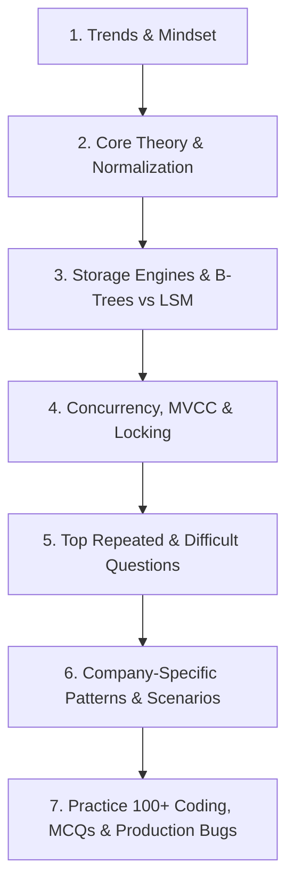

# 🗄️ The Ultimate DBMS Interview Preparation Guide 2026–2027

*Curated by an elite research team analyzing thousands of real interview experiences across FAANG, unicorns, and top product companies.*

---

## 📌 Trends & Mindset for DBMS Interviews in 2026–2027

> **2026 Reality**: Database knowledge is non-negotiable for any backend, data, or infrastructure role. Interviewers no longer stop at basic normalization or SQL; they test **internal architectures** (B-trees, LSM trees, WAL), **distributed systems** (CAP, consensus, sharding), and **real-world trade-offs** between consistency, availability, and performance. Expect deep dives into **modern database paradigms** – from NewSQL to columnar stores, and from change data capture to multi-model databases.

### 🔥 What Interviewers Are Really Testing

| Area | Why They Ask | Weight |
| :--- | :--- | :--- |
| **Transaction & Concurrency** | ACID, isolation levels, deadlocks. Core to data integrity. | **30%** |
| **Indexing & Storage Engines** | B-tree vs Hash vs LSM, covering indexes, clustering. Directly impacts performance. | **25%** |
| **Normalization & Schema Design** | Real-world modeling, trade-offs between normalized and denormalized designs. | **20%** |
| **Distributed Systems & Replication** | CAP theorem, consensus, leader election, sharding. Essential for scale. | **15%** |
| **Query Optimization & Internals** | Execution plans, cost-based optimization, join algorithms. Differentiates seniors. | **10%** |

> 💡 **Memory Trick**: **ACID** (Atomicity, Consistency, Isolation, Durability) is the heart of DBMS. Then **INDEX** to speed up, **DISTRIBUTE** to scale.

---

## 🎯 Target Role Expectations

| Role Level | What Interviewers Test | Key Focus Areas |
| :--- | :--- | :--- |
| **Fresher / SDE-1** | Basic SQL proficiency, Relational Algebra, Normalization (1NF–3NF), Primary vs. Foreign keys, Basic Joins, ACID definitions. | Correct query syntax, schema design, basic indexes. |
| **SDE-2 (Mid-Level)** | Query optimization, indexing strategies, transaction isolation anomalies (dirty read, non-repeatable read, phantom read), MVCC, locking (`FOR UPDATE`), connection pooling, DB performance tuning. | Avoiding full table scans, preventing race conditions, schema migrations. |
| **Senior / Staff / Lead** | Distributed database architecture, LSM-Tree vs. B-Tree, partitioning & sharding strategies, WAL & crash recovery, distributed transactions (Saga vs 2PC), multi-DC replication, CDC (Change Data Capture), vector DBs, NewSQL engines (Spanner, CockroachDB). | System availability, write throughput, trade-offs under high concurrency, disaster recovery. |

---

## 🗺️ Learning Roadmap & Study Order



### Recommended Study Order

```
1. README.md              -> Overview, trends, testing matrix & roadmap (This File)
2. Interview_Guide.md     -> Theory (150+ Questions across 8 Domains, 3 Levels)
3. Cheat_Sheet.md         -> Quick revision tables, Mermaid diagrams & Day Strategy
4. Top_Questions.md       -> Top 25 Most Repeated, Top 50 Difficult, Top 50 Rejected, Top 50 Differentiating
5. Company_Questions.md   -> FAANG, FinTech, & Unicorn company-specific hiring patterns
6. Practice_Questions.md  -> 100+ Coding, 100+ MCQs, 75+ Scenarios, 50+ Production, 50+ Debugging, 50+ Tricky
7. Resources.md           -> Handpicked books, CMU lectures, docs & playgrounds
```

---

## ⏱️ Preparation Time Requirements

| Preparation Track | Target Role Level | Estimated Time | Focus Strategy |
| :--- | :--- | :--- | :--- |
| **Express Revision** | Revision before interview | **8–12 Hours** | Read `Cheat_Sheet.md`, review `Top_Questions.md`, scan `Company_Questions.md`. |
| **Standard Prep** | SDE-1 / SDE-2 | **3–4 Weeks** | Complete `Interview_Guide.md`, solve `Top_Questions.md` & `Practice_Questions.md`. |
| **Deep Architecture** | Senior / Staff Engineer | **6–8 Weeks** | Master Advanced `Interview_Guide.md`, LSM vs B-Tree, Distributed DBs, DDIA concepts. |

---

## 📂 Complete Folder Structure

```
DBMS/
├── README.md              # Subject overview, trends, testing matrix, roadmap (This file)
├── Interview_Guide.md     # 3-tier deep dive + 150+ Theory Questions across 8 domains
├── Cheat_Sheet.md         # Rapid revision tables, Mermaid diagrams, Day strategy
├── Top_Questions.md       # Top 25 Repeated, Top 50 Difficult, Top 50 Rejected, Top 50 Differentiating
├── Company_Questions.md   # Curated patterns from Google, Amazon, Meta, Uber, Stripe, etc.
├── Practice_Questions.md  # 100+ Coding, 100+ MCQs, 75+ Scenarios, 50+ Debugging, 50+ Production
└── Resources.md           # Handpicked books, CMU lectures, documentation, & tools
```

---

## 💡 How to Use This Guide Effectively

1. **Do Not Skip Code/SQL Snippets**: Always test the SQL queries provided in `Practice_Questions.md` and `Top_Questions.md` on PostgreSQL or MySQL.
2. **Focus on Trade-offs**: When asked "Should we add an index?", don't just say "Yes". Explain write amplification, memory footprint, and low-selectivity caveats.
3. **Draw Architecture Diagrams**: Practice sketching B+ Tree node splitting, 2-Phase Commit execution flows, and MVCC tuple visibility.

Good luck! Jump right into [`Interview_Guide.md`](file:///s:/Interview_Guide/DBMS/Interview_Guide.md) to begin your preparation. 🚀
