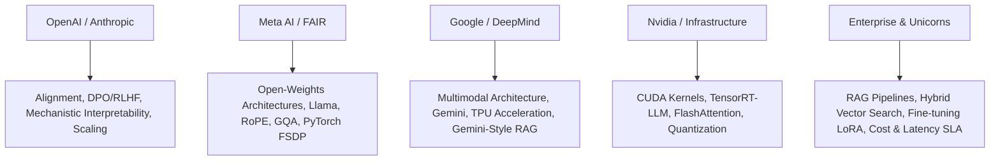

# 🏢 Company-Specific Generative AI & LLM Interview Questions

Curated collection of GenAI interview questions and hiring patterns collected from top product companies and AI research labs.

---

## 🏛️ Company Hiring Patterns & Focus Areas

---

## 🎯 Curated Company Questions

### 1. OpenAI & Anthropic (Research & Frontier Models)

#### Q: How would you debug reward hacking during PPO training in RLHF?
- **Company Category**: Frontier AI Research Labs
- **Why It Matters**: Evaluates mastery over model alignment pitfalls where a policy maximizes scalar reward without fulfilling human intent.
- **Expected Answer**:
  1. **Symptoms**: Policy generates non-sensical, repetitive text full of polite filler words ("As an AI assistant, I would be delighted...") that trick the Reward Model into assigning high scores.
  2. **Root Cause**: Reward Model function approximation error in high-dimensional text space.
  3. **Mitigations**:
     - **KL Divergence Penalty**: Enforce $D_{\text{KL}}(\pi_\theta \| \pi_{\text{ref}}) \le \delta$ in PPO objective.
     - **Reward Model Ensembling**: Average outputs of multiple independent reward models to smooth out extreme outliers.
     - **Switch to DPO**: Eliminate the explicit reward model entirely by optimizing preferences via closed-form likelihood ratio.
- **Interview Tip**: Emphasize how constitutional AI and automated red-teaming reduce human preference noise.

---

### 2. Meta AI / FAIR (Architecture & Open Source LLMs)

#### Q: Compare SwiGLU activation to standard GELU and derive its computational trade-off.
- **Company Category**: Big Tech / Open Source AI
- **Why It Matters**: Meta's Llama series replaced standard FFNs with SwiGLU layers.
- **Expected Answer**:
  Standard FFN with GELU:
  $$\text{FFN}(x) = \text{GELU}(x W_1) W_2$$
  SwiGLU FFN (Shazeer, 2020):
  $$\text{SwiGLU}(x) = \left( \text{Swish}_{\beta}(x W_{\text{gate}}) \otimes (x W_{\text{up}}) \right) W_{\text{down}}$$
  where $\text{Swish}_{\beta}(x) = x \cdot \sigma(\beta x)$.
  SwiGLU adds a 3rd matrix multiplication ($W_{\text{gate}}$). To keep parameter count and FLOPs identical to standard FFN, hidden dimension is reduced from $4 d_{\text{model}}$ to $\frac{2}{3} \times 4 d_{\text{model}} \approx \frac{8}{3} d_{\text{model}}$.
- **Follow-up**: *What performance boost does SwiGLU provide?* Consistently lowers perplexity across downstream language tasks.

---

### 3. Google & DeepMind (Multimodal Systems & Scaling)

#### Q: How does contrastive learning work in CLIP (Contrastive Language-Image Pre-training)?
- **Company Category**: Multimodal Research & AI Product
- **Why It Matters**: Core foundation of vision-language models and text-to-image conditioning.
- **Expected Answer**:
  Given a batch of $N$ (image, text) pairs $\{(I_i, T_i)\}_{i=1}^N$:
  1. Pass images through Image Encoder $\to E_I(I_i) \in \mathbb{R}^d$, text through Text Encoder $\to E_T(T_i) \in \mathbb{R}^d$.
  2. Normalize embeddings to unit length.
  3. Compute cosine similarity matrix $S_{i, j} = \langle E_I(I_i), E_T(T_j) \rangle / \tau$.
  4. Compute **Symmetric Cross-Entropy Loss** over rows (image-to-text) and columns (text-to-image):
     $$\mathcal{L}_{\text{CLIP}} = \frac{1}{2} (\mathcal{L}_{\text{img}\to\text{text}} + \mathcal{L}_{\text{text}\to\text{img}})$$
     Only diagonal pairs $(i, i)$ are positive targets; off-diagonal pairs $(i, j)$ act as negative samples.

---

### 4. Nvidia, Databricks & Infra (Serving & CUDA Acceleration)

#### Q: Walk through the memory allocation layout of ZeRO-3 (Zero Redundancy Optimizer) across a 64-GPU cluster.
- **Company Category**: High-Performance AI Infrastructure
- **Why It Matters**: Critical for training 70B-500B models that exceed individual GPU memory capacity.
- **Expected Answer**:
  Standard Data Parallelism (DDP) duplicates Parameters ($P$), Gradients ($G$), and Optimizer States ($O$) across all GPUs.
  For 16-bit FP16 training with AdamW (32-bit master weights, momentum, variance), memory footprint per parameter is **16 bytes**:
  - FP16 Parameters ($2P$), FP16 Gradients ($2P$), FP32 Master Weights ($4P$), FP32 Momentum ($4P$), FP32 Variance ($4P$).
  
  **ZeRO Stages**:
  - **ZeRO-1**: Shards Optimizer States across $N$ GPUs (Saves $4x$ memory).
  - **ZeRO-2**: Shards Optimizer States + Gradients across $N$ GPUs (Saves $8x$ memory).
  - **ZeRO-3**: Shards Optimizer States + Gradients + Parameters across $N$ GPUs. Each GPU holds only $1/N$ parameters. During forward/backward pass, parameters are gathered on-demand via All-Gather and freed immediately after computation.

---

### 5. Uber, Airbnb, Microsoft & Amazon (Enterprise RAG & Applications)

#### Q: How would you build a production RAG system that handles 500,000 PDF documents with low query latency and strict permission access control?
- **Company Category**: Enterprise Tech & Unicorns
- **Why It Matters**: Tests system design capabilities combining security, search, and LLM orchestration.
- **Expected Answer**:
  1. **Document Pipeline**:
     - Parse PDFs using OCR + Layout-aware chunking (preserving tables and headers).
     - Compute document embeddings with `bge-large-en-v1.5`.
     - Store vectors in **Pinecone / Milvus** with Metadata Payload: `{doc_id, tenant_id, user_permissions_acl, timestamp}`.
  2. **Security Filtering**:
     - Inject pre-filtering clause directly into Vector DB query execution plan: `WHERE tenant_id == user.tenant AND user.role IN acl`.
  3. **Retrieval Optimization**:
     - Hierarchical Navigable Small World (HNSW) index for sub-10ms vector search.
     - Hybrid search: BM25 (sparse) + HNSW (dense) via Reciprocal Rank Fusion (RRF).
     - Cross-Encoder Re-ranking (bge-reranker-large) over top-30 candidates to pick top-4.
  4. **Cost & Latency Management**:
     - Redis Semantic Caching: Check if incoming query cosine distance to previous queries is $< 0.05$; return cached LLM answer instantly if hit.
