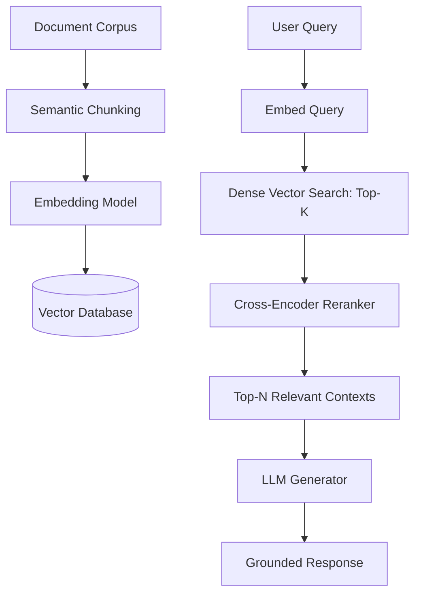
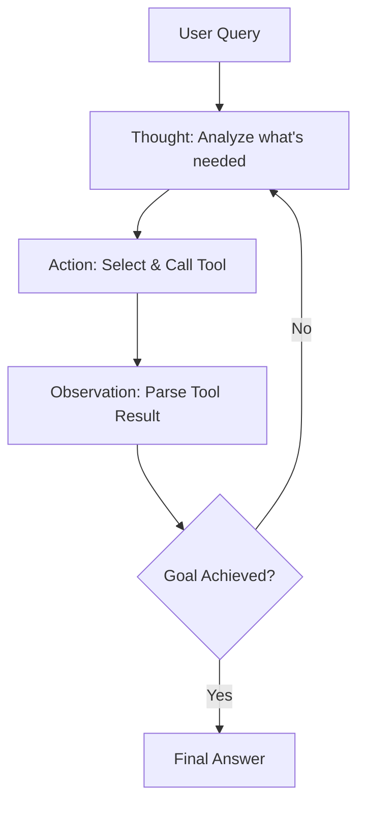

# 📖 Generative AI & LLM Comprehensive Interview Guide

This guide is organized into three progressive levels: **Beginner**, **Intermediate**, and **Advanced**. Each section breaks down theoretical concepts, mathematical foundations, coding patterns, real-world interview expectations, and follow-up questions.

---

## 🟢 Section 1: Beginner Level (Foundations)

### 1. Transformer Architecture & Self-Attention

#### Conceptual Overview
The Transformer architecture (Vaswani et al., 2017) discarded recurrent and convolutional networks in favor of pure **Self-Attention**. It computes direct relationships between all pairs of tokens in a sequence simultaneously, eliminating sequential bottlenecking and allowing massive parallelization during training.

```mermaid
graph TD
    Input[Input Tokens] --> Embed[Embedding + Positional Encoding]
    Embed --> QKV[Linear Projections: Q, K, V]
    QKV --> MatMul1[Q x K^T / sqrt(d_k)]
    MatMul1 --> Mask[Causal / Padding Mask]
    Mask --> Softmax[Softmax]
    Softmax --> MatMul2[Attention Weights x V]
    MatMul2 --> OutLinear[Output Linear Projection]
```

#### Scaled Dot-Product Attention Equation
$$\text{Attention}(Q, K, V) = \text{softmax}\left(\frac{QK^T}{\sqrt{d_k}}\right)V$$

Where:
- $Q \in \mathbb{R}^{N \times d_k}$: Query matrix representing the target sequence tokens.
- $K \in \mathbb{R}^{M \times d_k}$: Key matrix representing the input sequence tokens.
- $V \in \mathbb{R}^{M \times d_v}$: Value matrix containing contextual representations.
- $\frac{1}{\sqrt{d_k}}$: Scaling factor to prevent large dot products from pushing softmax logits into regions with vanishing gradients.

#### Code Implementation: Scaled Dot-Product Attention in PyTorch
```python
import torch
import torch.nn as nn
import torch.nn.functional as F

def scaled_dot_product_attention(Q, K, V, mask=None):
    """
    Q, K, V shape: (batch_size, num_heads, seq_len, d_k)
    """
    d_k = Q.size(-1)
    scores = torch.matmul(Q, K.transpose(-2, -1)) / (d_k ** 0.5)
    
    if mask is not None:
        scores = scores.masked_fill(mask == 0, float('-inf'))
        
    attn_weights = F.softmax(scores, dim=-1)
    output = torch.matmul(attn_weights, V)
    return output, attn_weights
```

---

### 2. Tokenization & Subword Algorithms

Subword tokenization bridges raw text and numerical inputs. It balances vocabulary size and out-of-vocabulary (OOV) representation.

| Tokenizer | Algorithm | Key Characteristics | Usage |
| :--- | :--- | :--- | :--- |
| **BPE (Byte Pair Encoding)** | Iteratively merges most frequent character pairs | Frequency-driven, handles arbitrary subwords | GPT-2, GPT-4, Llama |
| **WordPiece** | Merges pairs maximizing likelihood of training data | Likelihood-driven | BERT |
| **SentencePiece** | Treats input as raw byte stream (includes spaces ` `) | Language-agnostic, whitespace-independent | T5, Llama, Mistral |

---

### 3. Beginner Expected Interview Questions & Follow-ups

#### Q1: Why is the scaling factor $\sqrt{d_k}$ necessary in scaled dot-product attention?
- **Answer**: Assuming Query $q$ and Key $k$ are independent random variables with mean 0 and variance 1, their dot product $q \cdot k = \sum_{i=1}^{d_k} q_i k_i$ has mean 0 and variance $d_k$. As $d_k$ grows large, the values of the dot product grow in magnitude, forcing the `softmax` function into regions with extremely small gradients (gradient vanishing). Dividing by $\sqrt{d_k}$ scales the variance back to 1.
- **Follow-up**: *What happens if you omit $\sqrt{d_k}$ during training?* The network suffers from slow convergence or unstable gradients early in pre-training.

---

## 🟡 Section 2: Intermediate Level (Core LLM & PEFT Engineering)

### 1. Encoder-Decoder vs. Decoder-Only vs. Encoder-Only

```mermaid
graph LR
    subgraph Encoder-Only (BERT)
        E1[Bidirectional Masked Attention]
    end
    subgraph Decoder-Only (GPT / Llama)
        D1[Causal Autoregressive Masking]
    end
    subgraph Encoder-Decoder (T5 / BART)
        ED1[Bidirectional Encoder] --> ED2[Cross-Attention Decoder]
    end
```

- **Encoder-Only (BERT)**: Uses bidirectional self-attention. Pre-trained via Masked Language Modeling (MLM). Ideal for classification, NER, and sentence embeddings.
- **Decoder-Only (GPT, Llama, Mistral)**: Uses causal masking (token $t$ only attends to tokens $\le t$). Pre-trained via Causal Language Modeling (CLM). Standard for autoregressive text generation.
- **Encoder-Decoder (T5, BART)**: Encoder processes full input bidirectionally; decoder generates autoregressively using cross-attention over encoder outputs. Ideal for translation and summarization.

---

### 2. Parameter-Efficient Fine-Tuning (PEFT) & LoRA / QLoRA

#### Low-Rank Adaptation (LoRA)
Full fine-tuning updates all parameters $W_0 \in \mathbb{R}^{d \times k}$. LoRA decomposes the weight update $\Delta W$ into two low-rank matrices $A$ and $B$:

$$W = W_0 + \Delta W = W_0 + \frac{\alpha}{r} (B \cdot A)$$

Where:
- $A \in \mathbb{R}^{r \times k}$, initialized with Gaussian distribution $\mathcal{N}(0, \sigma^2)$.
- $B \in \mathbb{R}^{d \times r}$, initialized to zero (ensuring $\Delta W = 0$ at start of training).
- $r \ll \min(d, k)$: Rank parameter (typically $r \in [8, 64]$).
- $\alpha$: Constant scaling hyperparameter.

```python
import torch
import torch.nn as nn

class LoRALinear(nn.Module):
    def __init__(self, base_layer: nn.Linear, r: int = 8, alpha: float = 16.0):
        super().__init__()
        self.base_layer = base_layer
        self.base_layer.weight.requires_grad = False  # Freeze base weights
        
        in_features = base_layer.in_features
        out_features = base_layer.out_features
        
        self.r = r
        self.alpha = alpha
        self.scaling = alpha / r
        
        self.lora_A = nn.Parameter(torch.zeros(r, in_features))
        self.lora_B = nn.Parameter(torch.zeros(out_features, r))
        
        nn.init.kaiming_uniform_(self.lora_A, a=math.sqrt(5))
        nn.init.zeros_(self.lora_B)

    def forward(self, x: torch.Tensor) -> torch.Tensor:
        base_out = self.base_layer(x)
        lora_out = (x @ self.lora_A.T @ self.lora_B.T) * self.scaling
        return base_out + lora_out
```

#### QLoRA (Quantized LoRA) Innovations
1. **NormalFloat4 (NF4)**: Information-theoretically optimal quantile quantization data type for normally distributed weights.
2. **Double Quantization (DQ)**: Quantizes quantization constants themselves, saving ~0.37 bits per parameter.
3. **Paged Optimizers**: Uses CUDA Unified Memory to prevent memory spikes during gradient updates by swapping memory to CPU.

---

### 3. Retrieval-Augmented Generation (RAG) Architecture



#### Critical RAG Concepts
- **Chunking Strategies**: Fixed-size with overlap, Recursive character splitting, Semantic parsing (by headers/markdown).
- **Hybrid Search**: Combines Dense Retrieval (embeddings via cosine distance) with Sparse Retrieval (BM25 for exact keyword/entity matches) using Reciprocal Rank Fusion (RRF).
- **Re-ranking**: Cross-Encoders evaluate $(Query, Document)$ pairs jointly to score semantic relevance before passing to LLM context.

---

### 4. Agentic AI & Tool Calling

The most critical 2026–2027 interview topic for applied AI roles. Agentic AI refers to LLM-powered systems that reason, plan, use external tools, and autonomously execute multi-step workflows.

#### ReAct Pattern (Reason-Act-Observe)

The foundational pattern for LLM agents: the model alternates between reasoning about the current state, selecting an action (tool call), and observing the result.



#### Function Calling / Tool Use Architecture

```python
import openai
import json

# Define tools the LLM can call
tools = [
    {
        "type": "function",
        "function": {
            "name": "get_weather",
            "description": "Get current weather for a city",
            "parameters": {
                "type": "object",
                "properties": {
                    "city": {"type": "string", "description": "City name"},
                    "unit": {"type": "string", "enum": ["celsius", "fahrenheit"]}
                },
                "required": ["city"]
            }
        }
    }
]

def run_agent(user_query: str):
    messages = [{"role": "user", "content": user_query}]
    
    while True:
        response = openai.chat.completions.create(
            model="gpt-4o",
            messages=messages,
            tools=tools,
            tool_choice="auto"
        )
        msg = response.choices[0].message
        
        # If no tool call — final answer
        if not msg.tool_calls:
            return msg.content
        
        # Execute tool calls
        messages.append(msg)  # Add assistant's tool call to history
        for tool_call in msg.tool_calls:
            result = execute_tool(tool_call.function.name,
                                  json.loads(tool_call.function.arguments))
            messages.append({
                "role": "tool",
                "tool_call_id": tool_call.id,
                "content": json.dumps(result)
            })
```

#### MCP — Model Context Protocol

Anthropic's open standard (now industry-wide) that standardizes how LLMs connect to external data sources and tools:

| Layer | Role |
| :--- | :--- |
| **MCP Host** | Application containing LLM (Claude Desktop, IDE plugin) |
| **MCP Client** | Protocol client managing server connections |
| **MCP Server** | Lightweight service exposing Resources, Tools, and Prompts |

MCP removes the need to write custom API integration code per tool. A single MCP server exposes a standardized interface the LLM queries.

#### Multi-Agent Orchestration Patterns

| Pattern | Architecture | Best For |
| :--- | :--- | :--- |
| **Sequential** | Agent A → Agent B → Agent C | Linear document processing pipelines |
| **Parallel** | Agent A & B run concurrently → Aggregator | Independent research subtasks |
| **Supervisor** | Orchestrator LLM routes to specialist agents | Complex routing with conditional logic |
| **Reflection** | Agent → Critic → Refined Agent output | High-quality generation with self-correction |

---

### 5. Intermediate Expected Interview Questions & Follow-ups

#### Q2: How does KV-Caching reduce autoregressive decoding time from $O(N^2)$ to $O(N)$ per token?
- **Answer**: During autoregressive text generation, at step $t$, the key vector $K_{\le t}$ and value vector $V_{\le t}$ of previous tokens do not change. Without caching, the model recomputes $K$ and $V$ for all previous $t-1$ tokens at every new step. KV-Cache stores $K$ and $V$ in GPU memory and appends only the newly computed $k_t$ and $v_t$, reducing matrix operations per step to a single token vector multiplication.
- **Follow-up**: *What is the GPU memory consumption of KV-Cache for a 70B parameter model?*
  $$\text{Memory}_{\text{KV}} = 2 \times b \times s \times l \times h \times d_{\text{head}} \times \text{bytes\_per\_elem}$$
  For Batch $b=1$, Seq Len $s=4096$, Layers $l=80$, Heads $h=64$, Head Dim $d=128$, FP16 (2 bytes):
  $$2 \times 1 \times 4096 \times 80 \times 64 \times 128 \times 2 \approx 10.73 \text{ GB of VRAM per sequence!}$$

#### Q2b: How does the ReAct agent pattern prevent hallucination in tool-use scenarios?
- **Answer**: Traditional prompting causes LLMs to fabricate answers from parametric memory. ReAct externalizes knowledge retrieval: the model *reasons* about what information is needed, *acts* by calling a real tool (search API, database, calculator), and *observes* the factual response before generating an answer. The grounding in real tool output prevents the model from confabulating. Failure modes: tool errors, infinite loops, prompt injection via malicious tool outputs.
- **Follow-up**: *What safety measures prevent prompt injection via tool outputs?* → Sandboxed execution environment, output length limits, structured JSON schema validation, allow-list of trusted tool domains.

---

## 🔴 Section 3: Advanced Level (System Architecture, Optimization & Alignment)

### 1. Advanced Attention Variants: MHA vs MQA vs GQA

```
Multi-Head Attention (MHA)    Multi-Query Attention (MQA)    Grouped-Query Attention (GQA)
Q Q Q Q  K K K K  V V V V      Q Q Q Q  K  V                   Q Q Q Q  K K  V V
 (8 Query, 8 Key, 8 Value)      (8 Query, 1 Key, 1 Value)       (8 Query, 2 Key, 2 Value)
```

- **MHA**: Each query head has a dedicated Key and Value head. High accuracy, maximum KV-cache footprint.
- **MQA**: All query heads share a single Key and Value head. 8x-64x KV-cache memory reduction, slight quality degradation.
- **GQA (Llama-3, Mistral)**: Groups query heads into $G$ partitions, each sharing a Key/Value head. Achieves MHA quality at near-MQA speed.

---

### 2. High-Performance Inference Engines: vLLM & PagedAttention

Traditional KV-cache allocates contiguous memory blocks based on `max_seq_len`, causing **60%–80% memory fragmentation** (internal and external).

**PagedAttention** (vLLM) resolves this by applying Virtual Memory Paging concepts to KV-caching:
- Divides KV-cache into fixed-size physical memory blocks.
- Uses a **Block Table** to map logical sequence blocks to non-contiguous physical GPU RAM blocks.
- Enables dynamic memory allocation, continuous batching, and instant memory sharing across beam search branches and copy-on-write requests.

---

### 3. Model Alignment: RLHF (PPO) vs. DPO

```mermaid
graph TD
    SFT[SFT Model] --> PairData[(Preference Pairs: y_w > y_l)]
    
    subgraph Traditional RLHF
        PairData --> RM[Train Reward Model r_phi]
        RM --> PPO[Optimize Policy pi_theta via PPO + KL Penalty]
    end
    
    subgraph Direct Preference Optimization (DPO)
        PairData --> DPO_Loss[Closed-Form DPO Loss Optimization]
    end
```

#### Direct Preference Optimization (DPO) Mathematical Derivation
DPO eliminates the explicit Reward Model and PPO reinforcement learning loop by reparameterizing the reward function $r(x, y)$ directly through the implicit language model policy $\pi_\theta$:

$$r(x, y) = \beta \log \frac{\pi_\theta(y|x)}{\pi_{\text{ref}}(y|x)}$$

Substituting into the Bradley-Terry preference model yields the objective:

$$\mathcal{L}_{\text{DPO}}(\theta; \pi_{\text{ref}}) = -\mathbb{E}_{(x, y_w, y_l)} \left[ \log \sigma \left( \beta \log \frac{\pi_\theta(y_w|x)}{\pi_{\text{ref}}(y_w|x)} - \beta \log \frac{\pi_\theta(y_l|x)}{\pi_{\text{ref}}(y_l|x)} \right) \right]$$

Where $y_w$ is the winning (preferred) response and $y_l$ is the losing (dispreferred) response.

---

### 4. LLM Evaluation Metrics

How to measure the quality of generated text is a critical interview topic at every AI company.

| Metric | Type | How It Works | Best For | Limitation |
| :--- | :--- | :--- | :--- | :--- |
| **BLEU** | Reference-based | N-gram overlap (precision) between generated and reference text | Machine Translation | Doesn't reward paraphrase; poor for open-ended generation |
| **ROUGE-L** | Reference-based | Longest Common Subsequence (LCS) recall between generated and reference | Summarization | Same limitation: brittle to synonyms |
| **BERTScore** | Embedding-based | Cosine similarity of token embeddings (uses BERT-family model) | General NLG evaluation | Inherits BERT's domain biases |
| **Perplexity** | Intrinsic | Exponential of model's cross-entropy loss on test corpus | Language model quality | Lower ≠ better downstream task performance |
| **G-Eval / LLM-as-Judge** | LLM-based | Uses GPT-4 as evaluator scoring on defined rubric dimensions | Open-ended generation, Chatbot quality | Expensive; has position bias and self-preference |

```python
# LLM-as-Judge pattern (G-Eval style)
EVAL_PROMPT = """
You are an impartial judge. Evaluate the following response on a scale 1-5.

Criteria:
- Factual Accuracy (1-5)
- Coherence (1-5)
- Helpfulness (1-5)
- Conciseness (1-5)

Question: {question}
Response: {response}
Reference Answer: {reference}

Output ONLY a JSON: {"accuracy": X, "coherence": X, "helpfulness": X, "conciseness": X}
"""
```

### 5. Content Safety & Guardrails

- **Llama Guard**: Meta's safety classifier trained on a safety taxonomy (violence, hate, privacy, sexual content). Runs as a separate inference pass on both inputs and outputs.
- **Constitutional AI (Anthropic)**: Trains models to be self-critiquing — model evaluates its own response against a list of principles and rewrites unsafe responses iteratively.
- **NeMo Guardrails (NVIDIA)**: Programmatic guardrails defined in Colang (a domain-specific language) that control conversation flow, block topical rails, and validate outputs.
- **Prompt Injection Defense**: Separate system prompt from user content with clearly delimited tokens; use structured output schemas; validate tool call arguments via allowlists.

---

### 6. Advanced Expected Interview Questions & Senior Scenarios

#### Q3: Explain FlashAttention and why it yields 2x-4x speedups without changing the exact math of attention.
- **Answer**: Standard attention writes intermediate matrices $S = QK^T \in \mathbb{R}^{N \times N}$ and $P = \text{softmax}(S) \in \mathbb{R}^{N \times N}$ to High Bandwidth Memory (HBM) on the GPU, requiring $O(N^2)$ memory reads/writes. FlashAttention tiles the input matrices $Q, K, V$ into blocks that fit inside fast High-Speed SRAM (L1/L2 cache). Using online softmax normalization (Tiling algorithm), it computes attention iteratively block-by-block without ever materializing the $N \times N$ matrix in HBM, reducing memory access from $O(N^2)$ to $O(N)$.

#### Q4: System Design: How would you deploy a 70B parameter model with a latency SLA under 50ms per token for 1,000 concurrent users?
- **Strategy**:
  1. **Quantization**: Apply AWQ or GPTQ 4-bit quantization, shrinking model size from 140GB (FP16) to ~35GB, allowing model to fit on a single A100 (80GB) or 2x L40S GPUs.
  2. **KV-Cache Optimization**: Use **vLLM** with PagedAttention and Grouped-Query Attention (GQA).
  3. **Continuous Batching**: Use iteration-level batching (inflight batching) instead of request-level batching to prevent long prompts from stalling short completion streams.
  4. **Speculative Decoding**: Deploy a small 1B draft model to generate candidate token sequences, verified in parallel by the 70B target model in a single forward pass.

#### Q5: How do you build a safe multi-agent system that prevents runaway autonomous execution?
- **Strategy**:
  1. **Human-in-the-Loop Checkpoints**: Require human approval before any irreversible action (deleting data, sending emails, making financial transactions).
  2. **Tool Permission Scoping**: Each agent has a minimal permission set (principle of least privilege). A research agent can read but not write; a writer agent can create files but not execute code.
  3. **Max Iteration Limits**: Hard cap on ReAct loop iterations (e.g., 15 steps) to prevent infinite agent loops.
  4. **Output Schema Validation**: Validate every agent output with Pydantic schemas before passing to the next agent or executing a tool.
