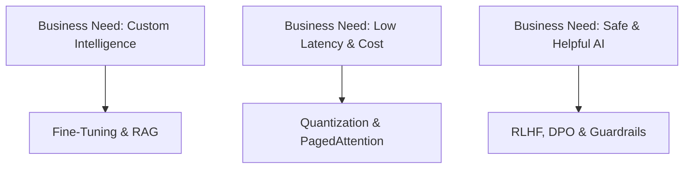

# 🧠 Generative AI (GenAI) & LLMs Interview Preparation Guide 2026–2027

Welcome to the definitive, production-grade **Generative AI & LLM Interview Guide**. Curated by Senior AI Engineers, Staff Scientists, and Hiring Managers across FAANG, AI Research Labs (OpenAI, Anthropic, DeepMind), and leading tech unicorns, this module provides an exhaustive, end-to-end framework to ace GenAI technical interviews.

---

## 🎯 Subject Overview

Generative AI has shifted from academic research to the core architectural foundation of modern software systems. Interviews for **Machine Learning Engineer (GenAI)**, **Applied Scientist**, **LLM Infrastructure Engineer**, and **AI System Architect** positions test both theoretical mechanics and real-world engineering trade-offs.

Key topics covered in this module:
- **Transformer Architectures & Attention Mechanics**: Scaled Dot-Product Attention, Multi-Head Attention (MHA), Multi-Query Attention (MQA), Grouped-Query Attention (GQA), Positional Encodings (Sinusoidal, RoPE, ALiBi).
- **LLM Training & Alignment**: Pre-training objectives (CLM, MLM), Supervised Fine-Tuning (SFT), Reinforcement Learning from Human Feedback (RLHF via PPO), Direct Preference Optimization (DPO).
- **Parameter-Efficient Fine-Tuning (PEFT)**: LoRA, QLoRA (NF4, Double Quantization), Prefix Tuning, Prompt Tuning, Adapters.
- **Retrieval-Augmented Generation (RAG)**: Chunking strategies, Embedding space optimization, Vector Databases (FAISS, Pinecone), Hybrid Search, Re-ranking, Self-RAG.
- **High-Throughput Inference & Serving**: KV-Caching, Continuous Batching, PagedAttention (vLLM), Speculative Decoding, Quantization (GPTQ, AWQ, GGUF/GGML).
- **Diffusion Models & Multimodal Systems**: DDPM/DDIM forward/reverse processes, Latent Diffusion (Stable Diffusion), Classifier-Free Guidance (CFG), CLIP contrastive alignment.

---

## 💡 Why Companies Ask Generative AI



1. **High Infrastructure Costs**: Running 70B+ parameter models requires strict latency and memory optimization (KV-cache, quantization, speculative decoding).
2. **Hallucination & Reliability**: Industry systems demand robust RAG architectures, factual grounding, and guardrails over raw prompt engineering.
3. **Domain Adaptation**: Fine-tuning pre-trained models on proprietary datasets requires deep mastery of PEFT (LoRA/QLoRA) and alignment (DPO/RLHF).

---

## 📋 Prerequisites & Knowledge Foundations

Before diving into this module, ensure you possess working familiarity with:

| Foundation | Core Concepts | Essential Tools |
| :--- | :--- | :--- |
| **Mathematics** | Linear Algebra (Matrix Multiplication, Singular Value Decomposition), Probability, Calculus | NumPy, PyTorch Tensors |
| **Deep Learning** | Backpropagation, Gradient Descent, Normalization (LayerNorm, RMSNorm), Loss Functions | PyTorch, CUDA basics |
| **Python & Software** | Asynchronous execution, Object-Oriented Design, Memory Management | Python 3.10+, Hugging Face `transformers` |

---

## 🗺️ 6-Week Learning Roadmap

```
Week 1: Transformer Architecture & Attention -> Week 2: Tokenization & Pre-training
                                                           |
Week 4: RAG & Vector Databases <------------- Week 3: PEFT (LoRA/QLoRA) & Fine-Tuning
         |
Week 5: LLM Alignment (RLHF & DPO) -----------> Week 6: Inference, Serving & Multimodal
```

### Timeline & Study Schedule

| Week | Focus Area | Key Deliverables | Time Required |
| :--- | :--- | :--- | :--- |
| **Week 1** | Transformer Mechanics & Attention | Code Multi-Head Attention & RoPE from scratch in PyTorch | 10–12 Hours |
| **Week 2** | Tokenization, Pre-training & Scaling | Master BPE/SentencePiece & Chinchilla scaling laws | 8–10 Hours |
| **Week 3** | Parameter-Efficient Fine-Tuning | Fine-tune Llama/Mistral using LoRA & QLoRA | 12–14 Hours |
| **Week 4** | RAG Systems & Vector Search | Build a hybrid retrieval pipeline with Reranking | 10–12 Hours |
| **Week 5** | Model Alignment & Safety | Understand RLHF (PPO) & implement DPO loss | 10–12 Hours |
| **Week 6** | Inference Optimization & Serving | Master KV-Cache math, vLLM, & Diffusion / CLIP basics | 12–15 Hours |

---

## 📂 How to Use This Folder

To maximize your interview preparation efficiency, navigate the files in the following order:

```
Gen_AI/
├── 1. README.md                <-- (You are here) Overview & Roadmap
├── 2. Interview_Guide.md       <-- Detailed conceptual breakdown (Beginner -> Advanced)
├── 3. Cheat_Sheet.md           <-- Quick formulas, comparison tables & memory aids
├── 4. Top_Questions.md         <-- 50+ Top real interview questions with deep answers
├── 5. Company_Questions.md     <-- FAANG & AI Lab company-specific interview patterns
├── 6. Practice_Questions.md    <-- Coding, Debugging, Scenarios & Output Predictions
└── 7. Resources.md             <-- Curated research papers, books, repositories & courses
```

> [!TIP]
> **Memory Trick (PALER)**: Remember the 5 core pillars of GenAI interviews:
> - **P**rompting & In-Context Learning
> - **A**rchitectures (Transformers, Attention, RoPE)
> - **L**oRA & Fine-Tuning (PEFT, QLoRA)
> - **E**valuation & Safety (Perplexity, G-Eval, Guardrails)
> - **R**AG & Retrieval (Embeddings, Vector Search, Re-ranking)

---

*Let's get started! Open [Interview_Guide.md](file:///S:/Interview_Guide/Gen_AI/Interview_Guide.md) to begin reviewing core concepts.*
