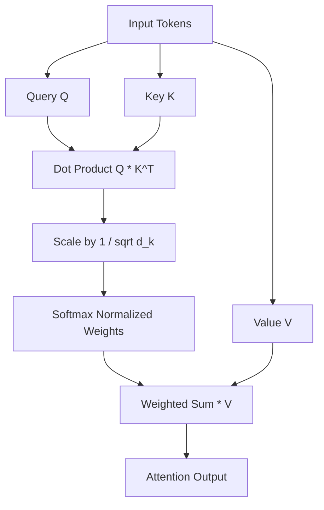

# 📗 Machine Learning (ML) Comprehensive Interview Guide

This guide is structured strictly into 3 progressive tiers: **Beginner**, **Intermediate**, and **Advanced**. Each section details key concepts, common mistakes, expected interview questions, coding requirements, architecture discussions, and production edge cases.

---

## 📌 Table of Contents

1. [Beginner Tier: Foundations & Classical ML](#1-beginner-tier-foundations--classical-ml)
   - [Core Topics & Concepts](#beginner-topics--concepts)
   - [Common Beginner Mistakes](#common-beginner-mistakes)
   - [Expected Beginner Interview Questions](#expected-beginner-interview-questions)
2. [Intermediate Tier: Deep Learning & Practical Engineering](#2-intermediate-tier-deep-learning--practical-engineering)
   - [Frequently Tested Concepts](#frequently-tested-concepts)
   - [Coding Expectations](#intermediate-coding-expectations)
   - [Real Interview Scenarios & Follow-ups](#real-interview-scenarios--follow-ups)
3. [Advanced Tier: GenAI, Transformers, Architecture & Scale](#3-advanced-tier-genai-transformers-architecture--scale)
   - [Production Concepts & Architecture](#production-concepts--architecture)
   - [Optimization & Performance](#optimization--performance)
   - [Senior / Staff Level Interview Expectations](#senior--staff-level-interview-expectations)

---

## 1. Beginner Tier: Foundations & Classical ML

### Beginner Topics & Concepts

#### 1. Supervised vs. Unsupervised vs. Reinforcement Learning
- **Supervised Learning**: Learns a mapping function $f(X) \to Y$ using labeled pairs $(x_i, y_i)$. Subtypes include Classification (discrete labels) and Regression (continuous values).
- **Unsupervised Learning**: Learns patterns, clusters, or representations from unlabeled data $X$. Subtypes include Clustering (K-Means, DBSCAN) and Dimensionality Reduction (PCA, t-SNE).
- **Reinforcement Learning**: An agent learns optimal policy $\pi(a|s)$ by taking actions in an environment to maximize cumulative reward over time.

#### 2. Bias-Variance Tradeoff & Generalization
- **Total Error** = $\text{Bias}^2 + \text{Variance} + \text{Irreducible Error}$.
- **Bias**: Error introduced by approximating a complex real-world problem with a simplified model (Underfitting). High bias models perform poorly on both train and test data.
- **Variance**: Sensitivity of the model to small fluctuations in the training set (Overfitting). High variance models fit training data almost perfectly but generalize poorly to unseen test data.

```
High Bias (Underfitting) <-------- Optimal Complexity --------> High Variance (Overfitting)
(e.g., Simple Linear Model)          (Balanced Model)              (e.g., Deep Unpruned Tree)
```

#### 3. Core Evaluation Metrics
- **Classification**:
  - $\text{Precision} = \frac{TP}{TP + FP}$ (Focuses on minimizing False Positives)
  - $\text{Recall} = \frac{TP}{TP + FN}$ (Focuses on minimizing False Negatives)
  - $\text{F1-Score} = 2 \cdot \frac{\text{Precision} \cdot \text{Recall}}{\text{Precision} + \text{Recall}}$ (Harmonic mean)
  - **ROC-AUC**: Area under Receiver Operating Characteristic curve ($\text{TPR}$ vs $\text{FPR}$ across thresholds).
- **Regression**: Mean Squared Error (MSE), Root Mean Squared Error (RMSE), Mean Absolute Error (MAE), $R^2$ Score.

#### 4. Feature Scaling & Data Preprocessing
- **Normalization (Min-Max)**: $x' = \frac{x - x_{\min}}{x_{\max} - x_{\min}} \in [0, 1]$.
- **Standardization (Z-score)**: $x' = \frac{x - \mu}{\sigma}$ (Mean 0, Variance 1).
- **Necessity**: Distance-based models (KNN, SVM, K-Means) and Gradient-based models require scaling; Tree-based models (Decision Trees, Random Forest) are scale-invariant.

---

### Common Beginner Mistakes

1. **Calculating Scaling Parameters on the Whole Dataset**: Fitting scalers (e.g. `StandardScaler.fit()`) before performing train/test split introduces **Data Leakage**. Scalers must *only* be fit on training data.
2. **Confusing Accuracy with F1-Score on Imbalanced Data**: Predicting the majority class 99% of the time yields 99% accuracy but fails completely on minority class detection (fraud, medical diagnosis).
3. **Misinterpreting Correlation as Causation**: High Pearson correlation does not imply feature $X$ causes output $Y$.

---

### Expected Beginner Interview Questions

1. *What is the difference between L1 (Lasso) and L2 (Ridge) regularization?*
   - **Answer**: L1 adds penalty $\lambda \sum |w_i|$ which yields sparse solutions (drives weights to exact zeros, performing automatic feature selection). L2 adds penalty $\lambda \sum w_i^2$ which shrinks weights towards zero without making them exactly zero.
2. *Why do we use Cross-Validation instead of a single Train/Test split?*
   - **Answer**: $K$-Fold cross-validation provides a more reliable estimate of model generalization performance by averaging metrics across $K$ distinct validation sets, reducing variance caused by a single lucky or unlucky split.
3. *How does K-Means clustering work, and how do you choose $K$?*
   - **Answer**: Initialize $K$ centroids randomly, assign each point to nearest centroid, recalculate centroids as mean of assigned points, repeat until convergence. $K$ is chosen via the Elbow Method (Plotting Ineria vs $K$) or Silhouette Analysis.

---

## 2. Intermediate Tier: Deep Learning & Practical Engineering

### Frequently Tested Concepts

#### 1. Gradient Descent & Optimization Variants
- **Standard (Batch) GD**: Computes gradient over entire dataset $\nabla L(\theta)$. Slow for large datasets.
- **Stochastic GD (SGD)**: Computes gradient for a single sample. High noise, but avoids local minima.
- **Mini-Batch GD**: Computes gradient over small batches (e.g., 32, 64, 128). Standard practice.
- **Adaptive Optimizers**:
  - **Momentum**: Accelerates SGD along relevant direction and dampens oscillations ($\mathbf{v}_t = \beta \mathbf{v}_{t-1} + (1-\beta)\nabla L$).
  - **RMSprop**: Scales learning rate by square root of exponential moving average of squared gradients.
  - **Adam**: Combines Momentum (first moment estimate) and RMSprop (second moment estimate) with bias correction.

#### 2. Deep Learning Regularization Techniques
- **Dropout**: During training, randomly zeros out activations with probability $p$. Forces neurons to learn redundant, robust features without relying on co-adaptations.
- **Batch Normalization (BatchNorm)**: Normalizes layer inputs across mini-batch ($\mu_B, \sigma_B^2$) and applies learnable scale $\gamma$ and shift $\beta$. Stabilizes internal covariate shift and allows higher learning rates.
- **Early Stopping**: Halts training when validation loss stops improving for a specified patience threshold.

#### 3. Convolutional & Recurrent Architectures
- **CNNs**: Utilize spatial locality via sliding kernels/filters, weight sharing, and pooling operations (Max/Average pooling). Captures translation-invariant hierarchical features.
- **RNNs / LSTMs / GRUs**: Designed for sequential data. Standard RNNs suffer from Vanishing/Exploding Gradients. LSTMs introduce Cell State ($C_t$) gated by Forget Gate ($f_t$), Input Gate ($i_t$), and Output Gate ($o_t$).

#### GRU vs LSTM — Key Comparison

| Dimension | LSTM | GRU |
|-----------|------|-----|
| **Gates** | 3 gates: Forget, Input, Output | 2 gates: Reset, Update |
| **Memory Cell** | Separate Cell State $C_t$ + Hidden State $h_t$ | Single Hidden State $h_t$ |
| **Parameters** | ~4x input/hidden dimension | ~3x input/hidden dimension (25% fewer) |
| **Training Speed** | Slower (more parameters) | Faster to train |
| **Performance** | Better for very long sequences | Matches LSTM quality on most tasks |
| **Best For** | Complex long-term dependencies (music, language) | Simpler sequential tasks, faster iteration |

```python
import torch.nn as nn

# GRU: fewer parameters, faster training, comparable quality
gru = nn.GRU(input_size=128, hidden_size=256, num_layers=2,
             batch_first=True, bidirectional=True, dropout=0.3)

# LSTM: better for very long sequences requiring complex gating
lstm = nn.LSTM(input_size=128, hidden_size=256, num_layers=2,
               batch_first=True, bidirectional=True, dropout=0.3)
```

#### 4. Learning Rate Schedulers

Learning rate scheduling is critical for both classical DL and LLM fine-tuning. Static LRs cause either divergence (too high) or slow convergence (too low).

```python
import torch.optim as optim
from torch.optim.lr_scheduler import CosineAnnealingLR, OneCycleLR
import math

# 1. Cosine Annealing with Warm Restarts
scheduler = CosineAnnealingLR(optimizer, T_max=100, eta_min=1e-6)

# 2. OneCycleLR (Smith, 2019) — warmup + cosine decay in one cycle
scheduler = OneCycleLR(
    optimizer,
    max_lr=3e-4,           # Peak LR after warmup
    total_steps=num_epochs * len(train_loader),
    pct_start=0.1,         # 10% warmup, 90% cosine decay
    anneal_strategy='cos'
)

# 3. Manual Linear Warmup + Cosine Decay (common in LLM fine-tuning)
def lr_with_warmup(step, warmup_steps, total_steps, base_lr):
    if step < warmup_steps:
        return base_lr * (step / warmup_steps)    # Linear warmup
    progress = (step - warmup_steps) / (total_steps - warmup_steps)
    return base_lr * 0.5 * (1 + math.cos(math.pi * progress))  # Cosine decay
```

| Scheduler | Best For | Behavior |
|-----------|----------|----------|
| **Constant LR** | Quick experiments | No adaptation — risky |
| **Step Decay** | Image classification | Drops LR by factor at fixed epochs |
| **Cosine Annealing** | General DL, LLM fine-tuning | Smooth decay, avoids local minima |
| **Warmup + Cosine** | Transformers, LLMs | Stabilizes early training, smooth decay |
| **OneCycleLR** | ResNets, fast training | Super-convergence via LR cycling |

#### 5. Model Explainability (SHAP & LIME)

> [!IMPORTANT]
> Explainability questions appear in **every Data Science interview** and increasingly in ML Engineer interviews at companies with compliance requirements.

```python
import shap
from lime.lime_tabular import LimeTabularExplainer

# ---- SHAP (SHapley Additive exPlanations) ----
# Works with any model; uses game theory to attribute prediction to features
explainer = shap.TreeExplainer(xgb_model)   # Fast tree-specific explainer
shap_values = explainer.shap_values(X_test) # Shape: (n_samples, n_features)

# Waterfall plot: shows how features pushed prediction from base value
shap.waterfall_plot(explainer.expected_value, shap_values[0], X_test.iloc[0])

# Summary plot: global feature importance across all samples
shap.summary_plot(shap_values, X_test, plot_type="bar")

# ---- LIME (Local Interpretable Model-Agnostic Explanations) ----
# Fits a local linear model around a specific prediction
explainer = LimeTabularExplainer(
    training_data=X_train.values,
    feature_names=X_train.columns.tolist(),
    mode='classification'
)
explanation = explainer.explain_instance(
    data_row=X_test.iloc[0].values,
    predict_fn=xgb_model.predict_proba,
    num_features=10
)
explanation.show_in_notebook()
```

| Dimension | SHAP | LIME |
|-----------|------|------|
| **Theoretical Basis** | Shapley values (game theory, exact) | Local linear approximation |
| **Scope** | Global + Local explanations | Local only |
| **Consistency** | Consistent (same input → same output) | Stochastic (randomness in sampling) |
| **Speed** | Fast for trees (TreeSHAP), slow for DNN | Fast for any model |
| **Best For** | XGBoost, LightGBM, Tree models | Any black-box model (DNN, SVM) |

---

### Intermediate Coding Expectations

Interviewers expect candidates to write modular NumPy or PyTorch code without relying on high-level `sklearn.fit` or `torch.nn.Module` for standard primitives during coding rounds.

#### Example: Implementing Sigmoid and Cross-Entropy Loss in NumPy

```python
import numpy as np

def sigmoid(z):
    # Numerically stable sigmoid
    return np.where(z >= 0, 1 / (1 + np.exp(-z)), np.exp(z) / (1 + np.exp(z)))

def binary_cross_entropy(y_true, y_pred, eps=1e-15):
    # Clip predictions to prevent log(0)
    y_pred = np.clip(y_pred, eps, 1 - eps)
    loss = -np.mean(y_true * np.log(y_pred) + (1 - y_true) * np.log(1 - y_pred))
    return loss
```

---

### Real Interview Scenarios & Follow-ups

#### Scenario: Training Loss decreases, but Validation Loss increases after epoch 10.
- **Diagnosis**: Overfitting.
- **Follow-up Question**: *What actions will you take in order of priority?*
  1. Add regularization (L2 weight decay or higher Dropout rate).
  2. Implement Early Stopping at epoch 10.
  3. Increase data augmentation or acquire more training samples.
  4. Reduce model capacity (fewer layers or hidden units).

---

## 3. Advanced Tier: GenAI, Transformers, Architecture & Scale

### Production Concepts & Architecture

#### 1. Transformer Architecture & Self-Attention Mechanics
The core self-attention equation computes interaction across input tokens:

$$\text{Attention}(Q, K, V) = \text{softmax}\left(\frac{QK^T}{\sqrt{d_k}}\right)V$$

- **Queries ($Q$)**, **Keys ($K$)**, **Values ($V$)**: Projections of input embeddings $X W_Q, X W_K, X W_V$.
- **Scaling Factor $\sqrt{d_k}$**: Prevents the dot product $QK^T$ from growing extremely large for high dimensions, which would push softmax into regions with vanishingly small gradients.
- **Multi-Head Attention**: Runs self-attention in parallel across $h$ different projection subspaces, allowing the model to jointly attend to information from different representation aspects.



#### 2. Large Language Model Fine-Tuning
- **Full Fine-Tuning**: Updates all parameters of pre-trained model. Computationally expensive; requires immense GPU memory.
- **Parameter-Efficient Fine-Tuning (PEFT)**:
  - **LoRA (Low-Rank Adaptation)**: Freezes pre-trained weight matrix $W_0 \in \mathbb{R}^{d \times k}$ and injects trainable rank-decomposition matrices $A \in \mathbb{R}^{r \times k}$ and $B \in \mathbb{R}^{d \times r}$ where $r \ll \min(d,k)$. Updated weight $W = W_0 + \frac{\alpha}{r} (B A)$.
  - **QLoRA**: Quantizes base model weights to 4-bit NormalFloat (NF4) while maintaining LoRA adapters in 16-bit float.
- **RLHF & DPO**:
  - **RLHF (Reinforcement Learning from Human Feedback)**: Trains a Reward Model on preference data, then optimizes policy via PPO.
  - **DPO (Direct Preference Optimization)**: Optimizes policy directly on preference pairs $(y_w, y_l)$ using binary cross-entropy loss, eliminating the need for a separate reward model or RL policy sampling.

#### 3. Retrieval-Augmented Generation (RAG) Architecture
RAG integrates unstructured external knowledge bases into LLM inference:
1. **Indexing**: Document chunking, embedding generation (e.g. OpenAI `text-embedding-3`, BGE), vector database insertion (Milvus, Pinecone, Qdrant).
2. **Retrieval**: User query $\to$ Embedding $\to$ Cosine / Dense vector similarity search $\to$ Top-$K$ relevant chunks.
3. **Generation**: Prompt constructed with Context + Query $\to$ LLM generation.

---

### Optimization & Performance

#### 1. Quantization & Precision Formats
- **Precision Formats**: FP32 (Full precision), FP16 (Half precision), BF16 (Bfloat16 - wider dynamic range), INT8, INT4.
- **Post-Training Quantization (PTQ)**: Converts weights from FP16 to INT8/INT4 post-training using calibration data.
- **Quantization-Aware Training (QAT)**: Simulates quantization noise during forward pass, allowing model weights to adapt during backprop.

#### 2. Model Parallelism in Distributed Training
- **Data Parallelism (DP/DDP)**: Replicates model across GPUs; splits batch across devices; synchronizes gradients via AllReduce.
- **Tensor Parallelism (TP)**: Splits individual linear layer matrix multiplications across GPUs (e.g. Megatron-LM).
- **Pipeline Parallelism (PP)**: Splits sequential layers of network across GPUs into pipeline stages (e.g. GPipe).

---

### Senior / Staff Level Interview Expectations

At the Senior/Staff level, interviewers evaluate system trade-offs and edge case mitigation:

1. **Handling Data & Concept Drift in Production**:
   - **Data Drift**: $P(X)$ changes over time while $P(Y|X)$ remains constant. (e.g., User demographics shift).
   - **Concept Drift**: $P(Y|X)$ changes over time. (e.g., Macroeconomic changes alter fraud definition).
   - **Detection & Mitigation**: Monitor Kolmogorov-Smirnov (KS) test, Population Stability Index (PSI), or embedding drift. Trigger automated re-training pipelines when drift metrics exceed thresholds.

2. **KV-Cache Memory Bottlenecks in LLM Serving**:
   - During autoregressive decoding, cached Key and Value states grow linearly with sequence length $S$ and batch size $B$.
   - **Solutions**: PagedAttention (vLLM) to eliminate memory fragmentation, Grouped-Query Attention (GQA) or Multi-Query Attention (MQA) to reduce key/value heads.
