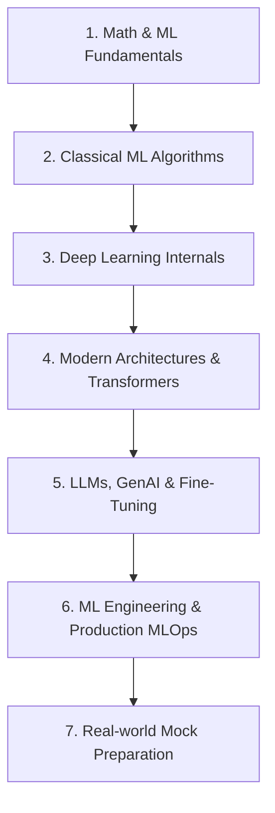

# 🤖 Machine Learning (ML) Interview Preparation Guide 2026–2027

Welcome to the ultimate **Machine Learning (ML)** interview preparation guide. This repository provides a complete, structured roadmap for mastering Machine Learning interviews across Big Tech (FAANG), AI research labs (OpenAI, Anthropic, DeepMind), unicorns, and top product companies.

---

## 📌 Table of Contents

1. [Subject Overview](#subject-overview)
2. [Why Companies Test Machine Learning](#why-companies-test-machine-learning)
3. [Interview Roles & Expectations](#interview-roles--expectations)
4. [Prerequisites](#prerequisites)
5. [Structured Learning Roadmap](#structured-learning-roadmap)
6. [Time Required & Study Strategy](#time-required--study-strategy)
7. [Recommended Study Order](#recommended-study-order)
8. [How to Use This Folder](#how-to-use-this-folder)

---

## 🌐 Subject Overview

Machine Learning in 2026–2027 spans classical statistical learning, deep learning internals, MLOps, and Large Language Models / Generative AI. Modern ML interviewers look for candidates who combine theoretical mathematical rigor with real-world engineering intuition.

Key domain pillars covered in this guide:
- **Classical ML**: Linear/Logistic Regression, Decision Trees, SVMs, Naive Bayes, K-Means, PCA, Random Forests, XGBoost.
- **Deep Learning**: Perceptrons, Backpropagation, CNNs, RNNs, LSTMs, Attention Mechanisms, Transformers.
- **Generative AI & LLMs**: Transformer architecture, Self-Attention, Fine-tuning (LoRA/QLoRA), RAG, Prompting, RLHF/DPO.
- **ML Engineering & System Design**: Feature Engineering, Model Evaluation, Data Drift, Pipeline Design, Model Quantization, Serving & Latency optimization.

---

## 🎯 Why Companies Test Machine Learning

Leading technology companies rely on Machine Learning to power core products—from search ranking and recommendation feeds to autonomous driving and foundation models. Interviewers evaluate candidates to ensure they can:

1. **Build Robust Models**: Avoid overfitting, data leakage, and improper evaluation metrics.
2. **Scale Algorithms**: Understand space/time complexity, matrix operations, and GPU parallel processing.
3. **Debug Training Pipelines**: Diagnose vanishing gradients, loss spikes, NaNs, and class imbalance.
4. **Deploy & Maintain**: Ensure low latency, model stability, and continuous retraining in production environments.

---

## 👔 Interview Roles & Expectations

| Role | Primary Focus | Key Interview Topics |
|------|---------------|----------------------|
| **ML Engineer (MLE)** | Production pipelines, ML infrastructure, scalable serving | Data pipelines, PyTorch/ONNX, Docker, model optimization, system design |
| **Applied Scientist (AS)** | Model prototyping, algorithmic improvement, experimentation | Mathematics, statistical modeling, custom architectures, A/B testing |
| **Research Scientist (RS)** | Novel architectures, fundamental AI advancements | Deep math derivations, paper comprehension, loss formulation, foundation models |
| **Data Scientist (DS)** | Business insights, statistical inference, feature engineering | SQL, exploratory data analysis, hypothesis testing, baseline ML algorithms |

---

## 🛠️ Prerequisites

Before diving into this guide, candidates should have foundational knowledge of:

- **Mathematics**: Linear Algebra (matrices, eigenvectors, dot products), Calculus (partial derivatives, gradients, chain rule), Probability & Statistics (Bayes' theorem, distributions, expectation).
- **Programming**: Python (NumPy, Pandas, PyTorch or TensorFlow, Scikit-learn).
- **Data Structures & Algorithms**: Basic complexity analysis ($O(N)$ space/time), arrays, trees, graphs.

---

## 🗺️ Structured Learning Roadmap

### Roadmap Phases:
1. **Phase 1: Fundamentals (Week 1)**: Loss functions, bias-variance tradeoff, gradient descent variants, regularization (L1/L2), evaluation metrics (Precision, Recall, F1, ROC-AUC).
2. **Phase 2: Core Algorithms (Week 2)**: Decision trees, bagging & boosting (Random Forest, LightGBM, XGBoost), SVMs, clustering, dimensionality reduction (PCA).
3. **Phase 3: Deep Learning (Week 3)**: Multi-layer perceptrons, backprop derivations, activation functions, CNNs, LSTMs, Batch Normalization, Dropout.
4. **Phase 4: Transformers & GenAI (Week 4)**: Self-attention, multi-head attention, Transformers, LLM fine-tuning (LoRA, QLoRA), RAG architectures.
5. **Phase 5: Practice & System Design (Week 5–6)**: Hands-on PyTorch coding, debugging training loops, real company interview questions.

---

## ⏱️ Time Required & Study Strategy

- **Total Recommended Time**: 4 to 6 weeks (10–15 hours per week).
- **Accelerated Preparation (1–2 weeks)**: Focus heavily on `Cheat_Sheet.md` and `Top_Questions.md`.
- **Deep Study (4+ weeks)**: Go through all 7 files sequentially, solving code implementations in `Practice_Questions.md`.

---

## 📂 Recommended Study Order

To maximize retention and interview performance, follow this exact sequence:

1. 📖 **[README.md](file:///S:/Interview_Guide/ML/README.md)**: High-level orientation and study plan.
2. 📘 **[Interview_Guide.md](file:///S:/Interview_Guide/ML/Interview_Guide.md)**: Structured progression across Beginner, Intermediate, and Advanced topics.
3. ⚡ **[Cheat_Sheet.md](file:///S:/Interview_Guide/ML/Cheat_Sheet.md)**: Formula revision, comparison tables, and code snippets.
4. ❓ **[Top_Questions.md](file:///S:/Interview_Guide/ML/Top_Questions.md)**: Detailed answers to 40+ high-frequency interview questions.
5. 🏢 **[Company_Questions.md](file:///S:/Interview_Guide/ML/Company_Questions.md)**: Industry-specific hiring patterns (Google, Meta, Amazon, OpenAI, Uber).
6. ✏️ **[Practice_Questions.md](file:///S:/Interview_Guide/ML/Practice_Questions.md)**: Practical coding from scratch, output prediction, and scenario problems.
7. 📚 **[Resources.md](file:///S:/Interview_Guide/ML/Resources.md)**: Books, courses, YouTube channels, and official documentation.

---

## 💡 How to Use This Folder

- **For Quick Revision**: Read [Cheat_Sheet.md](file:///S:/Interview_Guide/ML/Cheat_Sheet.md) before your interview round.
- **For Coding Rounds**: Practice implementing algorithms (Self-Attention, K-Means, SGD, Softmax) in [Practice_Questions.md](file:///S:/Interview_Guide/ML/Practice_Questions.md).
- **For Behavioral/System Design**: Review company-specific patterns in [Company_Questions.md](file:///S:/Interview_Guide/ML/Company_Questions.md).
