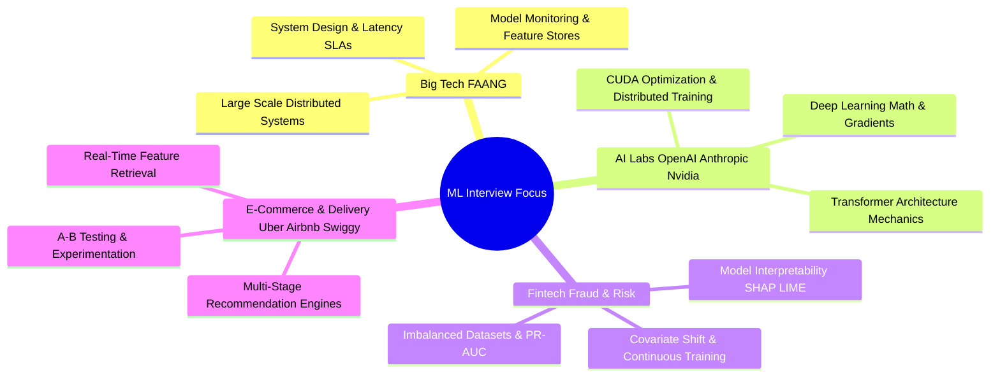

# 🏢 Company-Specific Machine Learning Interview Patterns

This curated guide analyzes the recurring hiring patterns, interview themes, and core expectations across **Big Tech (FAANG)**, **AI Research Labs**, **Fintech Unicorns**, and **Product Companies**.

---

## 📌 Company Categories & Focus Themes



---

## 1. Big Tech (Google, Meta, Amazon, Microsoft, Apple)

### Pattern 1: Scalable ML System Design & Ranking Architectures
- **Commonly Asked By**: Google, Meta, Amazon, Apple.
- **Why This Question Matters**: Tests candidate ability to architect end-to-end ML systems handling hundreds of millions of daily active users under strict sub-50ms latency SLAs.

#### Representative Question: "Design the Video Recommendation System for YouTube / Reels."
- **Expected Answer**:
  1. **Candidate Generation (Retrieval)**: Fast filtering of millions of videos down to ~500 items using Dual-Encoder / Two-Tower Neural Networks or ANN Vector Search (HNSW / ScaNN).
  2. **Heavy Ranking**: Deep Neural Network or Gradient Boosted Decision Tree (XGBoost) scoring candidates on multi-task objectives: $P(\text{click}), P(\text{watch\_time\_>\_30s}), P(\text{like})$.
  3. **Re-Ranking & Diversity**: Applies business logic, deduplication, fresh content insertion, and calibration.

```
Millions of Videos ──► [Two-Tower Neural Retrieval] ──► Top 500 ──► [Multi-Task Ranking Network] ──► Top 50 ──► [Diversity & Rules] ──► User Feed
```

- **Follow-up Questions**:
  - *How do you handle cold-start videos with zero historical engagement?* Incorporate content-based embeddings (video title, thumbnail ViT embeddings, channel metadata) into retrieval models.
  - *How do you prevent popularity bias?* Apply positional bias discounting and sample weighting during loss computation.
- **Interview Tip**: Always discuss offline metrics (NDCG, MAP) alongside online business metrics (CTR, Watch Time, 7-day retention)!

---

### Pattern 2: Fundamental Math & Loss Function Derivations
- **Commonly Asked By**: Google Research, Meta FAIR, Microsoft Research.
- **Why This Question Matters**: Ensures candidates understand underlying optimization principles without treating frameworks as black boxes.

#### Representative Question: "Derive the loss function for Support Vector Machines (Hinge Loss) and explain the role of soft margins."
- **Expected Answer**:
  - SVM maximizes margin $\frac{2}{\|w\|}$, equivalent to minimizing $\frac{1}{2}\|w\|^2$.
  - Soft margin allows slack variables $\xi_i \ge 0$ for non-linearly separable data:
    $$\min_{w, b, \xi} \frac{1}{2}\|w\|^2 + C \sum_{i=1}^N \xi_i \quad \text{s.t. } y_i(w^T x_i + b) \ge 1 - \xi_i$$
  - Reformulated as unconstrained **Hinge Loss**:
    $$\mathcal{L}(w, b) = \frac{1}{2}\|w\|^2 + C \sum_{i=1}^N \max\left(0, 1 - y_i(w^T x_i + b)\right)$$
- **Interview Tip**: Emphasize how $C$ controls the bias-variance tradeoff ($C \to \infty$ enforces hard margin / high variance; small $C$ allows margins violations / high bias).

---

## 2. AI Research Labs & Foundation Model Companies (OpenAI, Anthropic, Databricks, Nvidia)

### Pattern 1: Transformer & Attention Mechanism Internals
- **Commonly Asked By**: OpenAI, Anthropic, Nvidia, Databricks.
- **Why This Question Matters**: Essential for candidates building, fine-tuning, or optimizing foundation models and GPU kernels.

#### Representative Question: "Explain FlashAttention and why standard self-attention has high memory complexity."
- **Expected Answer**:
  - Standard Self-Attention computes $S = Q K^T \in \mathbb{R}^{N \times N}$ and $P = \text{softmax}(S) \in \mathbb{R}^{N \times N}$, requiring $O(N^2)$ High-Bandwidth Memory (HBM) reads/writes, making long sequence lengths bottlenecked by memory bandwidth (IO-bound) rather than compute.
  - **FlashAttention**: Computes exact self-attention using **Tiling** and **Online Softmax**. It loads blocks of $Q, K, V$ into fast GPU High-Speed SRAM, computes attention incrementally without storing intermediate $N \times N$ attention matrices to HBM, reducing memory complexity from $O(N^2)$ to $O(N)$ and achieving $2\times - 4\times$ wall-clock speedups.

```
Standard Attention:   GPU HBM (Slow)  ◄────── Reads/Writes N×N Matrix ──────► GPU SRAM
FlashAttention:       GPU HBM (Slow)  ◄────── Blocks of Q, K, V Tiled ──────► GPU SRAM (Online Softmax)
```

- **Interview Tip**: Distinguish between Compute-bound operations (MatMul) and Memory-bandwidth-bound operations (Softmax, LayerNorm, Elementwise add).

---

### Pattern 2: Distributed Training & Quantization
- **Commonly Asked By**: Nvidia, Databricks, Meta FAIR.
- **Why This Question Matters**: Training 100B+ parameter models requires multi-node distributed parallelization.

#### Representative Question: "Explain Data Parallelism vs Tensor Parallelism vs Pipeline Parallelism."
- **Expected Answer**:
  - **Data Parallelism (DP / DDP)**: Replicates full model across all GPUs; each GPU processes distinct mini-batches and synchronizes gradients via AllReduce. Fails when model size exceeds single GPU VRAM.
  - **Tensor Parallelism (TP - Megatron-LM)**: Splits individual weight matrices (e.g., Column Parallelism in FFN $W_{1}$, Row Parallelism in $W_{2}$) across GPUs within the same node using fast NVLink.
  - **Pipeline Parallelism (PP - GPipe)**: Partitions sequential model layers across different GPU nodes in a pipeline stage. Micro-batching reduces pipeline bubble idle time.
  - **ZeRO (Zero Redundancy Optimizer - DeepSpeed)**: Shards optimizer states (Stage 1), gradients (Stage 2), and model parameters (Stage 3) across data-parallel processes.

---

## 3. Fintech & Fraud Detection (Stripe, Razorpay, Paypal, Block)

### Pattern 1: Severe Imbalance & Model Interpretability
- **Commonly Asked By**: Stripe, Razorpay, PayPal.
- **Why This Question Matters**: Financial models require strict auditing, low false positive rates, and high explainability for compliance.

#### Representative Question: "How do you build a real-time Fraud Detection model where only 0.01% of transactions are fraudulent?"
- **Expected Answer**:
  1. **Metric Selection**: Reject Accuracy and ROC-AUC. Use **PR-AUC (Precision-Recall AUC)** and evaluate Precision at top 0.1% recall cutoff.
  2. **Sampling & Loss**: Train with Focal Loss or Class Weighting. Avoid aggressive undersampling that destroys real transaction distribution.
  3. **Interpretability**: Use **SHAP (SHapley Additive exPlanations)** values based on cooperative game theory to provide exact local feature attributions required by financial regulatory compliance.

```python
import shap
# SHAP explanation for individual model prediction
explainer = shap.TreeExplainer(xgboost_model)
shap_values = explainer.shap_values(X_test)
shap.force_plot(explainer.expected_value, shap_values[0,:], X_test.iloc[0,:])
```

- **Interview Tip**: Always discuss operational risk—a false positive locks a legitimate user's credit card during travel!

---

## 4. On-Demand & Logistics (Uber, Airbnb, Swiggy, Zomato)

### Pattern 1: Dynamic Pricing & Spatio-Temporal ML
- **Commonly Asked By**: Uber, Airbnb, Swiggy, Zomato.
- **Why This Question Matters**: Real-world physical operations require modeling spatio-temporal features and dynamic demand supply equilibrium.

#### Representative Question: "How would you model dynamic surge pricing or ETA prediction for food delivery?"
- **Expected Answer**:
  - **Feature Engineering**: Geohash spatial embeddings (H3 grid indexing), historical traffic metrics, driver availability, restaurant prep latency, weather conditions.
  - **Model Architecture**: Gradient Boosted Trees (XGBoost / LightGBM) for tabular features combined with Deep Learning for spatial/graph embeddings.
  - **Online Serving**: Low-latency feature store (Feast / Tecton) caching rolling aggregations (e.g., `orders_last_10_mins_in_geohash`) using Redis.
