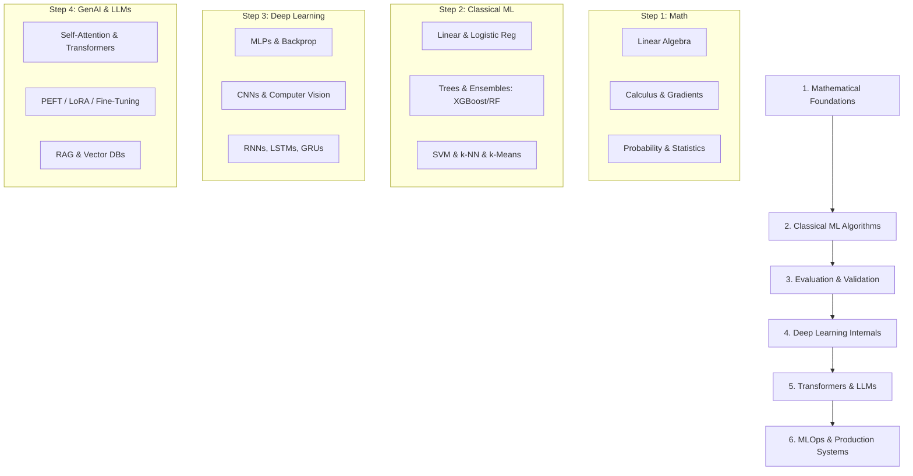

# 🤖 Machine Learning Interview Preparation Guide (2026–2027)

> **Curated by Senior AI Engineers, ML Researchers, and Technical Interviewers**

Welcome to the **Machine Learning Interview Preparation Guide**. This subject folder is an exhaustive, highly structured resource designed to help software engineers, machine learning engineers, data scientists, and applied scientists crack top-tier technical interviews at FAANG, AI research labs, fintech unicorns, and leading product companies.

---

## 📌 Overview

Machine Learning (ML) interviewing has undergone a massive transformation. In 2026–2027, top companies evaluate candidates not only on classical algorithmic ML and statistical theory, but heavily on **deep learning internals, foundation models (LLMs/GenAI), vector search, and production ML systems (MLOps)**.

Whether you are targeting **MLE (Machine Learning Engineer)**, **Applied Scientist**, **Data Scientist**, or **Research Scientist** roles, this directory equips you with everything required from fundamental math to production deployment and LLM alignment.

---

## 🎯 Why Companies Ask Machine Learning

1. **Production Value**: Companies process petabytes of data daily and rely on ML models for recommendation, search, fraud detection, pricing, and automation.
2. **System Scalability**: Building a prototype in Jupyter is trivial; deploying, monitoring, and scaling low-latency models requires deep architecture and MLOps knowledge.
3. **Generative AI Era**: Foundation models, Retrieval-Augmented Generation (RAG), and Parameter-Efficient Fine-Tuning (PEFT) are now baseline requirements for modern product teams.
4. **Problem Solving & Rigor**: Interviewers test whether you truly understand optimization, backpropagation, and metric selection—or if you simply call `.fit()` and `.predict()`.

---

## 📊 Interview Weightings & Core Pillars

| Pillar | Focus Areas | Weight |
|:---|:---|:---:|
| **Fundamentals & Intuition** | Bias-Variance, Overfitting/Underfitting, Cross-Validation, Metrics (Precision, Recall, ROC-AUC, F1). | **35%** |
| **Deep Learning & Architectures** | CNNs, LSTMs, Transformers, Self-Attention, Skip Connections, Normalization layers. | **30%** |
| **Practical ML & MLOps** | Feature engineering, Data leakage, Handling imbalanced data, Deployment, Drift monitoring. | **20%** |
| **LLMs & Generative AI** | Fine-Tuning (LoRA/PEFT), RAG, Prompt Engineering, RLHF, Evaluation (Perplexity, BLEU, ROUGE). | **10%** |
| **Math & Optimization** | Gradient Descent variants, Backpropagation derivations, Linear Algebra, Probability & Bayes. | **5%** |

> 💡 **Memory Trick**: **FAME-DL** – **F**undamentals, **A**rchitectures, **M**LOps, **E**valuation, **D**eep **L**earning. The 5 pillars of every modern ML interview.

---

## 🛣️ Learning Roadmap

---

## ⏱️ Recommended Study Timelines

### Fast-Track (2 Weeks - Experienced Engineers)
- **Week 1**: Focus on `Cheat_Sheet.md`, `Top_Questions.md`, and Transformer architecture mechanisms.
- **Week 2**: Practice PyTorch coding questions in `Practice_Questions.md` and review `Company_Questions.md`.

### Standard Preparation (4–6 Weeks)
- **Week 1–2**: Work through `Interview_Guide.md` (Beginner & Intermediate) and master classical ML algorithms.
- **Week 3–4**: Complete Deep Learning, Transformers, and LLM fine-tuning in `Interview_Guide.md` (Advanced).
- **Week 5**: Solve all coding, output prediction, and debugging problems in `Practice_Questions.md`.
- **Week 6**: Complete company-specific patterns in `Company_Questions.md` and conduct mock interviews.

---

## 📁 How to Use This Directory

| File | Purpose | Recommended Use |
|:---|:---|:---|
| **[Interview_Guide.md](file:///s:/Interview_Guide/Machine_Learning/Interview_Guide.md)** | Core theory organized strictly by Beginner, Intermediate, and Advanced tiers. | Read sequentially to build deep domain mastery. |
| **[Cheat_Sheet.md](file:///s:/Interview_Guide/Machine_Learning/Cheat_Sheet.md)** | Formula tables, PyTorch code snippets, comparison matrices, and quick revision notes. | Rapid review 24-48 hours before an interview. |
| **[Top_Questions.md](file:///s:/Interview_Guide/Machine_Learning/Top_Questions.md)** | Top 45+ most asked questions with exhaustive explanations and code examples. | Core interview practice & mental rehearsal. |
| **[Company_Questions.md](file:///s:/Interview_Guide/Machine_Learning/Company_Questions.md)** | Curated questions grouped by company hiring patterns (Google, Meta, OpenAI, Uber, etc.). | Target specific company interview formats. |
| **[Practice_Questions.md](file:///s:/Interview_Guide/Machine_Learning/Practice_Questions.md)** | Hands-on coding, debugging, scenario, and output prediction problems with complete solutions. | Test your implementation and debugging skills. |
| **[Resources.md](file:///s:/Interview_Guide/Machine_Learning/Resources.md)** | Hand-picked books, papers, courses, documentation, and repositories. | Deepen knowledge on specific weak areas. |

---

## 🔑 Key Interview Success Principles

- **Never treat algorithms as black boxes**: Be prepared to write gradient descent, custom loss functions, self-attention, or cross-entropy from scratch using NumPy or PyTorch.
- **Focus on Trade-offs**: Every design decision (e.g., L1 vs L2 regularization, Batch Norm vs Layer Norm, RAG vs Fine-tuning) has explicit trade-offs in compute, memory, latency, and accuracy.
- **Tie theory to production**: Interviewers love follow-ups like *"What happens if your dataset is 100x larger?"* or *"How do you detect feature drift in real-time?"*. Always state production considerations!
