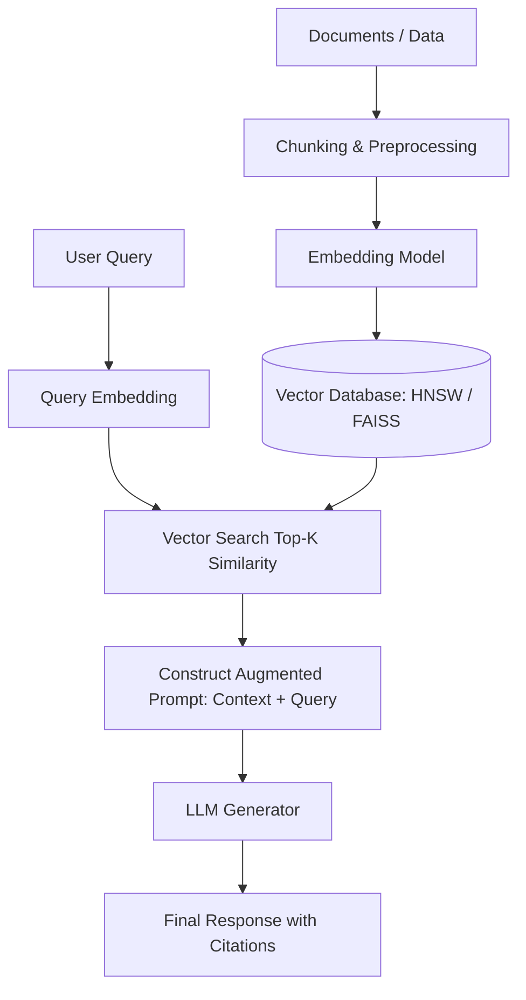

# 🎯 Top Machine Learning Interview Questions & Answers

This document contains 45+ carefully curated, high-frequency Machine Learning interview questions asked across FAANG, AI research labs, fintechs, and top product companies.

---

## 📌 Table of Contents
1. [Core ML & Statistical Fundamentals (Q1 – Q12)](#part-1-core-ml--statistical-fundamentals)
2. [Deep Learning & Neural Architectures (Q13 – Q24)](#part-2-deep-learning--neural-architectures)
3. [LLMs, GenAI & Foundation Models (Q25 – Q35)](#part-3-llms-genai--foundation-models)
4. [Practical ML Engineering & MLOps (Q36 – Q45)](#part-4-practical-ml-engineering--mlops)

---

## Part 1: Core ML & Statistical Fundamentals

### Q1: Explain the Bias-Variance Tradeoff. How do you identify and overcome overfitting?
- **Difficulty**: Medium | **Level**: SDE1/2 / MLE
- **Why Interviewers Ask**: Tests fundamental intuition regarding model generalization and error decomposition.
- **Detailed Answer**:
  Generalization error is composed of $\text{Bias}^2 + \text{Variance} + \text{Irreducible Error}$.
  - **High Bias**: The model is underfitting because it makes simplistic assumptions (e.g., linear regression on non-linear data). Training and validation errors are both high.
  - **High Variance**: The model is overfitting because it memorizes noise in the training set (e.g., deep unpruned decision tree). Training error is near zero, but validation error is high.
- **Overcoming Overfitting**:
  1. Increase training data quantity or apply data augmentation.
  2. Reduce model complexity (e.g., reduce tree depth, reduce neural network layers).
  3. Add Regularization ($L_1/L_2$ penalties, Dropout, Early Stopping).
  4. Use Ensemble techniques (Bagging / Random Forest).
  5. Apply Feature Selection to remove noisy/correlated inputs.
- **Follow-up Questions**:
  - *Does adding more trees to a Random Forest cause overfitting?* No, Random Forest uses bagging, which reduces variance as $N_{\text{trees}}$ increases without increasing bias.
  - *How does gradient boosting behave as tree count increases?* Gradient boosting sequentially fits residuals, so adding too many trees **will** overfit.
- **Interview Tip**: Always draw or explain the training vs validation error curve over model complexity!

---

### Q2: What is the difference between Precision, Recall, F1-Score, and ROC-AUC? When should you use each?
- **Difficulty**: Medium | **Level**: SDE2 / Applied Scientist
- **Why Interviewers Ask**: Evaluates candidate ability to select business-appropriate evaluation metrics, especially for skewed datasets.
- **Detailed Answer**:
  - **Precision**: $\frac{TP}{TP + FP}$. Measures accuracy of positive predictions. Critical when False Positives are expensive (e.g., marking legitimate emails as Spam).
  - **Recall (Sensitivity)**: $\frac{TP}{TP + FN}$. Measures coverage of actual positive instances. Critical when False Negatives are dangerous (e.g., failing to flag medical tumors or financial fraud).
  - **F1-Score**: Harmonic mean of Precision and Recall: $2 \cdot \frac{P \cdot R}{P + R}$. Balance metric when both FP and FN matter.
  - **ROC-AUC**: Plots True Positive Rate ($TP / (TP+FN)$) vs False Positive Rate ($FP / (FP+TN)$) across all classification decision thresholds. Measures overall ranking ability independent of threshold.
- **When to use PR-AUC over ROC-AUC**:
  - In highly imbalanced datasets (e.g., 99.9% negative, 0.1% positive), the False Positive Rate denominator ($TN + FP$) is dominated by huge $TN$, making FPR artificially small. This inflates ROC-AUC. **PR-AUC (Precision-Recall Curve)** focuses strictly on the minority class ($TP$) and provides an accurate evaluation.

---

### Q3: Derive how Gradient Descent updates parameters. Compare SGD, Mini-Batch, and Adam.
- **Difficulty**: Medium | **Level**: SDE2 / MLE
- **Why Interviewers Ask**: Assesses mathematical rigor and optimizer understanding.
- **Detailed Answer**:
  Parameter update rule: $w_{t+1} = w_t - \eta \cdot \nabla_w \mathcal{L}(w_t)$.
  
  ```
  Batch Gradient Descent  ──────► Computes gradient over entire dataset (N samples). Stable, but very slow.
  Stochastic GD (SGD)     ──────► Computes gradient over 1 sample. Fast, noisy updates, helps escape saddle points.
  Mini-Batch GD           ──────► Computes gradient over batch size (B samples e.g., 32, 64). Optimal vectorization & stability.
  ```

  - **Adam Optimizer (Adaptive Moment Estimation)**: Combines Momentum (first moment $m_t$) and RMSprop (second uncentered moment $v_t$):
    $$m_t = \beta_1 m_{t-1} + (1-\beta_1) g_t, \quad v_t = \beta_2 v_{t-1} + (1-\beta_2) g_t^2$$
    Bias-corrected estimates:
    $$\hat{m}_t = \frac{m_t}{1 - \beta_1^t}, \quad \hat{v}_t = \frac{v_t}{1 - \beta_2^t}$$
    Update rule:
    $$w_{t+1} = w_t - \frac{\eta}{\sqrt{\hat{v}_t} + \epsilon} \hat{m}_t$$

---

### Q4: Prove mathematically why L1 Regularization induces sparse weights while L2 does not.
- **Difficulty**: Hard | **Level**: SDE2 / Senior MLE
- **Why Interviewers Ask**: Tests deep mathematical intuition behind optimization geometry.
- **Detailed Answer**:
  Consider a 2D parameter space $(w_1, w_2)$.
  - **$L_2$ Constraint Space**: Sum of squares $w_1^2 + w_2^2 \le C$ forms a smooth hypersphere (circle). The loss function contours intersect the $L_2$ boundary at arbitrary non-zero points along the arc.
  - **$L_1$ Constraint Space**: Absolute values $|w_1| + |w_2| \le C$ form a rhombus/diamond with sharp corners situated exactly on the coordinate axes ($(C, 0), (-C, 0), (0, C), (0, -C)$). Loss contours are much more likely to intersect the constraint region at one of these sharp corners, forcing one or more parameters to become **exactly zero**.

---

### Q5: How does a Decision Tree handle continuous vs categorical variables? How does pruning prevent overfitting?
- **Difficulty**: Medium | **Level**: SDE1/2
- **Why Interviewers Ask**: Tests core knowledge of non-parametric tree splitting algorithms.
- **Detailed Answer**:
  - **Continuous Variables**: The algorithm sorts feature values in ascending order $[x_1, x_2, \dots, x_n]$, evaluates candidate split points at midpoints $\frac{x_i + x_{i+1}}{2}$, and selects the threshold that maximizes Information Gain / Gini impurity reduction.
  - **Categorical Variables**: Splits categories into subsets. For high cardinality, categories can be ordered by target mean for binary splits.
  - **Pruning**:
    - *Pre-Pruning*: Early stopping based on `max_depth`, `min_samples_split`, or `min_impurity_decrease`.
    - *Post-Pruning (Cost-Complexity Pruning)*: Grows full tree, then minimizes cost function $R_\alpha(T) = R(T) + \alpha |T|$ by collapsing subtrees that provide negligible error reduction relative to subtree size penalty $\alpha |T|$.

---

### Q6: What is Principal Component Analysis (PCA)? How do you derive the principal components?
- **Difficulty**: Medium | **Level**: SDE2 / Applied Scientist
- **Why Interviewers Ask**: Classic linear algebra & dimensionality reduction question.
- **Detailed Answer**:
  PCA projects data onto orthogonal axes that maximize variance (or minimize reconstruction error).
  1. Center dataset $X \in \mathbb{R}^{N \times D}$ by subtracting feature means: $X_c = X - \mu$.
  2. Compute Covariance Matrix: $\Sigma = \frac{1}{N-1} X_c^T X_c$.
  3. Compute Eigenvalues $\lambda_i$ and Eigenvectors $v_i$ of $\Sigma$ via Eigendecomposition or SVD: $\Sigma v_i = \lambda_i v_i$.
  4. Sort eigenvectors in descending order of eigenvalues $\lambda_1 \ge \lambda_2 \ge \dots \ge \lambda_D$.
  5. Select top $k$ eigenvectors to form transformation matrix $W_k \in \mathbb{R}^{D \times k}$. Project data: $X_{\text{pca}} = X_c W_k$.

---

### Q7: How do you handle severely imbalanced datasets? Compare SMOTE, Class Weighting, and Focal Loss.
- **Difficulty**: Medium | **Level**: SDE2 / Senior MLE
- **Why Interviewers Ask**: Real-world ML problems (fraud, anomaly detection, medical diagnosis) are almost always imbalanced.
- **Detailed Answer**:
  1. **Resampling Techniques**:
     - *Random Undersampling*: Fast, but discards valuable majority class data.
     - *SMOTE (Synthetic Minority Over-sampling Technique)*: Creates synthetic samples by interpolating between k-nearest neighbors in minority feature space: $x_{\text{new}} = x_i + \lambda (x_{nn} - x_i)$ where $\lambda \sim U(0,1)$.
  2. **Cost-Sensitive Learning (Class Weights)**: Modifies loss function by multiplying minority class loss by inverse class frequency $\frac{N_{\text{total}}}{N_{\text{class}}}$.
  3. **Focal Loss**: Down-weights easy-to-classify examples, focusing training on hard negatives:
     $$\text{FL}(p_t) = -\alpha_t (1 - p_t)^\gamma \log(p_t)$$
     where $\gamma$ smoothly reduces loss contribution from confident predictions ($p_t \to 1$).

---

### Q8: What is Data Leakage? Give 3 concrete real-world examples and how to prevent them.
- **Difficulty**: Medium | **Level**: SDE2 / MLE
- **Why Interviewers Ask**: Data leakage leads to inflated offline performance that completely fails in production.
- **Detailed Answer**:
  Data leakage occurs when information from outside the training dataset (or future information) is inadvertently used to train a model.
  - **Example 1 (Feature Leakage)**: Including a feature `account_closed_timestamp` when predicting customer churn, which is only populated after churn occurs.
  - **Example 2 (Preprocessing Leakage)**: Performing global min-max scaling, mean imputation, or TF-IDF fit across the full dataset prior to splitting into train/test sets.
  - **Example 3 (Temporal Leakage)**: Using standard random k-fold cross-validation on time-series data instead of Time-Series Split (rolling origin).
  - **Prevention**: Enforce pipeline boundaries (e.g., scikit-learn `Pipeline`), strict temporal splitting, and audit feature creation pipelines against production data availability timelines.

---

## Part 2: Deep Learning & Neural Architectures

### Q9: Describe the Transformer Encoder-Decoder Architecture and Self-Attention Mechanism.
- **Difficulty**: Hard | **Level**: SDE2 / Senior AI Engineer
- **Why Interviewers Ask**: Transformers form the backbone of modern NLP, Vision Transformers (ViT), and LLMs.
- **Detailed Answer**:
  - **Self-Attention**: Computes query-key compatibility scores to weigh value embeddings:
    $$\text{Attention}(Q, K, V) = \text{softmax}\left(\frac{Q K^T}{\sqrt{d_k}}\right) V$$
  - **Encoder Block**: Consists of Multi-Head Self-Attention (MHA) followed by Residual Connection, Layer Normalization, Feed-Forward Network (FFN), and another Residual + LayerNorm.
  - **Decoder Block**: Similar to Encoder but uses **Masked Self-Attention** (prevents attending to future tokens during autoregressive generation) and **Cross-Attention** over Encoder outputs.

---

### Q10: What is the Vanishing / Exploding Gradient Problem? How do ResNets, LSTMs, and Gradient Clipping resolve it?
- **Difficulty**: Hard | **Level**: SDE2 / Senior MLE
- **Why Interviewers Ask**: Deep neural networks suffer from unstable gradient flow during backpropagation through time/layers.
- **Detailed Answer**:
  By the Chain Rule, gradients propagated across $L$ layers involve multiplying weight matrices:
  $$\frac{\partial \mathcal{L}}{\partial W_1} = \frac{\partial \mathcal{L}}{\partial a_L} \prod_{l=2}^{L} \frac{\partial a_l}{\partial a_{l-1}} \frac{\partial a_1}{\partial W_1}$$
  If eigenvalues of layer weights are $< 1$ (or activation derivative like Sigmoid is $< 0.25$), gradients shrink exponentially to zero (**Vanishing Gradient**). If eigenvalues are $> 1$, gradients explode to infinity (`NaN`).
  - **ResNets**: Add residual skip connections $y = F(x) + x$. Gradient $\frac{\partial y}{\partial x} = \frac{\partial F(x)}{\partial x} + 1$. The $+1$ term ensures uninterrupted gradient flow even if $\frac{\partial F(x)}{\partial x} \to 0$.
  - **LSTMs**: Maintain an additive **Cell State** regulated by forget and input gates, preventing multiplicative decay.
  - **Gradient Clipping**: Scales gradients if norm exceeds threshold $g \leftarrow g \cdot \frac{\text{threshold}}{\|g\|}$ to stop exploding gradients.

---

### Q11: Explain Batch Normalization, Layer Normalization, and Group Normalization.
- **Difficulty**: Hard | **Level**: SDE2 / Senior MLE
- **Why Interviewers Ask**: Normalization layers are critical for deep learning stability and convergence speed.
- **Detailed Answer**:
  - **BatchNorm**: Normalizes across $(N, H, W)$ for each channel $C$ independently. Depends on batch size. Breaks down when batch size is small ($N<4$).
  - **LayerNorm**: Normalizes across $(C, H, W)$ for each individual batch instance $N$ independently. Crucial for sequence/NLP models with variable sequence lengths.
  - **GroupNorm**: Divides feature channels $C$ into $G$ groups and normalizes across $(C/G, H, W)$ per sample. Independent of batch size.

---

### Q12: Why does Dropout work? What is Inverted Dropout?
- **Difficulty**: Medium | **Level**: SDE2
- **Why Interviewers Ask**: Tests regularization mechanics in neural networks.
- **Detailed Answer**:
  - **Mechanism**: Randomly zeroes out activation probabilities $p$ of hidden neurons during each training step. Prevents co-adaptation of features and acts as an implicit ensemble of $2^N$ sub-networks with shared weights.
  - **Inverted Dropout**: Scales active activations by $\frac{1}{1-p}$ during **training** phase:
    ```python
    # Training step
    mask = (torch.rand_like(x) > p).float()
    x = (x * mask) / (1.0 - p) # Scaled during training

    # Test step: No modification needed! x remains unchanged.
    ```
    This eliminates needing to scale weights down by $(1-p)$ during inference.

---

## Part 3: LLMs, GenAI & Foundation Models

### Q13: Explain Retrieval-Augmented Generation (RAG) Architecture and Vector Search.
- **Difficulty**: Hard | **Level**: Senior MLE / AI Architect
- **Why Interviewers Ask**: RAG is the primary industry standard for reducing LLM hallucinations and injecting domain data.
- **Detailed Answer**:
  


  1. **Ingestion**: Documents are split into semantic chunks, embedded via embedding model (e.g., OpenAI `text-embedding-3-large`), and indexed in a Vector Database (Milvus, Pinecone, Qdrant) using approximate nearest neighbors algorithms like **HNSW (Hierarchical Navigable Small World)**.
  2. **Retrieval**: User query is embedded, top-$k$ relevant chunks are retrieved via Cosine Similarity / Dot Product.
  3. **Generation**: Retrieved chunks are prepended as context into the system prompt for the LLM.

---

### Q14: Compare Fine-Tuning Approaches: Full Parameter vs LoRA vs QLoRA vs Prefix Tuning.
- **Difficulty**: Hard | **Level**: Senior MLE / AI Engineer
- **Why Interviewers Ask**: Tests memory-efficiency trade-offs when adapting foundation models.
- **Detailed Answer**:
  - **Full Fine-Tuning**: Updates all $W$ parameters. Resource-intensive (requires $4\times$ model parameter memory for optimizer states).
  - **LoRA (Low-Rank Adaptation)**: Freezes base weight matrix $W_0 \in \mathbb{R}^{d \times k}$ and injects low-rank trainable decomposition matrices $B \cdot A$ ($A \in \mathbb{R}^{r \times k}, B \in \mathbb{R}^{d \times r}, r \ll d$). Reduces memory by $>70\%$.
  - **QLoRA**: Quantizes base model weights $W_0$ to **4-bit NormalFloat (NF4)** precision, keeps low-rank adapters in 16-bit BrainFloating (BF16), and uses Double Quantization + Paged Optimizers to allow fine-tuning 70B models on single consumer GPUs.

---

### Q15: What is Reinforcement Learning from Human Feedback (RLHF)? Explain PPO and DPO.
- **Difficulty**: Hard | **Level**: Staff AI Engineer / Researcher
- **Why Interviewers Ask**: Essential for understanding modern LLM alignment (instruction following & safety).
- **Detailed Answer**:
  - **RLHF Pipeline**:
    1. *Supervised Fine-Tuning (SFT)*: Fine-tune base LLM on high-quality instruction prompts.
    2. *Reward Model (RM) Training*: Collect human preference pairs $(y_w, y_l)$ where $y_w$ is preferred over $y_l$. Train Reward Model to minimize loss $\mathcal{L}_{\text{RM}} = -\log \sigma(r_\theta(x, y_w) - r_\theta(x, y_l))$.
    3. *PPO Reinforcement Learning*: Optimize SFT model policy using Proximal Policy Optimization (PPO) against reward model, constrained by KL-divergence penalty to prevent policy collapse.
  - **Direct Preference Optimization (DPO)**: Eliminates the complex RL loop and separate reward model entirely! Mathematically re-parameterizes the reward function to directly optimize the policy network on preference pairs using standard cross-entropy loss:
    $$\mathcal{L}_{\text{DPO}}(\pi_\theta; \pi_{\text{ref}}) = -\mathbb{E}_{(x, y_w, y_l)} \left[ \log \sigma \left( \beta \log \frac{\pi_\theta(y_w|x)}{\pi_{\text{ref}}(y_w|x)} - \beta \log \frac{\pi_\theta(y_l|x)}{\pi_{\text{ref}}(y_l|x)} \right) \right]$$

---

## Part 4: Practical ML Engineering & MLOps

### Q16: How do you handle Data Drift, Concept Drift, and Covariate Shift in Production?
- **Difficulty**: Hard | **Level**: Senior MLE / MLOps Lead
- **Why Interviewers Ask**: Distinguishes theoretical candidates from engineers with production operational experience.
- **Detailed Answer**:
  - **Covariate Shift**: Input feature distribution $P(X)$ changes over time, but conditional target relationship $P(y|X)$ remains unchanged. *Detection*: Kolmogorov-Smirnov (KS) test, Population Stability Index (PSI).
  - **Concept Drift**: Underlying relationship between features and target $P(y|X)$ changes over time (e.g., consumer behavior shifts post-pandemic). *Detection*: Monitoring rolling prediction error, accuracy degradation.
  - **Mitigation**: Automated retraining pipelines triggered by drift thresholds, online learning with streaming updates, weight decay on historical samples, or shadow model deployments.

---

### Q17: How would you deploy an LLM or Deep Learning model to achieve sub-10ms inference latency?
- **Difficulty**: Hard | **Level**: Senior MLE / AI Infrastructure
- **Why Interviewers Ask**: Production ML demands low latency under strict SLAs.
- **Detailed Answer**:
  1. **Quantization**: Convert weights from FP32/FP16 to INT8/INT4 using post-training quantization (PTQ) or quantization-aware training (QAT), cutting memory bandwidth requirements by $2\times - 4\times$.
  2. **Model Pruning & Distillation**: Compress model architecture by distilling knowledge from large teacher model into smaller student model.
  3. **Optimized Inference Engines**: Export models to **ONNX Runtime**, **TensorRT**, or **vLLM** (utilizing **PagedAttention** for dynamic KV-cache memory allocation).
  4. **Kernel Fusion & Hardware Tuning**: Use CUDA kernel fusion (e.g., **FlashAttention-2**), batch inference dynamically, and deploy on specialized hardware accelerators (Triton Inference Server).
