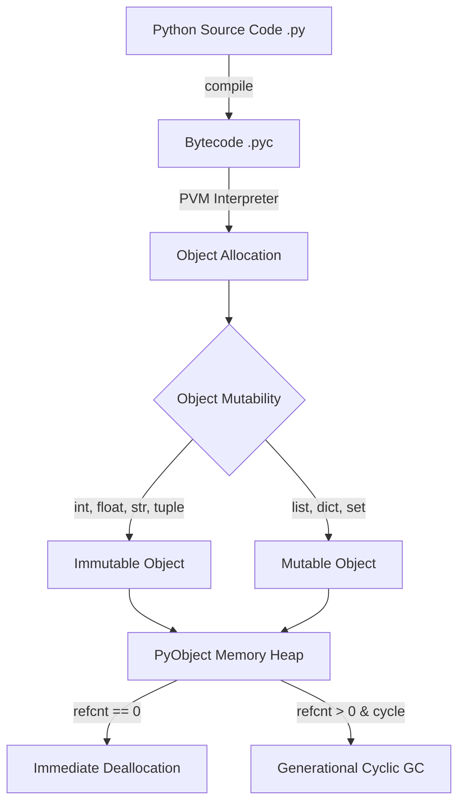
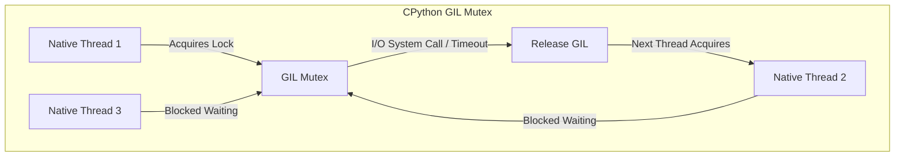
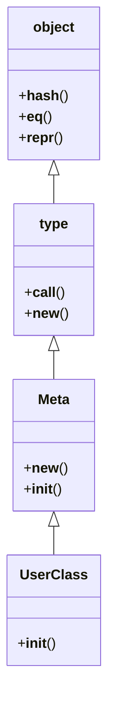

# ⚡ Python Quick Revision Cheat Sheet

A high-density reference sheet designed for 5-minute pre-interview review. Covers core syntax, high-value comparison tables, dunder protocols, concurrency matrices, standard library power tools, time complexities, modern Python 3.8–3.13 syntax, and common pitfall traps.

---

## 🚀 1. Extended Dunder & Protocol Methods Cheat Sheet

| Category | Dunder Method | Trigger Expression | Purpose & Key Detail |
|----------|---------------|-------------------|----------------------|
| **Lifecycle** | `__init__(self, ...)` | `obj = MyClass()` | Instance initializer (returns `None`). |
| | `__new__(cls, ...)` | `obj = MyClass()` | Allocates memory & returns instance. First arg is `cls`. Required for Singletons & Immutable subclassing. |
| | `__del__(self)` | Finalizer | Called when `ob_refcnt == 0`. Avoid for resource cleanup (unreliable due to cyclic GC). |
| **Representation** | `__str__(self)` | `str(obj)`, `print(obj)` | User-friendly string. Defaults to `__repr__` if omitted. |
| | `__repr__(self)` | `repr(obj)`, REPL | Unambiguous developer representation (ideally `eval(repr(x)) == x`). |
| | `__format__(self, spec)` | `f"{obj:spec}"` | Custom string formatting specifier support. |
| **Callable & Container**| `__call__(self, ...)` | `obj(*args)` | Makes object instance callable like a function. |
| | `__getitem__(self, k)` | `obj[k]`, `obj[start:stop]` | Read access via indexing or slicing. |
| | `__setitem__(self, k, v)`| `obj[k] = v` | Write access via indexing or slicing. |
| | `__delitem__(self, k)` | `del obj[k]` | Key / index deletion. |
| | `__len__(self)` | `len(obj)` | Container size (must return non-negative int). |
| | `__contains__(self, item)`| `item in obj` | Membership test ($O(1)$ for set/dict, $O(N)$ for list). |
| **Iteration** | `__iter__(self)` | `iter(obj)`, `for x in obj:`| Returns iterator object defining `__next__`. |
| | `__next__(self)` | `next(it)` | Yields next item; raises `StopIteration` when exhausted. |
| **Context Managers** | `__enter__` / `__exit__` | `with obj as x:` | Sync resource cleanup. `__exit__` returns `True` to suppress exceptions. |
| | `__aenter__` / `__aexit__` | `async with obj as x:` | Async resource cleanup. Coroutines returning enter resource / exit handling. |
| **Comparison & Hash** | `__eq__(self, other)` | `a == b` | Value equality. |
| | `__hash__(self)` | `hash(obj)` | Hash value for dict keys / sets. Must be immutable. Overriding `__eq__` sets `__hash__ = None` unless defined! |
| **Descriptors** | `__get__(self, inst, owner)`| `inst.attr` | Attribute getter in descriptor. |
| | `__set__(self, inst, val)`| `inst.attr = val` | Attribute setter in descriptor (Data Descriptor). |
| | `__set_name__(self, owner, name)`| Class definition | Automatically captures variable name assigned to descriptor in class. |
| **Attribute Lookup**| `__getattr__(self, name)`| `obj.missing_attr` | Invoked **ONLY** if attribute is not found in instance `__dict__` or class hierarchy. |
| | `__getattribute__(self, name)`| `obj.attr` | Intercepts **EVERY** attribute access unconditionally. Must call `super().__getattribute__()`. |
| **Optimization** | `__slots__` | Class attribute | Restricts dynamic attributes, eliminates per-instance `__dict__` RAM (~200 bytes per instance savings). |

---

## ⏱️ 2. Data Structure Time & Space Complexities

| Data Structure | Access | Search | Insert (Push) | Delete (Pop) | Space | Notes / Module |
|----------------|--------|--------|---------------|--------------|-------|----------------|
| **List** (Dynamic Array) | $O(1)$ | $O(n)$ | $O(1)$ amortized append / $O(n)$ at index | $O(1)$ pop end / $O(n)$ pop index | $O(n)$ | Built-in |
| **Deque** (Doubly Linked) | $O(n)$ | $O(n)$ | $O(1)$ left & right | $O(1)$ left & right | $O(n)$ | `collections.deque` |
| **Dict** (Hash Table) | $O(1)$ avg | $O(1)$ avg | $O(1)$ avg insert | $O(1)$ avg delete | $O(n)$ | Insertion-ordered since 3.7 |
| **Set** (Hash Set) | N/A | $O(1)$ avg | $O(1)$ avg insert | $O(1)$ avg delete | $O(n)$ | Unique items only |
| **Heap / Priority Queue** | $O(1)$ min | $O(n)$ | $O(\log n)$ `heappush` | $O(\log n)$ `heappop` | $O(n)$ | `heapq` (Min-heap) |
| **Bisections** | N/A | $O(\log n)$ `bisect` | $O(n)$ (requires list shift) | N/A | $O(1)$ | `bisect` (Sorted array) |

---

## 📊 3. High-Value Comparison Tables

### Table A: Mutable vs Immutable Data Types
| Characteristic | Mutable (`list`, `dict`, `set`, `bytearray`) | Immutable (`int`, `str`, `tuple`, `frozenset`, `bytes`) |
|----------------|---------------------------------------------|--------------------------------------------------------|
| **In-Place Modification** | Supported (`a.append(1)`, `d[k] = v`) | Unsupported (`TypeError`) |
| **Hashability (`__hash__`)** | Not Hashable (cannot be dict keys/set elements) | Hashable (if all contained items are hashable) |
| **Memory Allocation** | Dynamic resizing, higher overhead | Fixed allocation, optimized C memory |
| **Pass-by-Assignment** | Mutations reflect in caller scope | Rebinding creates new object reference |

### Table B: Method Types (`instance` vs `@classmethod` vs `@staticmethod`)
| Dimension | Instance Method | `@classmethod` | `@staticmethod` |
|-----------|-----------------|----------------|-----------------|
| **First Parameter** | `self` (Instance) | `cls` (Class) | None |
| **Access Scope** | Can access instance & class state | Can access class state only | Isolated function in class namespace |
| **Primary Use Case** | Standard state manipulation | Factory methods, alternative constructors | Self-contained helper utilities |

### Table C: Concurrency Models Comparison
| Feature | `threading` | `multiprocessing` | `asyncio` |
|---------|-------------|-------------------|-----------|
| **Execution Architecture** | OS Threads in single process | Multiple OS Processes | Single thread cooperative event loop |
| **GIL Bound?** | **Yes** (Only 1 thread runs bytecode) | **No** (Independent GIL per process) | **Yes** (Single thread execution) |
| **Best For** | I/O-bound tasks (network, disk) | CPU-bound tasks (math, ML) | High-concurrency I/O (10k+ web sockets) |
| **Memory Overhead** | Low (shared memory space) | High (IPC serialization & process overhead)| Minimal (coroutines lightweight) |
| **Data Sharing** | Shared memory (requires locks!) | `Queue`, `Pipe`, `Value`, `Manager` | Shared single-thread state |

### Table D: Object Identity (`is`) vs Equality (`==`)
| Operator | Mechanism | Example Case |
|----------|-----------|--------------|
| `==` | Calls `a.__eq__(b)` | `[1, 2] == [1, 2]` $\rightarrow$ `True` |
| `is` | Compares memory address `id(a) == id(b)` | `[1, 2] is [1, 2]` $\rightarrow$ `False` |

---

## 🛠️ 4. Standard Library Power Utilities Cheat Sheet

### `collections` Module
- `defaultdict(factory)`: Avoids `KeyError` by providing automatic default values (`defaultdict(list)`, `defaultdict(int)`).
- `Counter(iterable)`: Frequency map dictionary with helper `most_common(n)` ($O(k \log n)$).
- `deque(maxlen=N)`: Double-ended queue with $O(1)$ appends/pops on both ends.
- `ChainMap(d1, d2)`: Groups multiple dicts into a single updateable view without merging memory.
- `namedtuple("Point", ["x", "y"])`: Lightweight tuple subclass with field name access.

### `itertools` Module
- `chain(*iterables)`: Flattens multiple iterables into a single continuous stream lazily.
- `islice(iterable, stop)` or `islice(iterable, start, stop, step)`: Slices any generator/iterator lazily without creating a list copy.
- `groupby(iterable, keyfunc)`: Groups consecutive matching elements (requires input to be sorted by `keyfunc` first!).
- `product(*iterables, repeat=1)`: Cartesian product (replaces nested loops).
- `permutations(p, r)` / `combinations(p, r)`: Combinatorial generators.

### `functools` Module
- `@lru_cache(maxsize=128)`: Memoizes function calls with Least Recently Used eviction.
- `@cached_property`: Computes property once per instance and caches result as a normal instance attribute.
- `partial(func, *args, **kwargs)`: Freezes a portion of function arguments, returning a new callable signature.
- `reduce(func, iterable, initializer)`: Repeatedly applies binary function to collapse iterable into a single cumulative value.
- `@singledispatch`: Transforms function into generic function overloading based on first argument type.

---

## 🆕 5. Modern Python Syntax & Features (3.8 – 3.13)

```python
# 1. Walrus Operator := (Assignment Expressions - Python 3.8)
if (n := len(data)) > 10:
    print(f"Data too long: {n} items")

while (block := file.read(256)) != b"":
    process(block)


# 2. Positional-Only (/) and Keyword-Only (*) Parameters (Python 3.8)
def configure(arg1, arg2, /, pos_or_kw, *, kw_only1, kw_only2):
    # arg1, arg2 MUST be passed positionally
    # kw_only1, kw_only2 MUST be passed as keyword arguments
    pass


# 3. Structural Pattern Matching match/case (Python 3.10)
match response:
    case {"status": 200, "data": dict(payload)}:
        handle_payload(payload)
    case {"status": 400 | 404 as code}:
        handle_error(code)
    case _:
        handle_fallback()


# 4. Exception Groups & except* (Python 3.11)
try:
    async with asyncio.TaskGroup() as tg:
        tg.create_task(coro1())
        tg.create_task(coro2())
except* ValueError as eg:
    print("Handled ValueErrors:", eg.exceptions)


# 5. Type Statement & Type Alias (Python 3.12 - PEP 695)
type Point = tuple[float, float]
type Vector[T] = list[T]
```

---

## ⚡ 6. Asyncio Core Cheat Reference

```python
import asyncio

# Coroutine function definition
async def fetch_data(url: str) -> dict:
    await asyncio.sleep(1.0) # Non-blocking sleep!
    return {"url": url, "status": 200}

async def main():
    # 1. Schedule Task concurrently on event loop
    task1 = asyncio.create_task(fetch_data("https://api.com/1"))
    task2 = asyncio.create_task(fetch_data("https://api.com/2"))
    
    # 2. Concurrent execution with gather
    results = await asyncio.gather(task1, task2, return_exceptions=True)
    
    # 3. Modern Structured Concurrency with TaskGroup (Python 3.11+)
    async with asyncio.TaskGroup() as tg:
        t1 = tg.create_task(fetch_data("https://api.com/3"))
        t2 = tg.create_task(fetch_data("https://api.com/4"))
    # Both tasks guaranteed to be finished or cleanly cancelled on exit!

# Run entrypoint
asyncio.run(main())
```

---

## 💡 7. Memory Tricks & Quick Interview Notes

1. **Small Integer Caching**: CPython pre-allocates integer objects from `-5` to `256`.
   - `a = 256; b = 256; a is b` $\rightarrow$ `True`.
   - `a = 257; b = 257; a is b` $\rightarrow$ `False` (in script mode, compiler flags may merge constants in same code block, but distinct runtime allocations yield `False`).
2. **String Interning**: Identical string literals matching identifier syntax (`[a-zA-Z0-9_]*`) are automatically interned by CPython. Forced interning via `sys.intern(s)`.
3. **C3 Linearization MRO Rule**: Method Resolution Order in multiple inheritance.
   - Equation: $L(C(B_1 \dots B_N)) = C + \text{merge}(L(B_1), \dots, L(B_N), B_1 \dots B_N)$.
   - View class MRO via `ClassName.__mro__`.
4. **`__slots__` Memory Advantage**: Defining `__slots__ = ('x', 'y')` skips `__dict__` creation, saving ~200 bytes per object instance.

---

## ⚠️ 8. Production Pitfalls & Common Bugs

```python
# PITFALL 1: Late Binding in Closures
# Bug: Functions print [2, 2, 2] because i is bound at call time!
funcs = [lambda: i for i in range(3)]
print([f() for f in funcs]) # Output: [2, 2, 2]

# Fix: Use default argument to bind variable at definition time
funcs = [lambda i=i: i for i in range(3)]
print([f() for f in funcs]) # Output: [0, 1, 2]


# PITFALL 2: Modifying Tuple with Contained Mutable Elements
t = (1, 2, [3, 4])
try:
    t[2] += [5]
except TypeError:
    pass
# Result: Exception is raised BUT list IS modified! t becomes (1, 2, [3, 4, 5])
# Reason: += evaluates in-place extend on list first, then attempts assignment back to tuple index!


# PITFALL 3: Catching Base Exception vs Specific Exceptions
# WRONG: Swallows KeyboardInterrupt, SystemExit, and obscures bugs
try:
    process()
except Exception as e: # Better than bare `except:` but specify concrete types where possible!
    logger.error(e)


# PITFALL 4: Dict Key Collision between Booleans, Floats, and Integers
# In Python, True == 1 == 1.0 and hash(True) == hash(1) == hash(1.0) == 1
d = {1: "int", True: "bool", 1.0: "float"}
print(len(d)) # Output: 1! Value is "float", key is 1.


# PITFALL 5: Re-raising Exceptions Improperly
try:
    val = int("invalid")
except ValueError as e:
    # WRONG: raise e  <-- Resets traceback to this line!
    # RIGHT: raise    <-- Re-raises original exception preserving full stack trace!
    # RIGHT: raise CustomError() from e <-- Chained exception (sets __cause__)
    raise
```

---

## 📊 10. Mermaid Architecture Diagrams

### Diagram A: Python Bytecode Compilation & Memory Lifecycle


### Diagram B: Global Interpreter Lock (GIL) Execution Model


### Diagram C: Class & Metaclass Object Hierarchy


---

## ⚡ 11. LEGB Scope Resolution Summary

```
+------------------------------------+
| BUILT-IN (len, range, Exception)   |
|  +-------------------------------+ |
|  | GLOBAL (Module-level names)   | |
|  |  +--------------------------+ | |
|  |  | ENCLOSING (nonlocal)     | | |
|  |  |  +---------------------+ | | |
|  |  |  | LOCAL (def / lambda)| | | |
|  |  |  +---------------------+ | | |
|  |  +--------------------------+ | |
|  +-------------------------------+ |
+------------------------------------+
```
*Variables marked `global x` bind to GLOBAL scope. Variables marked `nonlocal x` bind to nearest ENCLOSING scope.*


