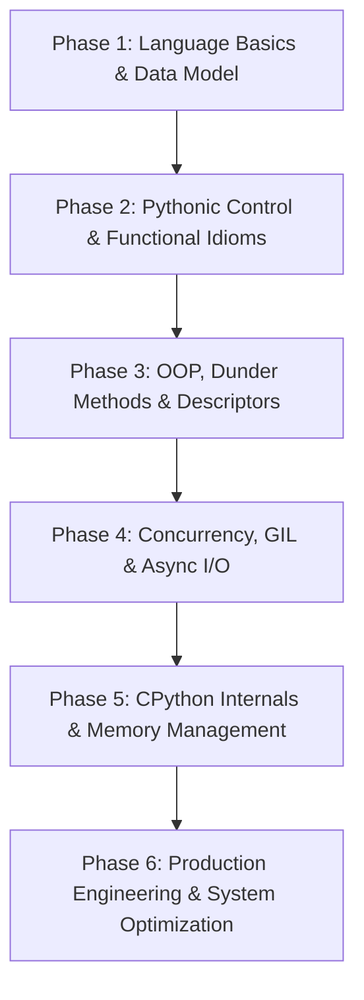

# 🐍 Python Interview Preparation Guide (2026–2027)

Welcome to the definitive, production-grade Python Interview Preparation repository. Curated by senior engineers, staff architects, and technical interviewers from top product companies (FAANG, FinTech, Unicorns, and AI Infrastructure labs), this guide prepares software engineers (SDE-1 to Staff+), backend developers, data engineers, and AI practitioners for modern Python technical interviews.

---

## 📌 Subject Overview

Python in 2026–2027 is far more than a rapid prototyping or scripting language. It serves as the primary backend architecture for high-scale platforms (Instagram, Spotify, Stripe, Dropbox, Netflix), the foundational interface for modern Machine Learning and AI infrastructure (PyTorch, Hugging Face, vLLM, LangChain), and a primary tool for Data Engineering and DevOps automation.

Modern technical interviews evaluate Python candidates not just on syntax, but on **deep language internals**, **CPython memory management**, **concurrency models (GIL vs multiprocessing vs asyncio)**, **data model (`__dunder__` execution)**, **type hinting (PEP 484/585)**, and **production performance profiling**.

---

## 🎯 Why Companies Ask Python

1. **Object Model & Internals Mastery**: Python's dynamic object model relies on reference counting, type objects, descriptors, and dynamic method resolution. Candidates who understand `__dunder__` protocols and memory layout write safer, faster code.
2. **Concurrency & Execution Mechanics**: Understanding the Global Interpreter Lock (GIL), non-blocking event loops (`asyncio`), and process isolation is critical for scaling backend microservices and data pipelines.
3. **Pythonic & Functional Idioms**: Iterators, generators, decorators, and context managers enable clean abstractions, zero-copy operations, and memory-efficient streaming.
4. **Modern Production Standards**: Production code in 2026+ demands strict static typing (`mypy`), structured error handling, memory profiling, and high-performance C-extensions or zero-copy buffer views (`memoryview`).

---

## 🚀 Interview Importance

Across engineering disciplines, Python knowledge is assessed in distinct interview stages:
- **Coding & Data Structures Rounds**: Evaluating clean, pythonic implementations, proper data structure selection (`deque`, `heapq`, `dict`), and time/space efficiency.
- **Python Deep-Dive Rounds**: Probing language mechanics (GIL workarounds, memory leaks, metaclasses, custom decorators, descriptor protocol).
- **System Design & Backend Architecture Rounds**: Designing async event-driven systems, REST/gRPC microservices, background job workers, and database ORM tuning.
- **AI / Data Engineering Infrastructure Rounds**: Memory-mapped I/O, vectorization, zero-copy buffer sharing, and parallel CPU bound execution.

---

## 🛠️ Prerequisites

Before tackling advanced Python interview topics, ensure you understand:
- Basic programming paradigms (procedural, functional, object-oriented).
- Operating System basics (CPU vs I/O bound tasks, process memory layouts, virtual memory, threads vs processes).
- Fundamental data structures (arrays, hash tables, linked lists, binary trees, graphs).

---

## 🗺️ Learning Roadmap

### Phase 1: Language Basics & Data Model (Days 1–3)
- Built-in types, mutability vs immutability, object identity (`id()`, `is` vs `==`).
- Memory allocation fundamentals, small integer caching (-5 to 256), string interning.
- Sequence slicing, comprehensions (list, dict, set, generator expressions).

### Phase 2: Pythonic Control & Functional Idioms (Days 4–7)
- Functions, LEGB variable scoping, closures, `global` vs `nonlocal`.
- Variable arguments (`*args`, `**kwargs`), positional-only and keyword-only parameters.
- Iterators and Generators (`iter()`, `next()`, `yield`, `yield from`, lazy evaluation).
- Decorator mechanics (`functools.wraps`, stateful decorators, parameterized decorators).

### Phase 3: OOP, Dunder Methods & Descriptors (Days 8–12)
- Class mechanics (`__init__` vs `__new__`), `@staticmethod`, `@classmethod`.
- Multiple inheritance, Diamond Problem, MRO, C3 Linearization, `super()` cooperative calls.
- Special dunder methods (`__getitem__`, `__call__`, `__repr__` vs `__str__`, `__slots__`).
- Descriptor protocol (`__get__`, `__set__`, `__set_name__`) and Metaclasses (`type`).

### Phase 4: Concurrency, GIL & Async I/O (Days 13–18)
- Understanding CPython's Global Interpreter Lock (GIL) and its implications.
- `threading` module (I/O bound) vs `multiprocessing` module (CPU bound).
- High-level concurrency with `concurrent.futures` (`ThreadPoolExecutor`, `ProcessPoolExecutor`).
- Modern `asyncio`: Event Loop lifecycle, Coroutines (`async`/`await`), `Tasks`, `Futures`, `asyncio.gather` vs `wait`, non-blocking I/O.

### Phase 5: CPython Internals & Memory Management (Days 19–22)
- Reference counting & Generational Garbage Collector (`gc` module, cyclic reference detection).
- Memory inspection and leaks (`tracemalloc`, `weakref`, `sys.getsizeof`).
- C-Buffer protocol, `memoryview`, and binary protocol handling with `struct`.

### Phase 6: Production Engineering & System Optimization (Days 23–27)
- Type annotations, generic types (`typing`), `Protocol` (structural subtyping).
- Context Managers (`with` statement, `__enter__`/`__exit__`, `contextlib`).
- Profiling (`cProfile`, `line_profiler`) and micro-benchmarking (`timeit`).
- Testing (`pytest`, mocking, fixtures) and clean packaging (`pyproject.toml`).

---

## ⏱️ Time Required

- **Freshers / Junior Engineers (0–2 YOE)**: ~20 to 25 hours over 2–3 weeks. Focus on Phases 1–3 and core data structures.
- **Mid-Level Engineers (2–5 YOE)**: ~35 to 40 hours over 3–4 weeks. Focus on Phases 2–5, concurrency, decorators, and system design patterns.
- **Senior / Staff Engineers (5+ YOE)**: ~50+ hours over 4–5 weeks. Exhaustive deep-dive into Phases 3–6, CPython memory internals, async architectures, and performance tuning.

---

## 📖 Recommended Study Order

To maximize interview retention and practical mastery, follow this order:

1. **[Interview_Guide.md](file:///s:/Interview_Guide/Python/Interview_Guide.md)**: Conceptual breakdown structured by experience level (Beginner → Intermediate → Advanced).
2. **[Cheat_Sheet.md](file:///s:/Interview_Guide/Python/Cheat_Sheet.md)**: Keep open for rapid revision of dunder methods, syntax, memory tricks, and comparison matrices.
3. **[Top_Questions.md](file:///s:/Interview_Guide/Python/Top_Questions.md)**: Master 45+ highly repeated technical interview questions with complete solutions and follow-ups.
4. **[Company_Questions.md](file:///s:/Interview_Guide/Python/Company_Questions.md)**: Study real-world questions categorized by hiring patterns at FAANG, Unicorns, and FinTech.
5. **[Practice_Questions.md](file:///s:/Interview_Guide/Python/Practice_Questions.md)**: Test your skills across 8 problem categories (coding, debugging, output prediction, scenarios).
6. **[Resources.md](file:///s:/Interview_Guide/Python/Resources.md)**: Deepen your understanding with top books, official PEP documentation, and interactive practice platforms.

---

## 📂 How to Use This Folder

- **Daily Practice**: Resolve 3–5 questions daily from [Practice_Questions.md](file:///s:/Interview_Guide/Python/Practice_Questions.md) and verify your solution against [Top_Questions.md](file:///s:/Interview_Guide/Python/Top_Questions.md).
- **Pre-Interview Revision**: Spend 15 minutes reviewing [Cheat_Sheet.md](file:///s:/Interview_Guide/Python/Cheat_Sheet.md) before your interview call.
- **Architectural Refresh**: Study the Advanced section in [Interview_Guide.md](file:///s:/Interview_Guide/Python/Interview_Guide.md) for Senior/Staff design rounds.
