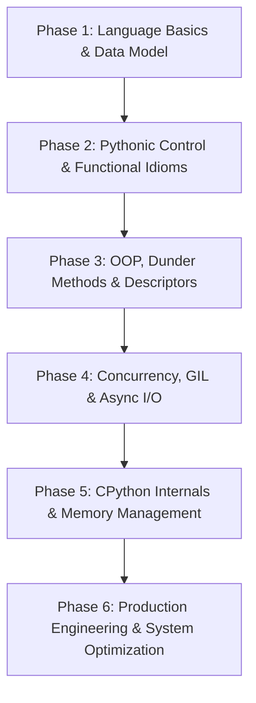

# 🐍 Python Interview Preparation Guide (2026–2027)

Welcome to the ultimate, production-grade **Python Interview Preparation Guide**. Curated by senior engineers, staff architects, and technical interviewers from top product companies (FAANG, FinTech, Unicorns, and AI Infrastructure labs), this repository prepares software engineers (SDE-1 to Staff+), backend developers, data engineers, and AI/ML practitioners for modern Python technical interviews.

---

## 📌 Subject Overview & 2026–2027 Trends

Python in 2026–2027 is far more than a rapid prototyping or scripting language. It serves as the primary backend architecture for high-scale platforms (Instagram, Spotify, Stripe, Dropbox, Netflix), the foundational interface for modern Machine Learning and AI infrastructure (PyTorch, Hugging Face, vLLM, LangChain), and a primary tool for Data Engineering and DevOps automation.

Modern technical interviews evaluate Python candidates not just on syntax, but on **deep CPython language internals**, **memory management (PyObject, reference counting, generational GC)**, **concurrency models (GIL vs multiprocessing vs asyncio)**, **data model (`__dunder__` execution)**, **type hinting (PEP 484/585/695)**, and **production performance profiling**.

---

## 🗺️ Master Index of All 20 Guide Sections

Every topic and section from the prep syllabus is mapped across the 7 files in this folder:

| Section | Topic Title | Target File |
|---------|-------------|-------------|
| **1** | [Trends & Mindset for Python Interviews (2026–2027)](file:///s:/Interview_Guide/Python/Interview_Guide.md#trends--mindset-for-python-interviews-20262027) | `Interview_Guide.md` |
| **2** | [Top 25 Most Repeated Questions](file:///s:/Interview_Guide/Python/Top_Questions.md#top-25-most-repeated-questions) | `Top_Questions.md` |
| **3** | [Top 50 Most Difficult Questions](file:///s:/Interview_Guide/Python/Top_Questions.md#top-50-most-difficult-questions) | `Top_Questions.md` |
| **4** | [Top 50 Most Tricky Questions](file:///s:/Interview_Guide/Python/Practice_Questions.md#7-output-prediction-questions-50) | `Practice_Questions.md` |
| **5** | [Top 50 Must-Know Questions](file:///s:/Interview_Guide/Python/Top_Questions.md#top-50-must-know-questions) | `Top_Questions.md` |
| **6** | [Top 50 Frequently Rejected Questions](file:///s:/Interview_Guide/Python/Company_Questions.md#top-50-frequently-rejected-questions) | `Company_Questions.md` |
| **7** | [Top 50 Questions That Differentiate Top Candidates](file:///s:/Interview_Guide/Python/Top_Questions.md#top-50-differentiating-questions) | `Top_Questions.md` |
| **8** | [Theory Questions (150+)](file:///s:/Interview_Guide/Python/Practice_Questions.md#1-theory-questions-150) | `Practice_Questions.md` |
| **9** | [Coding Questions (100+)](file:///s:/Interview_Guide/Python/Practice_Questions.md#2-coding-questions-100) | `Practice_Questions.md` |
| **10** | [MCQs (100+)](file:///s:/Interview_Guide/Python/Practice_Questions.md#3-multiple-choice-questions-100) | `Practice_Questions.md` |
| **11** | [Scenario Questions (75+)](file:///s:/Interview_Guide/Python/Practice_Questions.md#4-scenario-questions-75) | `Practice_Questions.md` |
| **12** | [Production Problems (50+)](file:///s:/Interview_Guide/Python/Practice_Questions.md#5-production-problems-50) | `Practice_Questions.md` |
| **13** | [Debugging Problems (50+)](file:///s:/Interview_Guide/Python/Practice_Questions.md#6-debugging-problems-50) | `Practice_Questions.md` |
| **14** | [Output Prediction Questions (50+)](file:///s:/Interview_Guide/Python/Practice_Questions.md#7-output-prediction-questions-50) | `Practice_Questions.md` |
| **15** | [Best Practices Questions (50+)](file:///s:/Interview_Guide/Python/Practice_Questions.md#8-best-practices-questions-50) | `Practice_Questions.md` |
| **16** | [Optimization Questions (50+)](file:///s:/Interview_Guide/Python/Practice_Questions.md#9-optimization-questions-50) | `Practice_Questions.md` |
| **17** | [Advanced Questions (50+)](file:///s:/Interview_Guide/Python/Practice_Questions.md#10-advanced-questions-50) | `Practice_Questions.md` |
| **18** | [Cheat Sheets & Quick Revision](file:///s:/Interview_Guide/Python/Cheat_Sheet.md) | `Cheat_Sheet.md` |
| **19** | [Mermaid Architecture Diagrams](file:///s:/Interview_Guide/Python/Cheat_Sheet.md#10-mermaid-architecture-diagrams) | `Cheat_Sheet.md` |
| **20** | [Interview Day Strategy](file:///s:/Interview_Guide/Python/Interview_Guide.md#interview-day-strategy) | `Interview_Guide.md` |

---

## 🛠️ Learning Roadmap

### Phase 1: Language Basics & Data Model (Days 1–3)
- Built-in types, mutability vs immutability, object identity (`id()`, `is` vs `==`).
- Memory allocation fundamentals, small integer caching (-5 to 256), string interning.
- Sequence slicing, comprehensions (list, dict, set, generator expressions).

### Phase 2: Pythonic Control & Functional Idioms (Days 4–7)
- Functions, LEGB variable scoping, closures, `global` vs `nonlocal`.
- Variable arguments (`*args`, `**kwargs`), positional-only and keyword-only parameters.
- Iterators and Generators (`iter()`, `next()`, `yield`, `yield from`, lazy evaluation).
- Decorator mechanics (`functools.wraps`, stateful decorators, parameterized decorators).

### Phase 3: OOP, Dunder Methods & Descriptors (Days 8–12)
- Class mechanics (`__init__` vs `__new__`), `@staticmethod`, `@classmethod`.
- Multiple inheritance, Diamond Problem, MRO, C3 Linearization, `super()` cooperative calls.
- Special dunder methods (`__getitem__`, `__call__`, `__repr__` vs `__str__`, `__slots__`).
- Descriptor protocol (`__get__`, `__set__`, `__set_name__`) and Metaclasses (`type`).

### Phase 4: Concurrency, GIL & Async I/O (Days 13–18)
- Understanding CPython's Global Interpreter Lock (GIL) and its implications.
- `threading` module (I/O bound) vs `multiprocessing` module (CPU bound).
- High-level concurrency with `concurrent.futures` (`ThreadPoolExecutor`, `ProcessPoolExecutor`).
- Modern `asyncio`: Event Loop lifecycle, Coroutines (`async`/`await`), `Tasks`, `Futures`, `asyncio.gather` vs `wait`, non-blocking I/O.

### Phase 5: CPython Internals & Memory Management (Days 19–22)
- Reference counting & Generational Garbage Collector (`gc` module, cyclic reference detection).
- Memory inspection and leaks (`tracemalloc`, `weakref`, `sys.getsizeof`).
- C-Buffer protocol, `memoryview`, and binary protocol handling with `struct`.

### Phase 6: Production Engineering & System Optimization (Days 23–27)
- Type annotations, generic types (`typing`), `Protocol` (structural subtyping).
- Context Managers (`with` statement, `__enter__`/`__exit__`, `contextlib`).
- Profiling (`cProfile`, `line_profiler`) and micro-benchmarking (`timeit`).
- Testing (`pytest`, mocking, fixtures) and clean packaging (`pyproject.toml`).

---

## ⏱️ Time Required

- **Freshers / Junior Engineers (0–2 YOE)**: ~20 to 25 hours over 2–3 weeks. Focus on Phases 1–3 and core data structures.
- **Mid-Level Engineers (2–5 YOE)**: ~35 to 40 hours over 3–4 weeks. Focus on Phases 2–5, concurrency, decorators, and system design patterns.
- **Senior / Staff Engineers (5+ YOE)**: ~50+ hours over 4–5 weeks. Exhaustive deep-dive into Phases 3–6, CPython memory internals, async architectures, and performance tuning.

---

## 📖 Recommended Study Order

1. **[README.md](file:///s:/Interview_Guide/Python/README.md)**: Overview & Master Index.
2. **[Interview_Guide.md](file:///s:/Interview_Guide/Python/Interview_Guide.md)**: 2026–2027 Trends, Tiered conceptual guide (Beginner $\rightarrow$ Intermediate $\rightarrow$ Advanced), and 10-step Interview Day Strategy.
3. **[Cheat_Sheet.md](file:///s:/Interview_Guide/Python/Cheat_Sheet.md)**: High-density revision tables, dunders, complexities, standard library power tools, modern syntax, memory tricks, and Mermaid diagrams.
4. **[Top_Questions.md](file:///s:/Interview_Guide/Python/Top_Questions.md)**: Top 25 Most Repeated, Top 50 Most Difficult, Top 50 Must-Know, and Top 50 Differentiating questions.
5. **[Company_Questions.md](file:///s:/Interview_Guide/Python/Company_Questions.md)**: Top 50 Frequently Rejected Questions and Company-Inspired Architecture Scenarios.
6. **[Practice_Questions.md](file:///s:/Interview_Guide/Python/Practice_Questions.md)**: 150+ Theory, 100+ Coding, 100+ MCQs, 75+ Scenarios, 50+ Production, 50+ Debugging, 50+ Output Prediction, 50+ Best Practices, 50+ Optimization, and 50+ Advanced Questions.
7. **[Resources.md](file:///s:/Interview_Guide/Python/Resources.md)**: Books, Official Docs, PEPs, YouTube Channels, and Practice Platforms.
