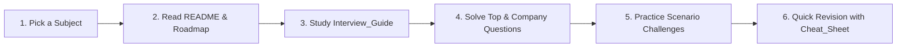

# 🎯 Ultimate Technical Interview Preparation Guide (2026–2027)

[](CONTRIBUTING.md)
[](LICENSE)
[](https://github.com/priyanshu-arya/Interview_Guide)
[](#-repository-structure)

Welcome to the **Ultimate Technical Interview Preparation Repository**. This project is a curated, production-grade open-source resource engineered by senior software engineers, FAANG hiring managers, staff architects, and technical interviewers. 

Our mission is to provide an exhaustive, zero-filler, highly structured preparation guide covering fundamental computer science, software engineering, system design, machine learning, and cutting-edge Generative AI.

---

## 📌 Quick Navigation & Covered Subjects

Each subject in this repository strictly adheres to a standard **7-File Architecture**, providing a comprehensive learning roadmap from fundamental concepts to senior-level architectural discussions and real company patterns.

| Subject | Description | Quick Links |
| :--- | :--- | :--- |
| **🐍 Python** | Core Python, GIL, Memory Management, Decorators, Generators, AsyncIO, OOP, and Profiling | [`Python/`](Python/README.md) • [Guide](Python/Interview_Guide.md) • [Cheat Sheet](Python/Cheat_Sheet.md) • [Top Qs](Python/Top_Questions.md) |
| **🗄️ SQL** | Query Optimization, Indexing (B-Tree/Hash), Joins, Window Functions, CTEs, and Transactions | [`SQL/`](SQL/README.md) • [Guide](SQL/Interview_Guide.md) • [Cheat Sheet](SQL/Cheat_Sheet.md) • [Top Qs](SQL/Top_Questions.md) |
| **💾 DBMS** | Relational Theory, ACID, Storage Engines, Concurrency Control, Lock Manager, WAL, & Sharding | [`DBMS/`](DBMS/README.md) • [Guide](DBMS/Interview_Guide.md) • [Cheat Sheet](DBMS/Cheat_Sheet.md) • [Top Qs](DBMS/Top_Questions.md) |
| **🏗️ System Design** | Scalability, Distributed Systems, CAP Theorem, Load Balancing, Caching, Microservices, & Case Studies | [`System_Design/`](System_Design/README.md) • [Guide](System_Design/Interview_Guide.md) • [Cheat Sheet](System_Design/Cheat_Sheet.md) • [Top Qs](System_Design/Top_Questions.md) |
| **🤖 Machine Learning** | Classical ML, Feature Engineering, Supervised/Unsupervised Models, Deep Learning, & Evaluation | [`ML/`](ML/README.md) • [Guide](ML/Interview_Guide.md) • [Cheat Sheet](ML/Cheat_Sheet.md) • [Top Qs](ML/Top_Questions.md) |
| **🧠 Generative AI** | Transformers, Attention Mechanics, RAG, PEFT/LoRA, Alignment (RLHF/DPO), & Agentic AI | [`Gen_AI/`](Gen_AI/README.md) • [Guide](Gen_AI/Interview_Guide.md) • [Cheat Sheet](Gen_AI/Cheat_Sheet.md) • [Top Qs](Gen_AI/Top_Questions.md) |

---

## 🏛️ Standard Subject Folder Architecture

To ensure consistency, readability, and ease of revision across all domains, every subject folder strictly implements the following structure:

```text
<Subject>/
├── README.md              # Overview, prerequisites, study order, and learning roadmap
├── Interview_Guide.md     # 3-tier deep dive: Beginner, Intermediate, & Advanced production topics
├── Cheat_Sheet.md         # Ultra-fast revision notes, comparison tables, syntax, & memory tricks
├── Top_Questions.md       # 40–60 curated questions with detailed solutions & follow-ups
├── Company_Questions.md   # Real-world hiring patterns from Tier-1 product companies (Google, Meta, etc.)
├── Practice_Questions.md  # Categorized practice problems, debugging, tricky outputs, & scenario challenges
└── Resources.md           # Hand-picked official docs, books, interactive tools, & courses
```

---

## 🗺️ Recommended Learning Roadmap

Whether you have 48 hours or 3 months before your interview loop, follow this study framework:



### ⏱️ Time-Based Prep Strategies
1. **The 30-Minute Pre-Interview Sprint**: Open the target subject's `Cheat_Sheet.md` for fast syntax, memory tricks, and comparison tables.
2. **The 1-Week Targeted Cram**: Focus on `Top_Questions.md` and `Company_Questions.md` to cover recurring interview patterns.
3. **Comprehensive Mastery (3+ Weeks)**: Read `Interview_Guide.md` top-to-bottom, solve all problems in `Practice_Questions.md`, and explore supplementary links in `Resources.md`.

---

## 🤝 Contributing Guidelines

We welcome contributions from engineers, educators, and candidates! Whether you're adding a new subject, improving an existing guide, or sharing recent interview patterns:

- Read our comprehensive **[Contribution Guidelines (CONTRIBUTING.md)](CONTRIBUTING.md)**.
- Ensure any new subject adheres strictly to the **7-File Architecture**.
- Maintain high technical depth, accurate code examples, and zero generic filler.

---

## 📜 License

This repository is licensed under the [MIT License](LICENSE). Feel free to use these resources for personal preparation, teaching, or mentoring.

---

<p center>
  <i>Crafted for engineers, by engineers. Good luck with your interview loops! 🚀</i>
</p>