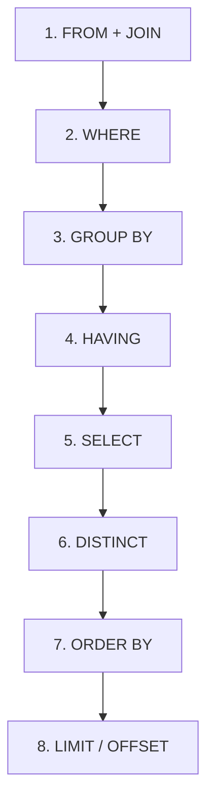
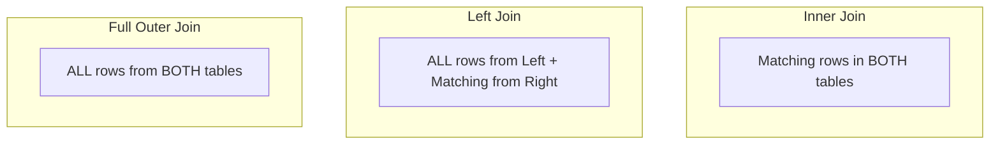
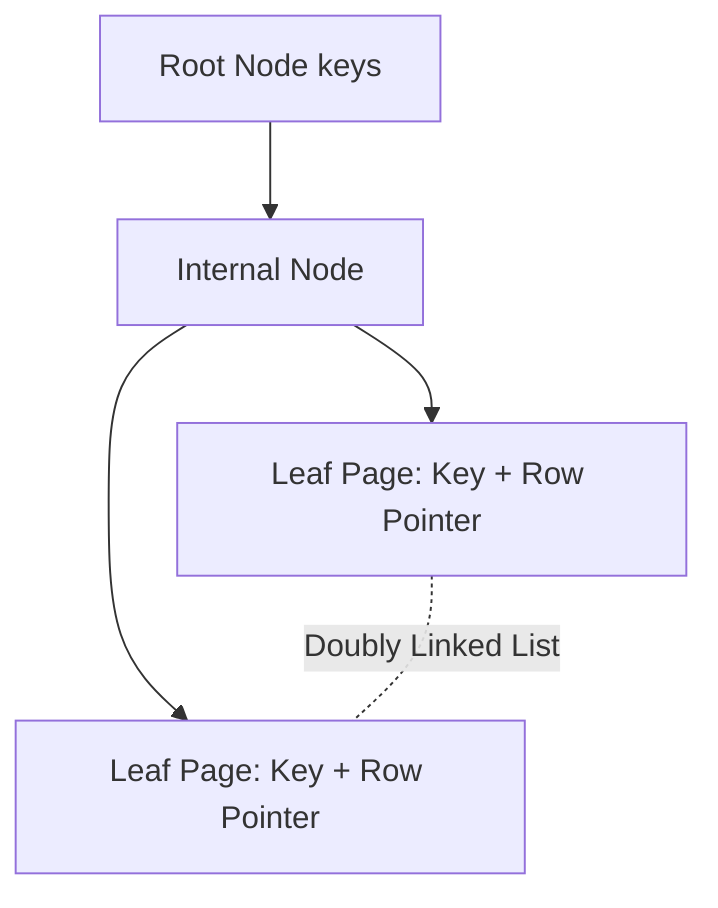

# ⚡ SQL Interview Cheat Sheet (Quick Revision & Diagrams)

Designed for rapid revision within 5–10 minutes before an interview.

---

## 📌 1. Query Execution Order

Memory Trick: **FWGH SLO** (*"From Where Group Having Select Limit Order"*)



---

## 🪟 2. Window Function Cheat Sheet

| Function | Same Values Handle | Gaps in Sequence | Example Output for (100, 100, 90) |
|----------|-------------------|------------------|-----------------------------------|
| `ROW_NUMBER()` | Arbitrary sequential numbering | No gaps | 1, 2, 3 |
| `RANK()` | Same rank for ties | Leaves gaps | 1, 1, 3 |
| `DENSE_RANK()` | Same rank for ties | **No gaps** | 1, 1, 2 |

### Window Frame Specification
```sql
SUM(amount) OVER (
    PARTITION BY user_id 
    ORDER BY transaction_date 
    ROWS BETWEEN UNBOUNDED PRECEDING AND CURRENT ROW
)
```

---

## 🔗 3. Join Types Visualized



---

## 🔒 4. Transaction Isolation Levels & Anomalies


| Isolation Level | Dirty Read | Non-Repeatable Read | Phantom Read | Serialization Anomaly |
|-----------------|------------|---------------------|--------------|-----------------------|
| **Read Uncommitted** | ❌ Allowed | ❌ Allowed | ❌ Allowed | ❌ Allowed |
| **Read Committed** *(Postgres/Oracle)* | ✅ Prevented | ❌ Allowed | ❌ Allowed | ❌ Allowed |
| **Repeatable Read** *(MySQL InnoDB)* | ✅ Prevented | ✅ Prevented | ❌ Allowed* | ❌ Allowed |
| **Serializable** | ✅ Prevented | ✅ Prevented | ✅ Prevented | ✅ Prevented |

*\*Note: MySQL InnoDB prevents phantom reads under Repeatable Read using Next-Key Locks (Gap Locking).*

---

## 🏎️ 5. Index Types at a Glance



| Index Type | Best Used For | Limitation |
|------------|---------------|------------|
| **B-Tree** | Range queries (`<`, `>`), equality (`=`), sorting (`ORDER BY`) | Overhead on high write volume |
| **Hash Index** | Point equality lookups (`=`) | Cannot do range scans or sorting |
| **Covering Index** | Query where ALL projected columns exist in index (`INCLUDE`) | Larger index size, slower writes |
| **GIN / GiST** | JSONB, Full-Text Search, Geospatial | High build and update overhead |

---

## ⚠️ 6. Quick Memory Tricks & SARGable Rules

- **WINDOW**: **W**rite queries, **I**ndexing, **N**ormalization, **D**ebugging, **O**ptimization, **W**indow functions.
- **SARGable Rule**: Never wrap indexed columns inside functions in `WHERE` predicates!
  - ❌ `WHERE YEAR(date_col) = 2026`
  - ✅ `WHERE date_col >= '2026-01-01' AND date_col < '2027-01-01'`
- **Anti-Join Safety**: Prefer `NOT EXISTS` over `NOT IN` to prevent `NULL` evaluation pitfalls.
