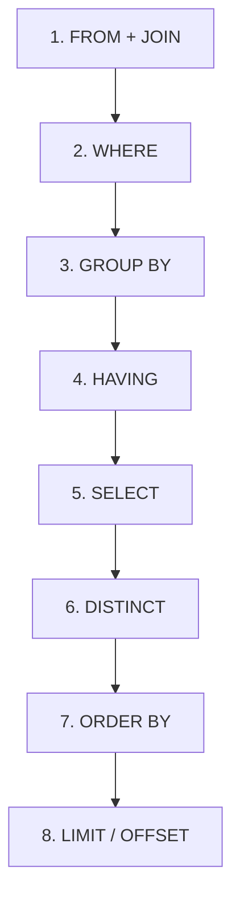
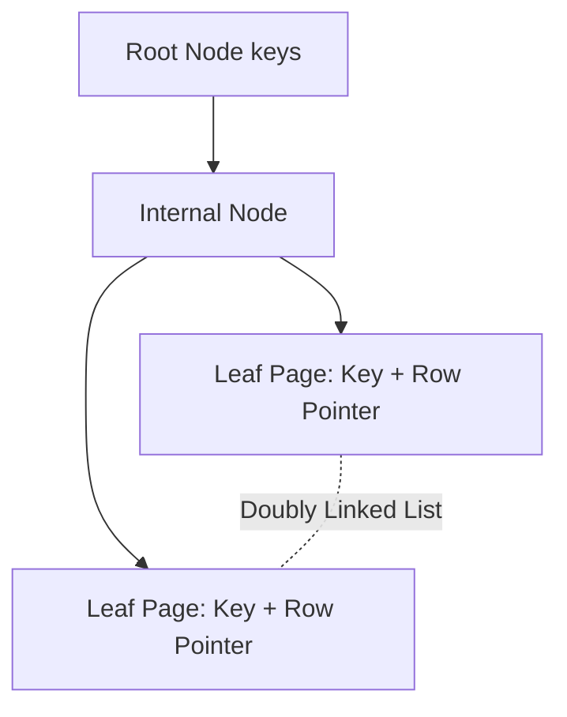

# ⚡ SQL Interview Cheat Sheet (Quick Revision & Diagrams)

Designed for rapid revision within 5–10 minutes before an interview.

---

## 📌 1. Query Execution Order

Memory Trick: **FWGH SLO** (*"From Where Group Having Select Limit Order"*)



---

## 🪟 2. Window Function Cheat Sheet

| Function | Same Values Handle | Gaps in Sequence | Example Output for (100, 100, 90) |
|----------|-------------------|------------------|-----------------------------------|
| `ROW_NUMBER()` | Arbitrary sequential numbering | No gaps | 1, 2, 3 |
| `RANK()` | Same rank for ties | Leaves gaps | 1, 1, 3 |
| `DENSE_RANK()` | Same rank for ties | **No gaps** | 1, 1, 2 |
| `NTILE(n)` | Divides rows into n equal buckets | N/A | Bucket 1, 1, 2 (for NTILE(2)) |
| `LAG(col, n)` | Accesses nth previous row's value | N/A | NULL, 100, 100 |
| `LEAD(col, n)` | Accesses nth next row's value | N/A | 100, 90, NULL |

### Window Frame Specification
```sql
-- Running total (Cumulative Sum)
SUM(amount) OVER (
    PARTITION BY user_id 
    ORDER BY transaction_date 
    ROWS BETWEEN UNBOUNDED PRECEDING AND CURRENT ROW
)

-- Moving 7-day average
AVG(daily_sales) OVER (
    ORDER BY sale_date
    ROWS BETWEEN 6 PRECEDING AND CURRENT ROW
)

-- Top N per Group (use in CTE)
WITH ranked AS (
    SELECT *, DENSE_RANK() OVER (PARTITION BY dept ORDER BY salary DESC) AS rnk
    FROM employees
)
SELECT * FROM ranked WHERE rnk <= 3;
```

---

## 🔗 3. Join Types Visualized

| Join Type | Returns | NULL Fill? |
|-----------|---------|-----------|
| `INNER JOIN` | Rows matching in **both** tables | No |
| `LEFT JOIN` | All rows from **left** + matched from right | Right side NULLs |
| `RIGHT JOIN` | All rows from **right** + matched from left | Left side NULLs |
| `FULL OUTER JOIN` | All rows from **both** tables | Both sides NULLs |
| `CROSS JOIN` | Cartesian product (N × M rows) | No |
| `SELF JOIN` | Table joined to itself | No |

### Anti-Join Pattern (Critical Interview Topic)
```sql
-- Find customers who have NEVER placed an order

-- ✅ Method 1: NOT EXISTS (BEST — safe with NULLs)
SELECT c.customer_id, c.name
FROM customers c
WHERE NOT EXISTS (
    SELECT 1 FROM orders o WHERE o.customer_id = c.customer_id
);

-- ✅ Method 2: LEFT JOIN IS NULL
SELECT c.customer_id, c.name
FROM customers c
LEFT JOIN orders o ON c.customer_id = o.customer_id
WHERE o.customer_id IS NULL;

-- ❌ Method 3: NOT IN — DANGEROUS if subquery returns ANY NULL!
-- NOT IN returns UNKNOWN for all rows when any value in the list is NULL!
SELECT customer_id FROM customers
WHERE customer_id NOT IN (SELECT customer_id FROM orders);  -- BUG if NULLs exist
```

---

## 📝 4. CTE & Recursive CTE Templates

### Standard CTE Syntax
```sql
WITH cte_name AS (
    -- Your query here
    SELECT dept_id, AVG(salary) AS avg_salary
    FROM employees
    GROUP BY dept_id
),
another_cte AS (
    SELECT e.*, c.avg_salary AS dept_avg
    FROM employees e
    JOIN cte_name c ON e.dept_id = c.dept_id
)
SELECT * FROM another_cte WHERE salary > dept_avg;
```

### Recursive CTE Template (Org Chart, Hierarchy)
```sql
WITH RECURSIVE org_chart AS (
    -- 1. Anchor Member: Starting point (CEO / root nodes)
    SELECT emp_id, name, manager_id, 0 AS level
    FROM employees
    WHERE manager_id IS NULL   -- No manager = CEO

    UNION ALL

    -- 2. Recursive Member: Join back to CTE itself
    SELECT e.emp_id, e.name, e.manager_id, oc.level + 1
    FROM employees e
    INNER JOIN org_chart oc ON e.manager_id = oc.emp_id
    -- PostgreSQL: add CYCLE detection with CYCLE emp_id SET is_cycle USING path
)
SELECT emp_id, name, level FROM org_chart ORDER BY level;
```

> [!WARNING]
> Always add a **termination condition** or **MAXRECURSION** limit (SQL Server: `OPTION (MAXRECURSION 100)`) to prevent infinite loops in recursive CTEs.

---

## 🔢 5. Aggregate Functions & NULL Behavior

> [!IMPORTANT]
> **NULL behavior in aggregates is the #1 interview trap**

| Function | NULL Behavior | Example with (10, NULL, 30) |
|----------|--------------|----------------------------|
| `COUNT(*)` | Counts ALL rows including NULLs | 3 |
| `COUNT(col)` | Ignores NULLs | 2 |
| `SUM(col)` | Ignores NULLs | 40 |
| `AVG(col)` | Ignores NULLs — avg = SUM/non-null-count | 20 (not 13.3) |
| `MAX(col)` | Ignores NULLs | 30 |
| `MIN(col)` | Ignores NULLs | 10 |
| `GROUP_CONCAT` / `STRING_AGG` | Ignores NULLs | "10,30" |

```sql
-- Safe division to prevent divide-by-zero
SELECT NULLIF(total_sales, 0) AS safe_division_ready,
       sales / NULLIF(total_orders, 0) AS avg_order_value
FROM summary;

-- Conditional Aggregation (Pivot-style without PIVOT keyword)
SELECT 
    dept_id,
    SUM(CASE WHEN gender = 'M' THEN salary ELSE 0 END) AS male_payroll,
    SUM(CASE WHEN gender = 'F' THEN salary ELSE 0 END) AS female_payroll,
    COUNT(CASE WHEN status = 'active' THEN 1 END)      AS active_count
FROM employees
GROUP BY dept_id;
```

---

## 📅 6. Date & Time Functions Quick Reference

| Function | PostgreSQL | MySQL | SQL Server | Purpose |
|----------|-----------|-------|-----------|---------|
| **Current timestamp** | `NOW()` / `CURRENT_TIMESTAMP` | `NOW()` | `GETDATE()` | Current date + time |
| **Current date only** | `CURRENT_DATE` | `CURDATE()` | `CAST(GETDATE() AS DATE)` | Current date |
| **Date difference** | `date1 - date2` (days) | `DATEDIFF(d1, d2)` | `DATEDIFF(day, d2, d1)` | Days between two dates |
| **Truncate to period** | `DATE_TRUNC('month', ts)` | `DATE_FORMAT(ts, '%Y-%m-01')` | `DATETRUNC(month, ts)` | Month/Year/Week start |
| **Extract part** | `EXTRACT(YEAR FROM date)` | `YEAR(date)` / `MONTH(date)` | `YEAR(date)` | Year/Month/Day/Hour |
| **Add interval** | `date + INTERVAL '7 days'` | `DATE_ADD(date, INTERVAL 7 DAY)` | `DATEADD(day, 7, date)` | Add time period |

```sql
-- Common date query patterns
-- Last 7 days of activity
WHERE created_at >= CURRENT_DATE - INTERVAL '7 days'

-- Monthly cohort (PostgreSQL)
SELECT DATE_TRUNC('month', signup_date) AS cohort_month,
       COUNT(*) AS new_users
FROM users
GROUP BY DATE_TRUNC('month', signup_date)
ORDER BY cohort_month;

-- N-day user retention
SELECT 
    DATE_TRUNC('week', first_login) AS signup_week,
    COUNT(DISTINCT user_id) AS d0_users,
    COUNT(DISTINCT CASE WHEN login_date = first_login + INTERVAL '7 days' THEN user_id END) AS d7_retained
FROM user_activity
GROUP BY 1;
```

---

## 🔤 7. String Functions Quick Reference

| Function | PostgreSQL | MySQL | Purpose |
|----------|-----------|-------|---------|
| Length | `LENGTH(str)` | `LENGTH(str)` | Character count |
| Substring | `SUBSTRING(str, 1, 5)` | `SUBSTRING(str, 1, 5)` | Extract portion |
| Concatenate | `str1 \|\| str2` | `CONCAT(str1, str2)` | Join strings |
| Trim whitespace | `TRIM(str)` | `TRIM(str)` | Remove leading/trailing spaces |
| Upper/Lower | `UPPER(str)` / `LOWER(str)` | Same | Case conversion |
| Pattern match | `str LIKE 'pre%'` | Same | Wildcard search |
| Replace | `REPLACE(str, 'old', 'new')` | Same | Substitution |
| Split | `SPLIT_PART(str, ',', 1)` | `SUBSTRING_INDEX(str, ',', 1)` | Split by delimiter |
| Regex match | `str ~ '^[A-Z]'` | `str REGEXP '^[A-Z]'` | Regular expression |

---

## ✍️ 8. Write Patterns (INSERT, UPDATE, UPSERT)

```sql
-- INSERT INTO SELECT (Batch insert from query result)
INSERT INTO archive_orders (order_id, customer_id, total, archived_at)
SELECT order_id, customer_id, total, NOW()
FROM orders
WHERE created_at < CURRENT_DATE - INTERVAL '365 days';

-- UPSERT: PostgreSQL (ON CONFLICT DO UPDATE)
INSERT INTO user_stats (user_id, login_count, last_login)
VALUES (42, 1, NOW())
ON CONFLICT (user_id)
DO UPDATE SET
    login_count = user_stats.login_count + EXCLUDED.login_count,
    last_login  = EXCLUDED.last_login;

-- UPSERT: MySQL (ON DUPLICATE KEY UPDATE)
INSERT INTO user_stats (user_id, login_count, last_login)
VALUES (42, 1, NOW())
ON DUPLICATE KEY UPDATE
    login_count = login_count + 1,
    last_login  = NOW();

-- MERGE: SQL Server / Oracle (upsert with conditional logic)
MERGE INTO target_table AS T
USING source_table AS S ON T.id = S.id
WHEN MATCHED THEN
    UPDATE SET T.col = S.col
WHEN NOT MATCHED THEN
    INSERT (id, col) VALUES (S.id, S.col)
WHEN NOT MATCHED BY SOURCE THEN
    DELETE;  -- Optional: delete rows no longer in source
```

---

## 🔒 9. Transaction Isolation Levels & Anomalies


| Isolation Level | Dirty Read | Non-Repeatable Read | Phantom Read | Serialization Anomaly |
|-----------------|------------|---------------------|--------------|-----------------------|
| **Read Uncommitted** | ❌ Allowed | ❌ Allowed | ❌ Allowed | ❌ Allowed |
| **Read Committed** *(Postgres/Oracle)* | ✅ Prevented | ❌ Allowed | ❌ Allowed | ❌ Allowed |
| **Repeatable Read** *(MySQL InnoDB)* | ✅ Prevented | ✅ Prevented | ❌ Allowed* | ❌ Allowed |
| **Serializable** | ✅ Prevented | ✅ Prevented | ✅ Prevented | ✅ Prevented |

*\*MySQL InnoDB prevents phantom reads under Repeatable Read using Next-Key Locks (Gap Locking).*

```sql
-- Pessimistic locking pattern (prevent concurrent modification)
BEGIN;
SELECT * FROM accounts WHERE account_id = 101 FOR UPDATE;
-- No other transaction can modify this row until COMMIT/ROLLBACK
UPDATE accounts SET balance = balance - 100 WHERE account_id = 101;
COMMIT;

-- Skip locked rows (queue processing — each worker gets unique rows)
SELECT * FROM job_queue
WHERE status = 'pending'
ORDER BY created_at
LIMIT 10
FOR UPDATE SKIP LOCKED;
```

---

## 🏎️ 10. Index Types at a Glance



| Index Type | Best Used For | Limitation |
|------------|---------------|------------|
| **B-Tree** | Range queries (`<`, `>`), equality (`=`), sorting (`ORDER BY`) | Overhead on high write volume |
| **Hash Index** | Point equality lookups (`=`) only | Cannot do range scans or sorting |
| **Covering Index** | Query where ALL projected columns exist in index (`INCLUDE`) | Larger index size, slower writes |
| **GIN / GiST** | JSONB, Full-Text Search, Geospatial | High build and update overhead |
| **Partial Index** | Filtered subset of rows (e.g., `WHERE status = 'active'`) | Only useful for matching filter |
| **Expression Index** | Queries on transformed columns `LOWER(email)` | Must match exact expression in WHERE |

### Composite Index — Leftmost Prefix Rule
```sql
-- Index created on (dept_id, salary, hire_date)
-- ✅ Can use: dept_id alone, dept_id + salary, all three columns
WHERE dept_id = 5                               -- ✅ Uses index
WHERE dept_id = 5 AND salary > 50000           -- ✅ Uses index
WHERE dept_id = 5 AND salary > 50000 AND hire_date > '2020-01-01' -- ✅ Full index

-- ❌ CANNOT skip leading columns
WHERE salary > 50000                            -- ❌ Does NOT use index (skips dept_id)
WHERE hire_date > '2020-01-01'                  -- ❌ Does NOT use index
```

---

## 📊 11. EXPLAIN ANALYZE Quick Reference

```sql
-- Run execution plan analysis (PostgreSQL)
EXPLAIN ANALYZE
SELECT e.name, d.dept_name
FROM employees e
JOIN departments d ON e.dept_id = d.dept_id
WHERE e.salary > 80000;
```

| Plan Node | What It Means | When to Be Concerned |
|-----------|--------------|---------------------|
| **Seq Scan** | Full table scan — reads every row | When table has >10K rows + WHERE clause |
| **Index Scan** | Uses B-tree index to find rows | Fast — generally good |
| **Index Only Scan** | Reads only index (covering index hit) | Fastest — target for read-heavy queries |
| **Hash Join** | Builds hash table from smaller table | High memory usage; watch for spills |
| **Nested Loop** | For each outer row, scan inner table | Good when inner has few matching rows |
| **Merge Join** | Merges two pre-sorted streams | Good for large sorted datasets |

---

## ⚠️ 12. Common Anti-Patterns & Pitfalls

```sql
-- ❌ Non-SARGable (function on indexed column — kills index)
WHERE YEAR(created_at) = 2026
WHERE UPPER(email) = 'USER@EXAMPLE.COM'

-- ✅ SARGable alternatives
WHERE created_at >= '2026-01-01' AND created_at < '2027-01-01'
WHERE email = LOWER('USER@EXAMPLE.COM')  -- or store emails lowercase

-- ❌ Implicit type conversion disables index
WHERE account_id = '12345'   -- account_id is INT, string causes cast

-- ❌ SELECT * in production queries
SELECT * FROM orders;  -- Fetches unused columns, kills covering index scans

-- ❌ OFFSET pagination at scale
SELECT * FROM orders ORDER BY created_at LIMIT 20 OFFSET 100000;  -- Scans 100,020 rows!

-- ✅ Keyset (cursor-based) pagination
SELECT * FROM orders
WHERE (created_at, order_id) < ('2026-07-01', 5421)
ORDER BY created_at DESC, order_id DESC
LIMIT 20;
```

---

## 🧠 13. Memory Tricks & Quick Interview Notes

> [!TIP]
> - **WINDOW**: **W**rite queries, **I**ndexing, **N**ormalization, **D**ebugging, **O**ptimization, **W**indow functions.
> - **SARGable Rule**: Never wrap indexed columns inside functions in `WHERE` predicates.
> - **Anti-Join Safety**: Prefer `NOT EXISTS` over `NOT IN` — `NOT IN` returns UNKNOWN if subquery has any NULL.
> - **DENSE_RANK vs RANK**: Dense = No gaps (1,1,2). Rank = Gaps (1,1,3). ROW_NUMBER = Always unique (1,2,3).
> - **COUNT gotcha**: `COUNT(*)` ≠ `COUNT(col)`. The latter ignores NULLs.
> - **AVG gotcha**: `AVG` excludes NULLs from denominator — it's `SUM(col) / COUNT(col)`, NOT `SUM(col) / COUNT(*)`.
> - **CTE vs Subquery**: CTE is named, reusable, and improves readability. Postgres materializes CTEs as optimization fences (pre-PostgreSQL 12).
> - **Recursive CTE**: Always needs an **Anchor Member** (base case) + **UNION ALL** + **Recursive Member** (self-referencing).
