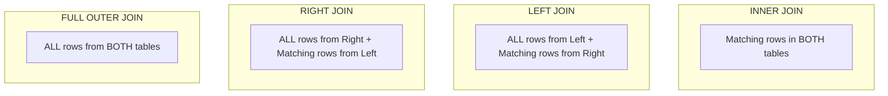

# ⚡ SQL Interview Cheat Sheet (Quick Revision)

Designed for rapid revision within 10–15 minutes before an interview.

---

## 📌 1. Execution Order of SQL Queries

Memory Trick: **FWGH SLO** (*"From Where Group Having Select Limit Order"*)

```
1. FROM / JOIN     -> Identify and join tables
2. WHERE           -> Filter raw rows (Pre-aggregation)
3. GROUP BY        -> Group rows into summary buckets
4. HAVING          -> Filter grouped buckets (Post-aggregation)
5. SELECT          -> Compute output columns / expressions
6. DISTINCT        -> Filter out duplicate output rows
7. ORDER BY        -> Sort final result set
8. LIMIT / OFFSET  -> Restrict number of returned rows
```

---

## 🪟 2. Window Functions Comparison

| Function | Same Values Handle | Gaps in Sequence | Example Input (100, 100, 90) Output |
|----------|-------------------|------------------|-------------------------------------|
| `ROW_NUMBER()` | Gives sequential arbitrary rank | No gaps | 1, 2, 3 |
| `RANK()` | Gives same rank to ties | Leaves gaps after ties | 1, 1, 3 |
| `DENSE_RANK()` | Gives same rank to ties | No gaps | 1, 1, 2 |

### Window Frame Specification
```sql
SUM(amount) OVER (
    PARTITION BY user_id 
    ORDER BY transaction_date 
    ROWS BETWEEN UNBOUNDED PRECEDING AND CURRENT ROW
)
```
- Default frame when `ORDER BY` is present: `RANGE BETWEEN UNBOUNDED PRECEDING AND CURRENT ROW`.
- Difference: `ROWS` counts literal physical rows; `RANGE` includes all peer rows with identical values in `ORDER BY`.

---

## 🔗 3. Join Types Summary



### Anti-Join Pattern (Find unmatched rows)
```sql
SELECT c.customer_id
FROM Customers c
LEFT JOIN Orders o ON c.customer_id = o.customer_id
WHERE o.customer_id IS NULL;
```

---

## 🔒 4. Transaction Isolation Levels & Anomalies

| Isolation Level | Dirty Read | Non-Repeatable Read | Phantom Read | Serialization Anomaly |
|-----------------|------------|---------------------|--------------|-----------------------|
| **Read Uncommitted** | ❌ Allowed | ❌ Allowed | ❌ Allowed | ❌ Allowed |
| **Read Committed** *(Postgres/Oracle Default)* | ✅ Prevented | ❌ Allowed | ❌ Allowed | ❌ Allowed |
| **Repeatable Read** *(MySQL InnoDB Default)* | ✅ Prevented | ✅ Prevented | ❌ Allowed* | ❌ Allowed |
| **Serializable** | ✅ Prevented | ✅ Prevented | ✅ Prevented | ✅ Prevented |

*\*Note: MySQL InnoDB prevents phantom reads in Repeatable Read using Next-Key Locks (Gap Locking).*

---

## 🏎️ 5. Index Types Cheat Sheet

| Index Type | Best Used For | Primary Limitation / Downside |
|------------|---------------|-------------------------------|
| **B-Tree** | Range queries (`<`, `>`, `BETWEEN`), equality (`=`), sorting (`ORDER BY`) | Poor for full-text search or unstructured data |
| **Hash Index** | Point equality lookups (`=`) | Cannot do range scans or sorting |
| **Covering Index** | Query where ALL selected columns are in the index | Larger index size, slower writes |
| **Composite Index** | Queries filtering on multiple columns | Must obey Leftmost Prefix Rule |
| **GIN / GiST** | JSONB, Full-Text Search, Array columns, Geospatial data | High index build and update overhead |

---

## ⚠️ 6. High-Value Common Mistakes & Pitfalls

### Pitfall 1: NOT IN with NULL Subquery
```sql
-- DANGEROUS: Returns 0 rows if subquery contains ANY NULL value!
SELECT * FROM Users WHERE id NOT IN (SELECT manager_id FROM Employees);

-- SAFE SOLUTION: Use NOT EXISTS
SELECT * FROM Users u WHERE NOT EXISTS (
    SELECT 1 FROM Employees e WHERE e.manager_id = u.id
);
```

### Pitfall 2: Non-SARGable Queries (Index Bypassing)
```sql
-- SLOW: Bypasses index on created_at column
SELECT * FROM Orders WHERE YEAR(created_at) = 2026;

-- FAST (SARGable): Utilizes index scan/range lookup
SELECT * FROM Orders WHERE created_at >= '2026-01-01' AND created_at < '2027-01-01';
```

### Pitfall 3: COUNT(column) vs COUNT(*)
```sql
-- COUNT(*) counts total rows (including rows with NULLs)
SELECT COUNT(*) FROM Users;

-- COUNT(email) counts only rows where email IS NOT NULL
SELECT COUNT(email) FROM Users;
```

---

## 💡 7. Fast Syntax Snippets

### Common Table Expression (CTE)
```sql
WITH RankedSales AS (
    SELECT user_id, amount,
           DENSE_RANK() OVER (PARTITION BY user_id ORDER BY amount DESC) as rnk
    FROM Sales
)
SELECT user_id, amount FROM RankedSales WHERE rnk = 1;
```

### Recursive CTE (Hierarchical Org Chart)
```sql
WITH RECURSIVE OrgChart AS (
    -- Anchor member
    SELECT emp_id, name, manager_id, 1 as level
    FROM Employees WHERE manager_id IS NULL
    UNION ALL
    -- Recursive member
    SELECT e.emp_id, e.name, e.manager_id, o.level + 1
    FROM Employees e
    JOIN OrgChart o ON e.manager_id = o.emp_id
)
SELECT * FROM OrgChart;
```

### Conditional Aggregation (Pivoting)
```sql
SELECT 
    department_id,
    SUM(CASE WHEN status = 'Completed' THEN amount ELSE 0 END) AS completed_amount,
    SUM(CASE WHEN status = 'Pending' THEN amount ELSE 0 END) AS pending_amount
FROM Orders
GROUP BY department_id;
```
