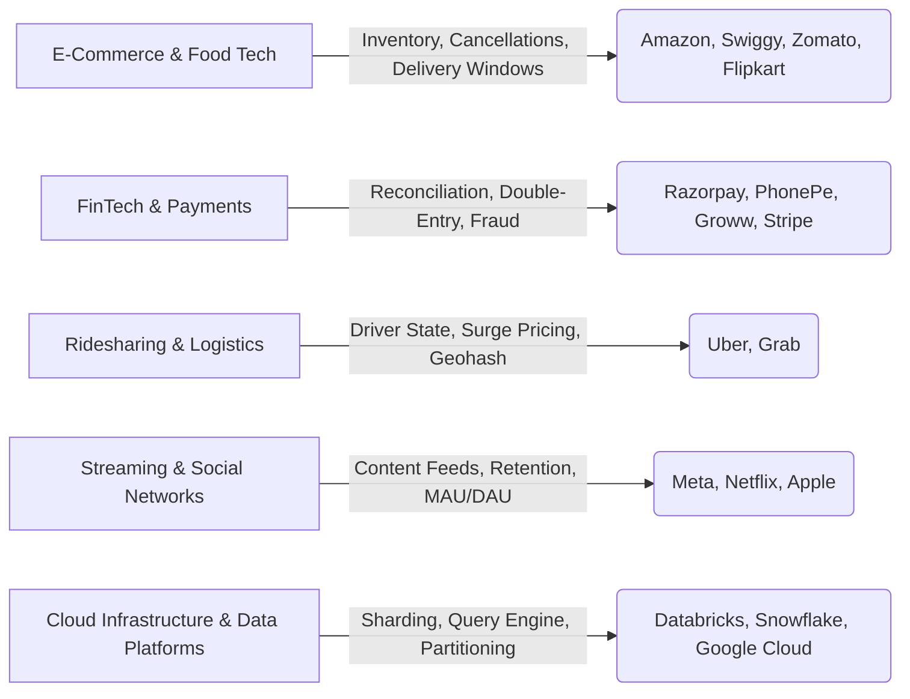

# 🏢 Product Company SQL Interview Questions (Pattern-Curated)

This file contains curated SQL interview questions inspired by recurring hiring patterns from leading product companies (Google, Microsoft, Amazon, Meta, Apple, Netflix, Uber, Airbnb, Adobe, Databricks, NVIDIA, Razorpay, Swiggy, Zomato, etc.).

> ℹ️ **Note**: Questions are derived from observed industry themes, core system design requirements, and engineering domain challenges rather than unverified internal dumps.

---

## 📌 Company Question Patterns Overview



---

## 🎯 Curated Company Interview Patterns

### Pattern 1: E-Commerce Order Cancellation Rate
- **Commonly Asked By**: Amazon, Flipkart, Swiggy, Zomato, Uber
- **Why This Question Matters**: Evaluates multi-table joins, conditional aggregations, and floating-point percentage division with NULL handling.

#### Problem Statement
Given a `Trips` table and a `Users` table, write a query to find the cancellation rate of requests with unbanned users (both client and driver must not be banned) each day between `"2026-03-01"` and `"2026-03-03"`. Round the cancellation rate to 2 decimal places.

#### Schema
```sql
Trips: (id INT, client_id INT, driver_id INT, city_id INT, status ENUM, request_at DATE)
Users: (users_id INT, banned VARCHAR(3), role ENUM)
```

#### Expected Answer
```sql
SELECT 
    t.request_at AS Day,
    ROUND(
        SUM(CASE WHEN t.status LIKE 'cancelled%' THEN 1.0 ELSE 0.0 END) / COUNT(*), 
        2
    ) AS "Cancellation Rate"
FROM Trips t
JOIN Users c ON t.client_id = c.users_id AND c.banned = 'No'
JOIN Users d ON t.driver_id = d.users_id AND d.banned = 'No'
WHERE t.request_at BETWEEN '2026-03-01' AND '2026-03-03'
GROUP BY t.request_at;
```

#### Follow-up Questions
- *What if `COUNT(*)` is 0 for a given date?* Use `NULLIF(COUNT(*), 0)` to prevent division by zero errors.
- *How would you index this table to speed up the query?* Create a composite index on `Trips(request_at, client_id, driver_id, status)` and an index on `Users(users_id, banned)`.

---

### Pattern 2: Financial Reconciliation & Double-Entry Balance
- **Commonly Asked By**: Razorpay, PhonePe, Stripe, PayPal, Groww
- **Why This Question Matters**: Tests transaction accuracy, debit/credit logic, cumulative balance tracking, and audit log processing.

#### Problem Statement
Calculate the running balance for every bank account given a double-entry ledger table.

#### Schema
```sql
Ledger: (entry_id INT, account_id INT, entry_type ENUM('DEBIT', 'CREDIT'), amount DECIMAL(18,2), created_at TIMESTAMP)
```

#### Expected Answer
```sql
SELECT 
    entry_id,
    account_id,
    created_at,
    amount,
    entry_type,
    SUM(CASE WHEN entry_type = 'CREDIT' THEN amount ELSE -amount END) OVER (
        PARTITION BY account_id
        ORDER BY created_at, entry_id
        ROWS BETWEEN UNBOUNDED PRECEDING AND CURRENT ROW
    ) AS running_balance
FROM Ledger;
```

#### Interview Tips
- Point out that transaction timestamp ordering must be deterministic by adding `entry_id` tie-breaker in `ORDER BY`.

---

### Pattern 3: Concurrent Seat Hold System (Ticketing & Booking)
- **Commonly Asked By**: BookMyShow, Airbnb, Ticketmaster, Marriott
- **Why This Question Matters**: Tests concurrency locking, temporary reservation holds, and transaction management under heavy read/write contention.

#### Problem Statement
Write a SQL query / procedure to hold a seat for a user for 10 minutes, preventing double booking during high concurrency.

#### Expected Answer
```sql
-- Step 1: Lock the target seat row inside a transaction
BEGIN TRANSACTION;

SELECT seat_id, status 
FROM ShowSeats 
WHERE show_id = 4501 AND seat_number = 'B12' AND status = 'AVAILABLE'
FOR UPDATE;

-- Step 2: Update status to HELD with 10-minute expiry
UPDATE ShowSeats 
SET status = 'HELD', hold_expires_at = NOW() + INTERVAL '10 minutes', held_by_user_id = 9921
WHERE show_id = 4501 AND seat_number = 'B12';

COMMIT;
```

#### Follow-up Questions
- *What if the user's payment fails or crashes?* A background cron worker periodically executes: `UPDATE ShowSeats SET status = 'AVAILABLE' WHERE status = 'HELD' AND hold_expires_at < NOW();`.

---

### Pattern 4: User Retention & Cohort Analysis (30-Day Active Users)
- **Commonly Asked By**: Meta, Netflix, Adobe, Google, Spotify
- **Why This Question Matters**: Evaluates cohort metrics, monthly active user retention rates, and self-joins across consecutive monthly intervals.

#### Problem Statement
Calculate monthly active user (MAU) retention rate: Percentage of active users in Month $M$ who were also active in Month $M-1$.

#### Expected Answer
```sql
WITH MonthlyActivity AS (
    SELECT DISTINCT 
        user_id,
        DATE_TRUNC('month', activity_date) AS activity_month
    FROM UserActivity
)
SELECT 
    curr.activity_month AS current_month,
    COUNT(DISTINCT curr.user_id) AS active_users,
    COUNT(DISTINCT prev.user_id) AS retained_users,
    ROUND(
        100.0 * COUNT(DISTINCT prev.user_id) / COUNT(DISTINCT curr.user_id), 
        2
    ) AS retention_rate_percentage
FROM MonthlyActivity curr
LEFT JOIN MonthlyActivity prev 
    ON curr.user_id = prev.user_id 
   AND prev.activity_month = curr.activity_month - INTERVAL '1 month'
GROUP BY curr.activity_month
ORDER BY curr.activity_month;
```

---

### Pattern 5: High-Throughput Job Queue (Worker Lock Skipping)
- **Commonly Asked By**: Uber, Databricks, Microsoft, Airbnb
- **Why This Question Matters**: Tests production queue engine implementation in relational databases.

#### Problem Statement
Design a worker polling query that allows 100 parallel worker threads to poll and claim pending jobs from a central `Jobs` table without blocking each other or causing deadlocks.

#### Expected Answer
```sql
WITH ClaimedJob AS (
    SELECT job_id
    FROM Jobs
    WHERE status = 'PENDING'
    ORDER BY priority DESC, created_at ASC
    LIMIT 1
    FOR UPDATE SKIP LOCKED
)
UPDATE Jobs
SET status = 'PROCESSING', worker_id = 'worker-node-04', started_at = NOW()
FROM ClaimedJob
WHERE Jobs.job_id = ClaimedJob.job_id
RETURNING Jobs.job_id, Jobs.payload;
```

#### Key Technical Detail
- `SKIP LOCKED`: Instructs the database engine to immediately bypass any rows currently locked by another worker thread rather than waiting, enabling true lock-free parallel execution across workers.

---

### Pattern 6: Hierarchical Category / Subcategory Rollup
- **Commonly Asked By**: Adobe, Salesforce, Oracle, Microsoft
- **Why This Question Matters**: Evaluates recursive hierarchy querying and tree path generation.

#### Expected Answer
```sql
WITH RECURSIVE CategoryTree AS (
    SELECT category_id, name, parent_id, CAST(name AS TEXT) AS full_path
    FROM Categories
    WHERE parent_id IS NULL
    
    UNION ALL
    
    SELECT c.category_id, c.name, c.parent_id, (ct.full_path || ' > ' || c.name)
    FROM Categories c
    JOIN CategoryTree ct ON c.parent_id = ct.category_id
)
SELECT * FROM CategoryTree ORDER BY full_path;
```

---

### Pattern 7: Detecting Fraudulent Accounts (Reciprocal / Triangle Network)
- **Commonly Asked By**: Razorpay, Meta, PhonePe, Uber
- **Why This Question Matters**: Evaluates graph pattern detection in relational databases.

#### Problem Statement
Find pairs of users who have transferred money to each other within 5 minutes (potential circular transaction fraud).

#### Expected Answer
```sql
SELECT DISTINCT 
    t1.sender_id AS user_a,
    t1.receiver_id AS user_b,
    t1.created_at AS t1_time,
    t2.created_at AS t2_time
FROM Transactions t1
JOIN Transactions t2 
    ON t1.sender_id = t2.receiver_id 
   AND t1.receiver_id = t2.sender_id
WHERE t2.created_at >= t1.created_at 
  AND t2.created_at <= t1.created_at + INTERVAL '5 minutes';
```
