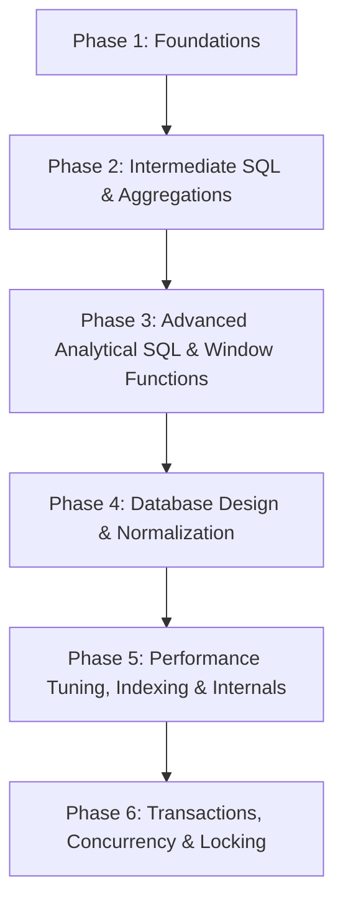

# 📊 SQL Interview Preparation Guide (2026–2027)

Welcome to the definitive, production-grade SQL Interview Preparation repository. This guide is built by senior engineers, database architects, and technical interviewers from top product companies to prepare software engineers (SDE-1 to Staff+), data engineers, and technical candidates for modern SQL interviews.

---

## 📌 Subject Overview

Structured Query Language (SQL) is the foundational language of relational database management systems (RDBMS) and distributed data warehouses. In 2026–2027, SQL is no longer evaluated merely as a data retrieval tool for analysts. It is a critical core competency for **Backend Engineers, System Architects, Machine Learning Engineers, Site Reliability Engineers, and Data Engineers**.

Modern SQL interviewers assess your ability to write declarative code, optimize complex query execution plans, design normalized and scalable schemas, manage concurrent transactions safely, and understand database storage engine mechanics under high load.

---

## 🎯 Why Companies Ask SQL

1. **Production Reliability**: A single unindexed query or bad join can freeze production database pools, lock tables, and cause system outages.
2. **Data Consistency & Integrity**: Applications rely on database constraints and transactions (ACID guarantees) to prevent lost updates, financial inaccuracies, and data corruption.
3. **Analytical & Reporting Depth**: Senior candidates must process hierarchical data, time-series data, gaps-and-islands problems, and sliding-window aggregations directly inside database engines using window functions and CTEs.
4. **Performance Tuning**: Companies operate at petabyte scale. Knowing how B-Trees, Hash Indexes, Join algorithms, and query planners operate is mandatory for optimizing latency and infrastructure cost.

---

## 🚀 Interview Importance

Across software engineering and data roles, SQL appears in multiple stages of the hiring loop:
- **Screening Rounds**: Quick live-coding of window functions, joins, and aggregates.
- **Data Modeling & System Design**: Designing relational schemas, indexing strategies, partitioning/sharding keys, and concurrency controls.
- **Senior / Staff Rounds**: Query optimization, index fragmentation, execution plan diagnosis, isolation level selection, and database internals.

---

## 🛠️ Prerequisites

Before diving into SQL interview preparation, you should be familiar with:
- Basic set theory and relational algebra concepts.
- Understanding of tables, rows, columns, primary keys, and foreign keys.
- Basic computer system concepts (memory vs disk storage, file systems).

---

## 🗺️ Learning Roadmap

### Phase 1: Foundations (Days 1–3)
- Basic Data Manipulation (SELECT, INSERT, UPDATE, DELETE)
- Filtering and Sorting (WHERE, ORDER BY, LIMIT/OFFSET, LIKE, IN, BETWEEN)
- Handling NULL values (IS NULL, COALESCE, NVL, IFNULL)

### Phase 2: Intermediate SQL & Aggregations (Days 4–7)
- Multi-table operations (INNER JOIN, LEFT JOIN, RIGHT JOIN, FULL OUTER JOIN, CROSS JOIN, SELF JOIN)
- Grouping & Filtering Aggregates (GROUP BY, HAVING, COUNT, SUM, AVG, MIN, MAX)
- Subqueries (Scalar, Correlated, EXISTS vs IN, Subqueries in FROM/WHERE)

### Phase 3: Advanced Analytical SQL (Days 8–12)
- Window Functions (`ROW_NUMBER()`, `RANK()`, `DENSE_RANK()`, `NTILE()`, `LAG()`, `LEAD()`, Frame specifications)
- Common Table Expressions (CTEs) & Recursive CTEs
- Pivoting & Unpivoting Data (`CASE WHEN`, `PIVOT`, `UNPIVOT`)
- Advanced Set Operations (`UNION`, `UNION ALL`, `INTERSECT`, `EXCEPT`/`MINUS`)

### Phase 4: Database Design & Normalization (Days 13–16)
- Entity-Relationship (ER) Modeling & Cardinality
- Normal Forms (1NF, 2NF, 3NF, BCNF) & Strategic Denormalization
- Constraints (Primary Key, Foreign Key, Unique, Check, Not Null)
- Schema Patterns (Star Schema, Snowflake Schema, Slowly Changing Dimensions)

### Phase 5: Performance Tuning & Internals (Days 17–21)
- B-Tree vs Hash vs GIN/GiST Indexes
- Composite Indexes, Covering Indexes, Filtered Indexes
- Reading `EXPLAIN` / `EXPLAIN ANALYZE` Execution Plans
- SARGability and anti-patterns that bypass indexes

### Phase 6: Transactions & Concurrency (Days 22–25)
- ACID Guarantees vs BASE Systems
- Transaction Isolation Levels (Read Uncommitted, Read Committed, Repeatable Read, Serializable)
- Concurrency Anomalies (Dirty Read, Non-repeatable Read, Phantom Read, Serialization Anomaly)
- Pessimistic vs Optimistic Locking, Deadlocks

---

## ⏱️ Time Required

- **Freshers / Junior Candidates (0–2 YOE)**: ~15 to 20 hours over 2 weeks. Focus on Phases 1–3 and basic Phase 4.
- **Mid-Level Engineers (2–5 YOE)**: ~25 to 30 hours over 3 weeks. Focus heavily on Phases 3–5 and coding mastery.
- **Senior / Staff Engineers (5+ YOE)**: ~35+ hours over 4 weeks. Deep dive into Phases 4–6, query optimization, execution plans, and architectural trade-offs.

---

## 📖 Recommended Study Order

1. Read [Interview_Guide.md](file:///s:/Interview_Guide/SQL/Interview_Guide.md) to understand level-by-level expectations.
2. Keep [Cheat_Sheet.md](file:///s:/Interview_Guide/SQL/Cheat_Sheet.md) open for rapid revision of syntax and execution order.
3. Master [Top_Questions.md](file:///s:/Interview_Guide/SQL/Top_Questions.md) for core interview questions with detailed explanations.
4. Solve problems in [Company_Questions.md](file:///s:/Interview_Guide/SQL/Company_Questions.md) to align with product company patterns.
5. Challenge yourself with [Practice_Questions.md](file:///s:/Interview_Guide/SQL/Practice_Questions.md) covering debugging, scenarios, and code snippets.
6. Explore [Resources.md](file:///s:/Interview_Guide/SQL/Resources.md) for deep-dive books, documentation, and tools.

---

## 💡 How to Use This Folder

- **Do Not Memorize**: Understand *why* a query execution plan behaves in a specific way rather than memorizing query syntax.
- **Test Locally**: Execute queries against real PostgreSQL or MySQL engines using Docker or DB Fiddle.
- **Check Edge Cases**: Always test NULL values, empty sets, duplicate values, and ties when writing window functions and joins.
