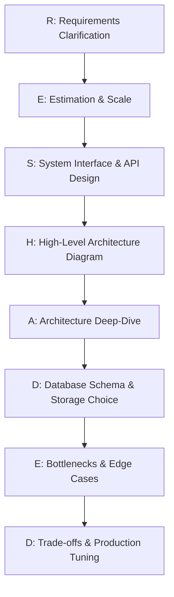

# ⚡ System Design Cheat Sheet & Quick Revision

*A rapid-revision reference guide designed to be read in under 15 minutes before an interview.*

---

## 📐 1. Back-of-the-Envelope Estimation Cheat Sheet

### Core Numbers Every Engineer Must Know

```math
1 \text{ Byte} = 8 \text{ bits} \quad|\quad 1 \text{ KB} = 10^3 \text{ Bytes} \quad|\quad 1 \text{ MB} = 10^6 \text{ Bytes} \quad|\quad 1 \text{ GB} = 10^9 \text{ Bytes} \quad|\quad 1 \text{ TB} = 10^{12} \text{ Bytes}
```

```math
1 \text{ Day} = 86,400 \text{ seconds} \approx 10^5 \text{ seconds}
```

```math
\text{Daily Traffic QPS} = \frac{\text{Daily Active Users (DAU)} \times \text{Requests per user per day}}{86,400}
```

```math
\text{Peak QPS} \approx 2 \times \text{Average QPS}
```

### Latency Numbers Every Architect Must Know

| Operation | Standard Time | Relative Scaled Analogy |
| :--- | :--- | :--- |
| L1 Cache reference | $0.5 \text{ ns}$ | 1 Heartbeat |
| Main Memory (RAM) reference | $100 \text{ ns}$ | 2 Minutes |
| Read 1MB sequentially from RAM | $250 \text{ }\mu\text{s}$ | 3 Days |
| Read 1MB sequentially from SSD | $1 \text{ ms}$ | 12 Days |
| Read 1MB sequentially from HDD | $20 \text{ ms}$ | 8 Months |
| Cross-datacenter Round-Trip (WAN) | $150 \text{ ms}$ | 5 Years |

### Storage & Bandwidth Quick Calculations
- **1 Million Daily Active Users (DAU)** sending 10 requests/day $\rightarrow 100 \text{ QPS average}$.
- **100 Million DAU** sending 10 requests/day $\rightarrow 10,000 \text{ QPS average} \implies 20,000 \text{ Peak QPS}$.
- **Storage for 100M daily text updates (1KB each)**:
  $$100 \times 10^6 \times 1 \text{ KB} = 100 \text{ GB/day} \implies 36.5 \text{ TB/year}$$

---

## 🛠️ 2. The RESHADED Framework for System Design Interviews



| Step | Goal | Key Questions to Ask |
| :--- | :--- | :--- |
| **R - Requirements** | Define Functional & Non-Functional boundaries | "What are top 3 core features? What latency SLA (e.g., P99 < 200ms)? Availability target (99.99%)?" |
| **E - Estimation** | Determine scale & resource footprint | "What is DAU/MAU? Read-to-Write ratio? Peak QPS? Data retention policy?" |
| **S - System APIs** | Define explicit endpoints & payloads | "REST/gRPC format? `POST /api/v1/resource`, input parameters, response structures, headers?" |
| **H - High-Level Design**| Draw block diagram of components | Draw Client $\rightarrow$ CDN/DNS $\rightarrow$ API Gateway $\rightarrow$ Load Balancer $\rightarrow$ Stateless Web App $\rightarrow$ Cache $\rightarrow$ DB. |
| **A - Architecture Dive**| Detail specific complex components | Deep dive into Message Queues, Stateful Connections, Search Indexes, or Fan-out engines. |
| **D - Data Schema** | Select DB type & table structures | Choose SQL vs NoSQL vs Columnar. Define Primary Keys, Partition Keys, Indexing strategies. |
| **E - Edge Cases** | Identify failure modes & bottlenecks | Single point of failures, rate limiting, cache stampedes, network partitions, split-brain scenarios. |
| **D - Decisions/Tradeoffs**| Justify technical choices | "Why Cassandra over Postgres? Why gRPC over REST? Trade-offs between latency vs consistency." |

---

## 📊 3. High-Value Technology Comparison Tables

### SQL vs NoSQL vs Columnar vs Vector Databases

| Database Category | Key Examples | Storage Model | Best Use Case | Avoid When |
| :--- | :--- | :--- | :--- | :--- |
| **Relational (SQL)** | PostgreSQL, MySQL | Row-based B+ Trees | Financial transactions, strict ACID | Petabyte-scale unstructured writes |
| **Key-Value** | Redis, DynamoDB | Hash tables, LSM Trees | Caching, session stores, user profiles | Complex multi-table JOINs |
| **Wide-Column** | Cassandra, ScyllaDB | Append-only SSTables | Time-series, telemetry, high-write messaging | Low-latency ad-hoc SQL queries |
| **Document** | MongoDB, DocumentDB | Nested JSON / BSON | Dynamic schemas, content catalogs | Highly relational graph models |
| **Columnar Analytics**| ClickHouse, Snowflake | Column-oriented vectors | OLAP analytics, aggregate telemetry | High-frequency single-row updates |
| **Vector DB** | Pinecone, Milvus, Qdrant | HNSW graph embedding | LLM RAG, similarity search | Traditional key-value lookups |

### Message Queues vs Event Streams

| Dimension | Message Queue (e.g., RabbitMQ) | Event Stream (e.g., Apache Kafka) |
| :--- | :--- | :--- |
| **Message Lifetime** | Deleted immediately after consumer ACK | Retained on disk until TTL expiration |
| **Consumption Model**| Push-based to competing workers | Pull-based by consumer groups using offsets |
| **Ordering Guarantee**| Order preserved per queue, lost on retries | Strict ordering guaranteed **per partition** |
| **Scalability** | Scale workers per queue | Scale throughput via log partitioning |

---

## 💡 4. Top Best Practices & Critical Architectural Rules

> [!IMPORTANT]
> 1. **Make Stateless Web Tiers**: Store session state in Redis, never in app server memory.
> 2. **Design for Idempotency**: All mutating write APIs must accept an `Idempotency-Key` header to prevent duplicate charges or operations on network retry.
> 3. **Prevent Cache Stampedes**: Use distributed locks or probabilistic early expiration (XFetch) for hot keys.
> 4. **Decouple Slow Workflows**: Offload email sending, video transcoding, and ML scoring to asynchronous Kafka message queues.
> 5. **Enforce Rate Limiting & Circuit Breakers**: Protect downstream services from thundering herds using Envoy rate limiters and Resilience4j circuit breakers.

---

## 🧠 5. Memory Tricks & Quick Notes

- 💡 **DADS**: **D**ata Storage, **A**PI Design, **D**istributed Systems, **S**calability.
- 💡 **BASE**: **B**asically **A**vailable, **S**oft-state, **E**ventual consistency (NoSQL philosophy).
- 💡 **SOLID**: Applies to System Design too! Decouple services by single responsibility.
- 💡 **4 Golden Signals**: **Latency**, **Traffic**, **Errors**, **Saturation**.
- 💡 **PACELC**: **P**artition $\implies$ (**A**vailability vs **C**onsistency); **E**lse $\implies$ (**L**atency vs **C**onsistency).

Proceed to [`Tools_Matrix.md`](file:///s:/Interview_Guide/System_Design/Tools_Matrix.md) for technology selection matrices or [`Top_Questions.md`](file:///s:/Interview_Guide/System_Design/Top_Questions.md) for exhaustive question breakdowns! 🚀
