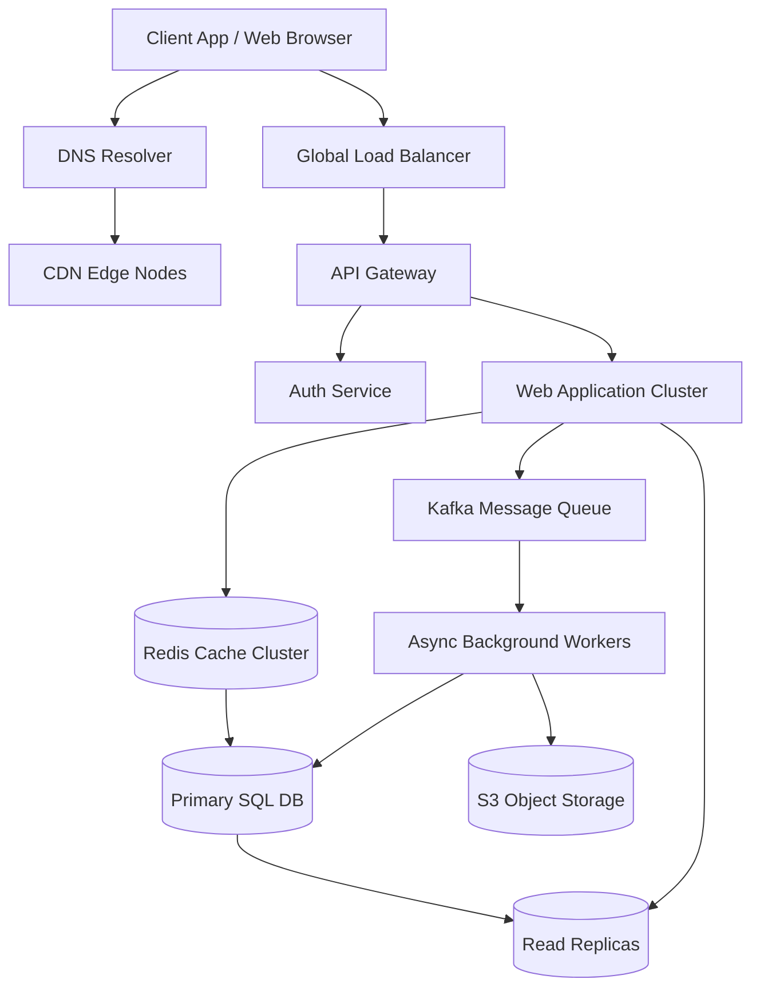
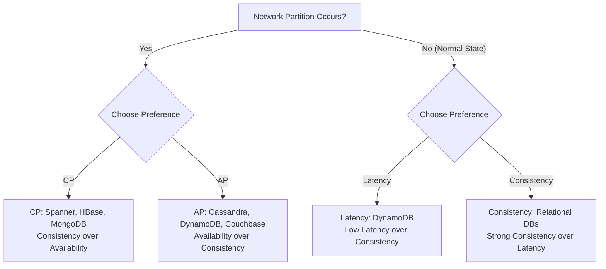
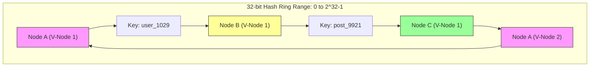
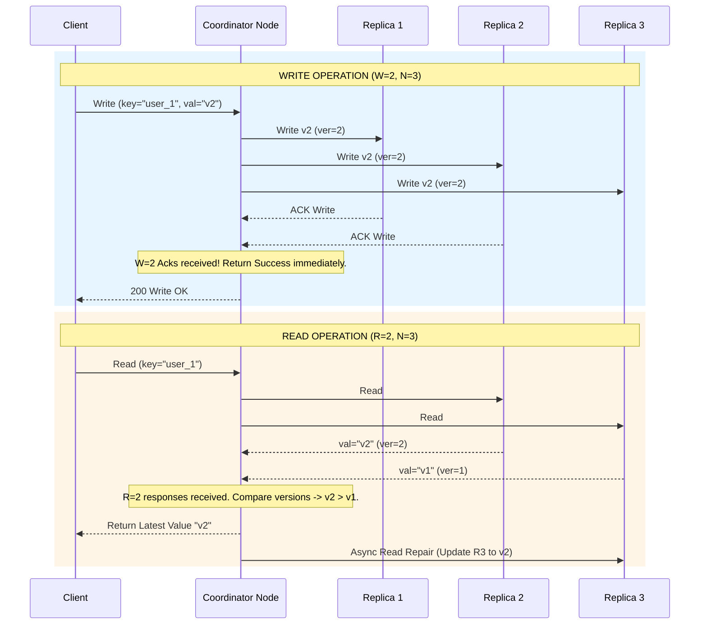

# ⚡ System Design Cheat Sheet & Quick Revision

*Designed for 15-minute rapid review right before your technical interview.*

---

## 🚀 The RESHADED Framework (8 Steps to Ace System Design)

Follow these steps sequentially to structure any system design discussion:

| Step | Phase | Action & Key Questions |
| :--- | :--- | :--- |
| **R** | **Requirements** | Clarify Functional (User actions) & Non-Functional (SLA, Latency, Availability vs Consistency, Scale). |
| **E** | **Estimation** | Back-of-the-envelope calculations for QPS (Read/Write), Storage/day, Bandwidth, and RAM needed. |
| **S** | **System Interface** | Define clean APIs (REST/gRPC request-response payloads & endpoints). |
| **H** | **High-Level Design** | Sketch core blocks: Client -> DNS -> CDN -> Load Balancer -> API Gateway -> Services -> Caching -> Database -> Queue. |
| **A** | **Analyze Bottlenecks** | Identify single points of failure (SPOF), hot partitions, DB read/write bottlenecks. |
| **D** | **Deep Dive** | Zoom into critical component algorithms (e.g., Trie for Autocomplete, Consistent Hashing ring, Rate Limiter script). |
| **E** | **Edge Cases & Faults** | Discuss network partitions, server crashes, GC pauses, duplicate requests, stale cache. |
| **D** | **Deployment & Monitoring** | Metrics (Golden Signals: Latency, Traffic, Errors, Saturation), Alerting, Blue-Green / Canary rollouts. |

---

## 📊 Back-of-the-Envelope Estimation Quick Reference

### Standard Constants & Math Shortcuts
- **Time Conversions**:
  - $1 \text{ day} = 86,400 \text{ seconds} \approx 10^5 \text{ seconds}$
  - $1 \text{ million requests / day} \approx 12 \text{ requests/sec}$
  - $100 \text{ million requests / day} \approx 1,200 \text{ requests/sec}$
  - $1 \text{ billion requests / day} \approx 12,000 \text{ requests/sec}$
- **Latency Numbers Every Engineer Should Know**:
  - L1 cache reference: $0.5 \text{ ns}$
  - Main memory (RAM) reference: $100 \text{ ns}$
  - Read $1 \text{ MB}$ sequentially from RAM: $250 \text{ } \mu\text{s}$
  - Read $1 \text{ MB}$ sequentially from NVMe SSD: $1 \text{ ms}$
  - Read $1 \text{ MB}$ sequentially from HDD: $20 \text{ ms}$
  - Round trip within same datacenter: $0.5 \text{ ms}$
  - Round trip US to Europe (cross-Atlantic): $150 \text{ ms}$

### Estimation Formulas
- **Peak QPS**: $\text{Average QPS} \times 2 \text{ to } 5$
- **Storage Requirement (5 Years)**: $\text{Daily Writes} \times \text{Size per Record} \times 365 \times 5 \times \text{Replication Factor (3)}$
- **RAM Needed for Cache**: Apply Pareto Principle (80/20 Rule) -> Cache $20\%$ of daily read volume.

---

## 🗄️ Storage Engine & Database Selection Matrix

| Storage Type | Characteristics | Best Use Cases | Examples |
| :--- | :--- | :--- | :--- |
| **In-Memory KV** | Ultra-low latency ($<1\text{ms}$), volatile/persistent. | Caching, session store, rate limiters, leaderboards. | Redis, Memcached |
| **Relational DB (RDBMS)** | ACID, complex joins, rigid schema, secondary indexes. | Financial transactions, orders, core user metadata. | PostgreSQL, MySQL |
| **Document DB** | Flexible JSON schema, horizontal scale, single-key access. | User profiles, product catalogs, content management. | MongoDB, Couchbase |
| **Columnar / Wide-Column** | LSM-tree based, high write throughput, distributed. | Time-series data, event logging, telemetry, IoT. | Cassandra, ScyllaDB, HBase |
| **Columnar OLAP** | Compressed vector columns, analytical queries. | Data warehousing, real-time analytics, reporting. | ClickHouse, Snowflake, Redshift |
| **Search Engine** | Inverted index, fuzzy search, full-text ranking. | Autocomplete, log search, product catalog search. | Elasticsearch, OpenSearch |
| **Graph DB** | Nodes & edges, fast traversal without expensive joins. | Social networks, fraud networks, knowledge graphs. | Neo4j, AWS Neptune |
| **Vector DB** | High-dimensional ANN indexing (HNSW, IVF). | Semantic search, LLM embeddings, RAG apps. | Pinecone, Milvus, Qdrant |

---

## ⚔️ High-Value Comparison Tables

### 1. Protocols & API Paradigms
| Metric | REST | gRPC | GraphQL |
| :--- | :--- | :--- | :--- |
| **Protocol** | HTTP/1.1 or HTTP/2 | HTTP/2 | HTTP/1.1 or HTTP/2 |
| **Payload** | JSON (Text) | Protobuf (Binary) | JSON (Text) |
| **Over-fetching** | Common | Minimal | None (Client specifies fields) |
| **Performance** | Moderate | Ultra-Fast ($5\times-10\times$ smaller) | Moderate |
| **Streaming** | No | Bidirectional streaming | Via Subscriptions |

### 2. Synchronization & Real-Time Delivery
| Technique | Direction | Overhead | Reconnection | Best Use Case |
| :--- | :--- | :--- | :--- | :--- |
| **Long Polling** | Bi-directional simulation | High (HTTP re-creation) | Manual | Legacy fallback |
| **WebSockets** | Full-duplex | Low (Single TCP frame) | Automatic / Custom | Real-time chat, multiplayer games |
| **SSE** | Server-to-Client | Low (Standard HTTP stream) | Automatic built-in | News feeds, stock tickers |

---

## 🎨 Essential Mermaid Diagrams

### 1. High-Level Distributed System Architecture Template

### 2. CAP & PACELC Theorem Decision Tree

### 3. Consistent Hashing Ring & Virtual Nodes

### 4. Quorum Read / Write Sequence ($N=3, W=2, R=2$)

---

## 🎯 Interview Day Strategy & Emergency Recovery

### 💡 Top 5 Golden Rules
1. **Never Start Drawing Without Clarifying Scope**: Spending 3 minutes confirming requirements prevents 30 minutes of designing the wrong system.
2. **Drive the Conversation**: Proactively outline what you will cover using the RESHADED framework.
3. **Explicitly State Assumptions**: Say "I am assuming $100\text{M}$ DAU based on standard social apps" rather than silently calculating.
4. **Quantify Trade-offs**: Never say "X is better than Y". Say "X gives us $<10\text{ms}$ read latency at the cost of eventual consistency, whereas Y gives ACID compliance at lower write throughput".
5. **Address Bottlenecks Proactively**: Don't wait for the interviewer to point out a single point of failure; call it out and fix it with redundancy.

### 🚨 What to Do if You Get Stuck
- **Stuck on Scale?** -> Break down into reads vs writes. Cache reads, queue writes.
- **Stuck on Data Model?** -> Ask: "What are the primary query access patterns?" (Access by ID vs range scan vs fuzzy search).
- **Stuck on Latency?** -> Add CDN for static, Redis for dynamic data, move slow processing to Kafka background workers.
