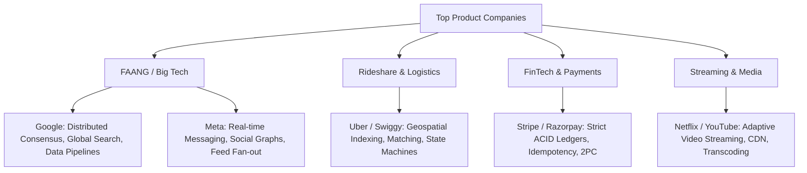

# 🏢 Company-Specific System Design Interview Questions & Patterns

*A curated collection of system design interview themes, recurring patterns, and expectations across top product companies.*

---

## 🎯 Company Categories & Hiring Mindsets

---

## 1. Meta (Facebook / WhatsApp / Instagram)

### Primary Focus Areas
- Real-time communication at massive scale
- Feed fan-out, graph storage, and low-latency read caching
- Machine learning post ranking and recommendation engines

### 🏆 Top Meta Design Questions

#### 1. Design Messenger / WhatsApp
- **Asked For**: E5 / E6 (Senior / Staff Engineer)
- **Core Expectation**: Deep understanding of WebSocket connection servers, message status tracking (sent, delivered, read receipts), persistent store selection (Cassandra), and media handling via S3/CDN.
- **Key Follow-up**: *“How do you handle end-to-end encryption key management without storing private keys on servers?”*
- **Interview Tip**: Emphasize stateful connection management and Redis session mapping.

#### 2. Design Instagram Feed & Stories
- **Asked For**: E4 / E5
- **Core Expectation**: Hybrid push/pull fan-out architecture, CDN media caching, ephemeral storage for stories (24-hour TTL), and media optimization.
- **Key Follow-up**: *“How do you rank feed posts in real-time based on user interaction signals?”*

---

## 2. Google

### Primary Focus Areas
- Distributed systems fundamentals, consensus, global scale, and algorithmic depth
- Low-level internals (LSM vs B+ Tree, Spanner TrueTime, MapReduce)
- Global search, crawling, and storage systems

### 🏆 Top Google Design Questions

#### 1. Design Google Search Autocomplete (Typeahead)
- **Asked For**: L4 / L5
- **Core Expectation**: In-memory Trie structure sharded by prefix range, pre-computing top-K searches offline via MapReduce/Spark, low latency ($<30\text{ms}$ SLA), and streaming delta updates.
- **Key Follow-up**: *“How do you handle trending queries (e.g., breaking news) that aren't yet reflected in the offline batch-built trie?”*
- **Interview Tip**: Focus heavily on memory estimation for the Trie node objects.

#### 2. Design Google Drive / Docs Co-Editing
- **Asked For**: L5 / L6
- **Core Expectation**: Block-level storage and chunking (4MB blocks), hash-based deduplication, CRDT / Operational Transformation for concurrent text editing.
- **Key Follow-up**: *“How do you resolve conflicting offline edits when a user reconnects after 2 hours?”*

---

## 3. Amazon

### Primary Focus Areas
- High availability, operational resilience, trade-offs, and microservices decomposition
- E-commerce inventory, cart checkout (ACID vs Saga), fulfillment tracking
- Scalable cloud infrastructure (AWS-native design patterns)

### 🏆 Top Amazon Design Questions

#### 1. Design Amazon E-Commerce Flash Sale & Inventory System
- **Asked For**: SDE-2 / Senior SDE
- **Core Expectation**: Preventing overselling under extreme concurrency ($100\text{k}$ users attempting to buy 1,000 units), atomic Redis inventory decrements, Saga pattern for checkout workflow.
- **Key Follow-up**: *“What happens if a user reserves an item in cart but abandons payment after 10 minutes?”*
- **Interview Tip**: Emphasize explicit locks vs optimistic concurrency (`UPDATE inventory SET count = count - 1 WHERE item_id = X AND count > 0`).

#### 2. Design Amazon Prime Video
- **Asked For**: SDE-2 / Senior SDE
- **Core Expectation**: Transcoding pipelines, HLS multi-bitrate streaming, global CDN edge caching, and DRM content protection.

---

## 4. Uber / Swiggy / Zomato

### Primary Focus Areas
- Real-time geospatial tracking, Quadtree / Geohash indexing
- State machine design for trips/orders
- Matching algorithms, surge pricing, and dynamic dispatch

### 🏆 Top Uber / Logistics Design Questions

#### 1. Design Driver Tracking & Matching Engine
- **Asked For**: Senior Backend / Staff Engineer
- **Core Expectation**: Storing driver GPS coordinates sent every 4s, spatial indexing (Redis Geo / Google S2), matching algorithms, and state transitions (`REQUESTED` $\rightarrow$ `MATCHED` $\rightarrow$ `IN_PROGRESS` $\rightarrow$ `COMPLETED`).
- **Key Follow-up**: *“How do you scale location updates if active drivers grow to 5 Million globally?”*
- **Interview Tip**: Draw a clear state machine diagram before detailing the database schema.

---

## 5. Stripe / Razorpay (FinTech)

### Primary Focus Areas
- Absolute consistency, zero data loss, double-entry bookkeeping ledgers
- Idempotent API design, distributed transactions, compliance & security

### 🏆 Top FinTech Design Questions

#### 1. Design a Payment Gateway & Multi-Currency Digital Wallet
- **Asked For**: Senior Software Engineer / Staff
- **Core Expectation**: Double-entry ledger database schema (`debit` and `credit` rows must sum to zero), idempotency key table in SQL DB, 2-Phase Commit or Saga pattern with bank integration.
- **Key Follow-up**: *“How do you guarantee a user is never double-charged when network times out during credit card processing?”*
- **Interview Tip**: Always start by writing down the idempotency check protocol.

---

## 6. Netflix

### Primary Focus Areas
- Adaptive bitrate video streaming, Microservice resiliency (Chaos Engineering)
- Personalization, recommendation pipeline, and global CDN offloading (Open Connect)

### 🏆 Top Netflix Design Questions

#### 1. Design Video Streaming & Recommendation Pipeline
- **Asked For**: Senior Software Engineer
- **Core Expectation**: Microservices architecture, Netflix Open Connect CDN, Fallback strategies (Circuit Breaker), Offline ML training feature store + low-latency online inference.

---

## 📑 Summary Matrix: Question vs. Target Companies

| System Design Question | Frequently Asked By | Critical Topic to Master |
| :--- | :--- | :--- |
| **URL Shortener** | All Companies (Screening Round) | Base62 Encoding, KGS, Caching |
| **Chat / Messaging (WhatsApp)** | Meta, Slack, Telegram, Uber | WebSockets, Cassandra, Presence Service |
| **News Feed / Timeline** | Meta, Twitter, LinkedIn | Push vs Pull, Hybrid Fan-out, Redis |
| **Geospatial Dispatch (Uber)** | Uber, Swiggy, Zomato, Grab | Geohash, Google S2, Spatial Indexing |
| **Payment Ledger (Stripe)** | Stripe, Razorpay, PayPal, Block | Idempotency Keys, Double-Entry Ledger |
| **Flash Sale / Inventory** | Amazon, Flipkart, Target | Redis Atomic Lock, Saga Pattern |
| **Autocomplete / Typeahead** | Google, Microsoft, Amazon | In-Memory Trie, Offline Spark Pipeline |
| **Video Streaming (YouTube)** | Netflix, YouTube, Disney+ | HLS/DASH, CDN, FFmpeg Transcoding Queue |
| **Distributed Cache (Redis)** | Google, AWS, Meta | Consistent Hashing, LRU Eviction |
