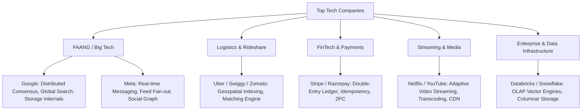

# 🏢 Company-Specific System Design Interview Questions & Patterns

*A curated collection of system design interview themes, recurring hiring patterns, and expectations across leading product companies.*

---

## 🎯 Company Categories & Hiring Mindsets

---

## 1. Meta (Facebook / WhatsApp / Instagram)

### Primary Focus Areas
- Real-time communication at massive scale (billions of active connections)
- Feed fan-out models, social graph storage, and low-latency caching
- Machine learning post ranking pipelines

### 🏆 Top Meta Design Questions

#### 1. Design Messenger / WhatsApp
- **Commonly Asked By**: Meta, Slack, Telegram, Discord, Uber
- **Why This Question Matters**: Evaluates persistent connection management (WebSockets), message ordering guarantees across devices, presence status tracking, and offline message storage.
- **Expected Answer & Follow-up**:
  - *Expected*: WebSocket Gateway cluster mapped via Redis Session Store, Cassandra wide-column store for message history indexed by `(chat_id, snowflake_message_id)`.
  - *Follow-up*: *“How do you manage end-to-end encryption (E2EE) key exchange without server access to private keys?”* $\rightarrow$ Signal Protocol using Diffie-Hellman ratchet keys stored on device.
- **Interview Tips**: Emphasize stateful server connection tuning (`sysctl` `epoll`) and push vs pull presence heartbeats.

#### 2. Design Instagram Feed & Stories
- **Commonly Asked By**: Meta, Twitter, TikTok, Pinterest
- **Why This Question Matters**: Tests fan-out trade-offs (push vs pull), ephemeral storage patterns (24-hour story expiration), and CDN image optimization.
- **Expected Answer & Follow-up**:
  - *Expected*: Hybrid fan-out model (push for regular accounts, pull for celebrities $>10\text{k}$ followers), Redis Sorted Sets for feed timelines.
  - *Follow-up*: *“How do you rank feed posts in real time based on user interaction signals?”* $\rightarrow$ Async feature extraction to Kafka, gRPC ML scoring worker.
- **Interview Tips**: Draw a clear diagram showing how celebrity posts bypass push fan-out.

---

## 2. Google

### Primary Focus Areas
- Distributed systems fundamentals, consensus, global scale, and algorithmic depth
- Low-level internals (LSM vs B+ Tree, Spanner TrueTime, MapReduce/Spark)
- Global search, crawling, and block storage

### 🏆 Top Google Design Questions

#### 1. Design Google Search Autocomplete (Typeahead)
- **Commonly Asked By**: Google, Microsoft, Amazon, Adobe
- **Why This Question Matters**: Evaluates custom data structures (Trie), offline batch processing, caching, and low latency SLAs ($<30\text{ms}$).
- **Expected Answer & Follow-up**:
  - *Expected*: In-memory Trie sharded by prefix range. Offline MapReduce job rebuilding Trie frequencies hourly. Real-time Redis sorted sets for breaking trends.
  - *Follow-up*: *“How do you handle breaking news queries before the hourly offline Trie build runs?”* $\rightarrow$ Blend real-time Redis trend scores with static Trie results.
- **Interview Tips**: Calculate Trie memory footprint explicitly (e.g., 26 pointers per node + frequency scores).

#### 2. Design Google Drive / Docs Co-Editing
- **Commonly Asked By**: Google, Microsoft, Figma, Notion
- **Why This Question Matters**: Tests block-level storage, chunk deduplication, and collaborative real-time text editing protocols.
- **Expected Answer & Follow-up**:
  - *Expected*: 4MB file block chunking with SHA-256 deduplication. CRDTs (Conflict-free Replicated Data Types) or Operational Transformation (OT) for live document synchronization.
  - *Follow-up*: *“How to handle offline edits when a user reconnects after 2 hours?”* $\rightarrow$ Local SQLite CRDT operation queue merged asynchronously on reconnect.
- **Interview Tips**: Highlight the difference between operational transformation and CRDTs.

---

## 3. Amazon

### Primary Focus Areas
- Operational resilience, fault tolerance, microservices decomposition, and clear trade-off justification
- E-commerce inventory management, cart checkout (ACID vs Saga), and fulfillment tracking
- Scalable cloud-native architectures (AWS-native design patterns)

### 🏆 Top Amazon Design Questions

#### 1. Design Amazon E-Commerce Flash Sale & Inventory System
- **Commonly Asked By**: Amazon, Flipkart, Target, Walmart
- **Why This Question Matters**: Tests race condition prevention under extreme concurrency ($100\text{k}$ users competing for 1,000 items) and Saga transaction orchestrations.
- **Expected Answer & Follow-up**:
  - *Expected*: Atomic Redis seat/inventory decrements (`DECRBY`) with 10-minute reservation leases before touching PostgreSQL DB. Saga pattern for cart checkout.
  - *Follow-up*: *“What if payment fails or user abandons cart after 10 minutes?”* $\rightarrow$ Lease expiration triggers async Redis keyspace event to increment inventory back.
- **Interview Tips**: Emphasize explicit optimistic locks (`UPDATE inventory SET count = count - 1 WHERE item_id = X AND count > 0`).

#### 2. Design Amazon Prime Video
- **Commonly Asked By**: Amazon, Netflix, Disney+, Hulu
- **Why This Question Matters**: Tests distributed video ingestion, multi-bitrate HLS/DASH transcoding, and global CDN delivery.
- **Expected Answer & Follow-up**:
  - *Expected*: S3 upload staging $\rightarrow$ Kafka transcoding queue (FFmpeg worker nodes generating 1080p, 720p, 480p chunks) $\rightarrow$ CloudFront CDN.

---

## 4. Uber / Swiggy / Zomato

### Primary Focus Areas
- Real-time geospatial tracking, Geohash / Google S2 cell indexing
- State machine design for trip/order lifecycles
- Dynamic dispatch algorithms and real-time surge pricing

### 🏆 Top Uber / Logistics Design Questions

#### 1. Design Driver Tracking & Matching Engine
- **Commonly Asked By**: Uber, Swiggy, Zomato, Grab, Lyft
- **Why This Question Matters**: Evaluates location ingestion streaming, spatial indexing, and atomic dispatch matching.
- **Expected Answer & Follow-up**:
  - *Expected*: Drivers send GPS updates every 4s to WebSocket ingestion gateway $\rightarrow$ Stored in Redis Geospatial Index (`GEOADD`). Match service queries current + 8 adjacent Geohash cells.
  - *Follow-up*: *“How do you prevent two nearby riders from being assigned the same driver simultaneously?”* $\rightarrow$ Redis distributed lock lease on driver ID during dispatch phase.
- **Interview Tips**: Draw a clear finite state machine diagram before detailing DB tables.

---

## 5. Stripe / Razorpay (FinTech)

### Primary Focus Areas
- Absolute data consistency, zero data loss, double-entry ledger database schemas
- Idempotent API design, distributed 2PC / Saga transactions, strict compliance & auditability

### 🏆 Top FinTech Design Questions

#### 1. Design Payment Gateway & Multi-Currency Wallet
- **Commonly Asked By**: Stripe, Razorpay, PayPal, Block, Adyen
- **Why This Question Matters**: Evaluates double-entry accounting schemas (`debit` and `credit` rows must sum to zero), idempotency tables, and bank reconciliation pipelines.
- **Expected Answer & Follow-up**:
  - *Expected*: Idempotency key table in SQL DB checked before initiating transaction. Double-entry ledger schema. 2-Phase Commit (2PC) or Saga pattern with external bank APIs.
  - *Follow-up*: *“How do you handle a network timeout while calling Visa API?”* $\rightarrow$ Transition state to `PENDING`, query Visa status endpoint asynchronously, or invoke refund compensating transaction.
- **Interview Tips**: Write down the idempotency check protocol steps explicitly.

---

## 6. Netflix

### Primary Focus Areas
- Adaptive bitrate video streaming, microservice resilience (Chaos Engineering)
- Personalization engines, offline feature stores, and global CDN offloading (Open Connect)

### 🏆 Top Netflix Design Questions

#### 1. Design Video Streaming Platform & Recommendation Engine
- **Commonly Asked By**: Netflix, YouTube, Disney+, Spotify
- **Why This Question Matters**: Tests microservice resilience, adaptive bitrate playback (`.m3u8` manifests), and low-latency ML feature recommendation retrieval.

---

## 7. Databricks / Snowflake / Enterprise Data

### Primary Focus Areas
- Distributed query execution, columnar storage formats (Parquet/ORC), LSM-tree compactions
- Vector databases, LLM RAG pipelines, and multi-tenant database isolation

### 🏆 Top Enterprise Data Questions

#### 1. Design a Distributed Analytical Database (OLAP Engine)
- **Commonly Asked By**: Databricks, Snowflake, ClickHouse, Google BigQuery
- **Why This Question Matters**: Tests understanding of columnar storage, SIMD vectorized query processing, and metadata catalog management.

---

## 📑 Summary Matrix: Question vs. Target Companies

| System Design Question | Frequently Asked By | Critical Topic to Master |
| :--- | :--- | :--- |
| **URL Shortener** | All Tech Companies (Screening) | Base62 Encoding, KGS, Caching |
| **Chat / Messaging (WhatsApp)** | Meta, Slack, Telegram, Uber | WebSockets, Cassandra, Presence Service |
| **News Feed / Timeline** | Meta, Twitter, LinkedIn | Push vs Pull, Hybrid Fan-out, Redis |
| **Geospatial Dispatch (Uber)** | Uber, Swiggy, Zomato, Grab | Geohash, Google S2, Spatial Indexing |
| **Payment Ledger (Stripe)** | Stripe, Razorpay, PayPal, Block | Idempotency Keys, Double-Entry Ledger |
| **Flash Sale / Inventory** | Amazon, Flipkart, Target | Redis Atomic Locks, Saga Pattern |
| **Autocomplete / Typeahead** | Google, Microsoft, Amazon | In-Memory Trie, Offline Spark Pipeline |
| **Video Streaming (YouTube)** | Netflix, YouTube, Disney+ | HLS/DASH, CDN, Transcoding Queue |
| **Distributed Cache (Redis)** | Google, AWS, Meta | Consistent Hashing, LRU Eviction |
| **OLAP Engine (ClickHouse)** | Databricks, Snowflake, ClickHouse | Columnar Vector Storage, LSM Compaction |

---

Proceed to [`Practice_Questions.md`](file:///s:/Interview_Guide/System_Design/Practice_Questions.md) for hands-on practice problems, MCQs, and debugging exercises! 🚀
