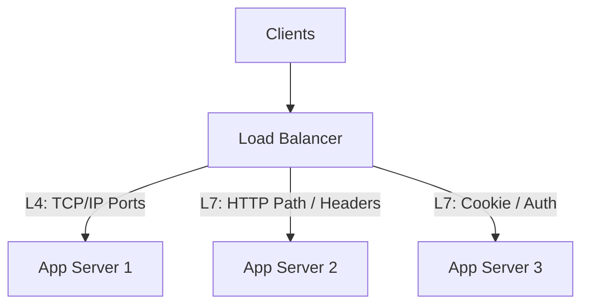
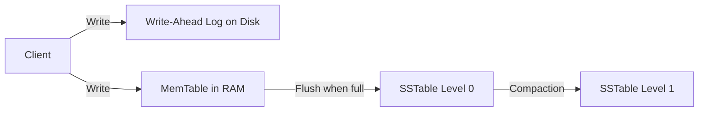

# 📚 Comprehensive System Design Interview Guide

*An exhaustive 3-Tier Deep Dive into System Design concepts for Software Engineers (SDE-1 to Staff).*

---

# 🟢 Part 1: Beginner Level (Foundations & Core Building Blocks)

---

## 1. Core Topics & Architectural Paradigms

### Client-Server Architecture & Communication Models
- **Client-Server Model**: Core paradigm where clients (browsers, mobile apps, IoT devices) initiate requests and servers process requests and return responses.
- **OSI Model vs. TCP/IP Model**:
  - *OSI 7 Layers*: Physical, Data Link, Network (IP), Transport (TCP/UDP), Session, Presentation, Application (HTTP/TLS).
  - *Transport Protocols*:
    - **TCP (Transmission Control Protocol)**: Connection-oriented, reliable, guarantees packet ordering via sequence numbers and ACKs, flow control (sliding window), congestion control. Used for HTTP, gRPC, MySQL, SSH.
    - **UDP (User Datagram Protocol)**: Connectionless, lightweight, low-overhead, no ordering or retry guarantees. Used for real-time video streaming (WebRTC), gaming, DNS, VoIP.

### Monolithic vs. Microservices Architecture
- **Monolithic Architecture**: Single codebase, single deployment unit. Simple to develop and debug initially, but suffers from tight coupling, long build times, single point of failure (SPOF), and scaling bottlenecks.
- **Microservices Architecture**: Application decomposed into small, loosely coupled, independently deployable services around business domains.
  - *Pros*: Independent scalability, technology flexibility, fault isolation.
  - *Cons*: Network latency overhead, distributed debugging complexity, eventual consistency challenges, operational complexity.

### REST vs. gRPC vs. GraphQL vs. WebSockets

| Protocol | Transport | Format | Paradigm | Best For |
| :--- | :--- | :--- | :--- | :--- |
| **REST** | HTTP/1.1 or HTTP/2 | JSON / XML | Resource-based (`GET /users`) | Public Web APIs, CRUD operations |
| **gRPC** | HTTP/2 | Protobuf (Binary) | Remote Procedure Call | Internal microservice-to-microservice high-speed RPCs |
| **GraphQL** | HTTP/1.1 or HTTP/2 | JSON | Query language for client specs | Mobile apps with dynamic front-end data requirements |
| **WebSockets** | TCP (Upgrade from HTTP) | Text / Binary | Bi-directional persistent socket | Real-time chat, live notifications, collaborative editing |

---

## 2. Fundamental System Concepts

### Domain Name System (DNS)
Translates human-readable domain names (`example.com`) to IP addresses (`192.0.2.1`).
- *Resolution Hierarchy*: Root DNS servers $\rightarrow$ Top-Level Domain (TLD) servers (`.com`) $\rightarrow$ Authoritative Name Servers.
- *DNS Caching*: Resolved IPs cached at browser, OS, ISP, and Recursive Resolver with a TTL (Time To Live).

### Content Delivery Networks (CDNs)
A globally distributed network of edge proxy servers (e.g., Cloudflare, CloudFront, Akamai) that cache static assets (images, CSS, JS, video chunks) geographically close to end users.
- *Push CDN*: Origin server pushes new assets to CDN whenever content updates.
- *Pull CDN*: CDN fetches asset from origin on first user request (cache miss) and caches it for subsequent requests.

### Stateful vs. Stateless Architecture
- **Stateless Tier**: Web servers do not preserve client session state between requests. Any app server can handle any request. Horizontal scaling is trivial!
- **Stateful Tier**: Servers store session data, connections, or state in local memory (e.g., WebSockets, databases). Scaling requires sticky sessions or distributed session stores (Redis).

---

## 3. Common Beginner Mistakes

> [!CAUTION]
> 1. **Hardcoding IP Addresses**: Hardcoding server IPs instead of using DNS names or Load Balancer endpoints.
> 2. **Single Point of Failure (SPOF)**: Running a single database or single web server instance without backups or replicas.
> 3. **Ignoring Latency Differences**: Assuming RAM, Disk, and Network speeds are comparable. Remember: Reading from RAM is $\sim 100\text{ ns}$, SSD read is $\sim 100\text{ }\mu\text{s}$, network round trip across regions is $\sim 100\text{ ms}$!
> 4. **Over-using Synchronous Calls**: Making blocking HTTP calls across multiple internal services in series instead of using asynchronous queues.

---

## 4. Expected Beginner Interview Questions

### Q1: What happens when you type `https://www.example.com` in a browser and press Enter?
- **Expected Answer**:
  1. *DNS Lookup*: Browser checks local cache $\rightarrow$ OS hosts file $\rightarrow$ Recursive DNS resolver queries Root, TLD, and Authoritative DNS servers to fetch IP address.
  2. *TCP Handshake*: Browser initiates 3-Way TCP Handshake (`SYN` $\rightarrow$ `SYN-ACK` $\rightarrow$ `ACK`) with server IP on port 443.
  3. *TLS Handshake*: Negotiates cipher suites, validates SSL/TLS certificate chain, and establishes encrypted session key.
  4. *HTTP Request*: Browser sends `GET / HTTP/1.1` request with headers.
  5. *Server Processing*: Load Balancer routes request to app server; app server executes business logic and database queries.
  6. *HTTP Response*: Server returns HTTP `200 OK` with HTML payload.
  7. *DOM Rendering*: Browser parses HTML, fetches CSS/JS/images (via CDN), renders page layout.

---

# 🟡 Part 2: Intermediate Level (Scalability, Data & Distributed Patterns)

---

## 1. Frequently Tested Scalability Concepts

### Load Balancing Strategies & Layer 4 vs. Layer 7



- **Layer 4 (L4) Load Balancing**: Operates at Transport Layer (TCP/UDP). Routes traffic based on IP address and port number without inspecting payload content. Ultra-fast, low CPU overhead (e.g., HAProxy in TCP mode, AWS NLB).
- **Layer 7 (L7) Load Balancing**: Operates at Application Layer (HTTP/HTTPS). Inspects HTTP headers, cookies, URL paths (`/api/v1/users` vs `/static/images`), and request payload. Supports smart routing, SSL termination, and rate limiting (e.g., NGINX, HAProxy, AWS ALB, Envoy).
- **Balancing Algorithms**: Round Robin, Weighted Round Robin, Least Connections, IP Hash, Consistent Hashing.

### Caching Strategies & Eviction Policies
- **Cache Locations**: Browser cache, CDN edge, API Gateway cache, Application Redis/Memcached, Database query cache.
- **Caching Patterns**:
  - **Cache-Aside (Lazy Loading)**: App reads from cache; on cache miss, app queries DB, populates cache, and returns data. (Best for read-heavy workloads).
  - **Write-Through**: App writes to cache; cache synchronously writes to DB before returning success. (Guarantees consistency, higher write latency).
  - **Write-Back (Write-Behind)**: App writes to cache; cache asynchronously batches writes to DB. (Ultra-fast writes, risk of data loss on cache crash).
  - **Write-Around**: App writes directly to DB, bypassing cache.
- **Cache Eviction Policies**:
  - **LRU (Least Recently Used)**: Evicts item not accessed for the longest time.
  - **LFU (Least Frequently Used)**: Evicts item with the lowest access count.
  - **FIFO (First In First Out)**: Evicts oldest item.

### Relational (SQL) vs. Non-Relational (NoSQL) Databases

| Dimension | SQL Databases (e.g., PostgreSQL, MySQL) | NoSQL Databases (e.g., DynamoDB, Cassandra, MongoDB) |
| :--- | :--- | :--- |
| **Data Structure** | Structured tables with fixed schemas and foreign keys | Key-Value, Document (JSON), Wide-Column, Graph |
| **Scaling Model** | Vertical scaling (Scale-Up); Horizontal via Read Replicas & Sharding | Native Horizontal scaling (Scale-Out) via auto-sharding |
| **ACID vs. BASE** | Strict ACID guarantees (Atomicity, Consistency, Isolation, Durability) | BASE properties (Basically Available, Soft-state, Eventual consistency) |
| **Best For** | Financial transactions, complex JOINs, structured business models | High QPS reads/writes, unstructured/semi-structured data, global scale |

### Database Partitioning & Sharding
- **Vertical Partitioning**: Splitting tables by columns (e.g., moving large `user_bio` text column to a separate table).
- **Horizontal Partitioning (Sharding)**: Splitting table rows across multiple database instances based on a **Shard Key**.
  - *Range-Based Sharding*: Shard 1 ($A-M$), Shard 2 ($N-Z$). Easy to query ranges, but prone to hotspots.
  - *Hash-Based Sharding*: `shard_id = hash(user_id) % num_shards`. Uniform distribution, but adding/removing nodes requires re-sharding all data!
  - *Directory-Based Sharding*: Lookup table maps shard keys to database nodes.

### Message Queues & Event Streaming (RabbitMQ vs. Apache Kafka)
- **Message Queue (RabbitMQ)**: Point-to-point / Pub-Sub message broker. Messages are deleted once consumed and acknowledged. Ideal for complex task routing, background jobs, and worker queues.
- **Event Streaming Platform (Apache Kafka)**: Distributed, partitioned, append-only disk commit log. Messages are retained based on configurable TTL. Consumers track their own reading **offset**. Ideal for high-throughput log aggregation, event sourcing, and real-time analytics pipelines.

### Rate Limiting Algorithms

| Algorithm | Burst Handling | Memory | Accuracy | Best For |
|-----------|---------------|--------|----------|----------|
| **Token Bucket** | ✅ Allows burst up to capacity | Low (2 vars per user) | High | API rate limiting (most common) |
| **Leaky Bucket** | ❌ No burst — fixed output rate | Low (queue per user) | High | Smoothing traffic spikes |
| **Fixed Window Counter** | ❌ 2× burst at window boundary | Very Low | Low | Simple but imprecise limits |
| **Sliding Window Log** | ❌ Exact but high memory | High (per-request log) | Exact | Low-volume, precision-critical APIs |
| **Sliding Window Counter** | ⚠️ Approximate burst handling | Low (2 vars per window) | High | Best balance of precision + memory |

```python
import time
import redis

# ─── Token Bucket (distributed with Redis) ───────────────────────────────────
TOKEN_BUCKET_SCRIPT = """
local key = KEYS[1]
local rate = tonumber(ARGV[1])     -- tokens per second
local capacity = tonumber(ARGV[2]) -- max bucket size (burst limit)
local now = tonumber(ARGV[3])      -- current timestamp (float seconds)
local requested = tonumber(ARGV[4])-- tokens requested per call

-- Get current state or initialize
local last_time = tonumber(redis.call('HGET', key, 'last_time') or now)
local tokens    = tonumber(redis.call('HGET', key, 'tokens') or capacity)

-- Refill tokens based on time elapsed
local elapsed = math.max(0, now - last_time)
tokens = math.min(capacity, tokens + elapsed * rate)

-- Check if request can be served
if tokens >= requested then
    tokens = tokens - requested
    redis.call('HSET', key, 'tokens', tokens, 'last_time', now)
    redis.call('EXPIRE', key, 3600)  -- TTL to auto-cleanup
    return 1   -- ALLOWED
else
    redis.call('HSET', key, 'last_time', now)
    return 0   -- REJECTED (rate limited)
end
"""

def is_rate_limited(client_id: str, rate: float = 10.0, capacity: int = 100) -> bool:
    r = redis.Redis()
    result = r.eval(TOKEN_BUCKET_SCRIPT, 1, f"rate_limit:{client_id}",
                    rate, capacity, time.time(), 1)
    return result == 0  # True = limited, False = allowed

# ─── Sliding Window Counter ───────────────────────────────────────────────────
def sliding_window_rate_limit(user_id: str, limit: int, window_sec: int) -> bool:
    r = redis.Redis()
    now = time.time()
    window_start = now - window_sec
    key = f"sw:{user_id}"

    pipe = r.pipeline()
    pipe.zremrangebyscore(key, 0, window_start)  # Remove expired entries
    pipe.zadd(key, {str(now): now})              # Add current request timestamp
    pipe.zcard(key)                               # Count requests in window
    pipe.expire(key, window_sec * 2)
    results = pipe.execute()

    count = results[2]
    return count > limit  # True = rate limited
```

**Production Rate Limiting Decision**:
- **External (API Gateway)**: Kong, NGINX, AWS API Gateway — preferred for L7 HTTP rate limiting without application code changes.
- **Distributed State**: Always store rate limit counters in Redis (not in-process memory) for horizontally-scaled services.
- **Headers**: Return `X-RateLimit-Limit`, `X-RateLimit-Remaining`, `X-RateLimit-Reset`, and `Retry-After` headers.


---

## 2. Coding & Real Interview Expectations

> [!IMPORTANT]
> - In SDE-2 system design interviews, candidates are expected to write production-grade code for key components (e.g., custom LRU cache, Snowflake ID generator, Rate Limiter Lua script, or Consistent Hashing ring).
> - Candidates must provide explicit **Capacity Estimations** (QPS, Storage, Bandwidth, Memory) before drawing architecture diagrams.

---

# 🔴 Part 3: Advanced Level (Distributed Architecture & Production Engineering)

---

## 1. Production Distributed Concepts

### CAP & PACELC Theorems
- **CAP Theorem**: In a network partition ($P$), a distributed system can guarantee either **Consistency** ($C$) or **Availability** ($A$), but NOT both.
  - *CP Systems*: Prioritize consistency (e.g., HBase, MongoDB, Spanner). Rejects reads/writes if quorum cannot be reached during network partition.
  - *AP Systems*: Prioritize availability (e.g., Cassandra, DynamoDB). Accepts reads/writes during partition, returning stale data or resolving conflicts later.
- **PACELC Theorem**: Extension of CAP. **If there is a Partition ($P$)**, trade off Availability ($A$) vs Consistency ($C$); **Else ($E$)**, trade off Latency ($L$) vs Consistency ($C$).

### Distributed Consensus (Raft vs. Paxos)
Ensures multiple nodes agree on a single data value or state transition even if nodes fail or drop messages.
- **Raft Algorithm**: Divided into three sub-problems:
  1. *Leader Election*: Nodes can be Leader, Follower, or Candidate. Uses randomized election timeouts to elect a single leader.
  2. *Log Replication*: Leader accepts client write commands, appends to log, and replicates to majority quorum of followers before committing.
  3. *Safety*: Guarantees committed log entries are durable and strictly ordered.

### Storage Engine Internals: B+ Tree vs. LSM-Tree

| Feature | B+ Tree (e.g., InnoDB MySQL, PostgreSQL) | Log-Structured Merge-Tree (LSM) (e.g., Cassandra, RocksDB) |
| :--- | :--- | :--- |
| **Write Pattern** | In-place updates on fixed-size disk pages (Random disk writes) | Append-only write to Write-Ahead Log (WAL) & MemTable (RAM) |
| **Disk Operations** | High Write Amplification due to page splits | Sequential disk writes; async SSTable compaction |
| **Performance Profile**| Ultra-fast point reads & range scans ($O(\log N)$) | Extremely high write throughput; reads require Bloom Filters |



### Consistent Hashing & Virtual Nodes
Solves data redistribution problem during node additions or removals in distributed caches/databases.
- **Hash Ring**: Hashes keys and server IPs onto a 360-degree integer ring ($0$ to $2^{32}-1$). A key is assigned to the first server encountered moving clockwise.
- **Virtual Nodes (v-nodes)**: Each physical node is mapped to multiple pseudo-random positions on the ring (e.g., 256 v-nodes per server).
  - *Benefit*: Eliminates hotspots, guarantees uniform load distribution, and spreads workload evenly across all remaining servers when a node fails.

```math
\text{v-node count} = k \implies \text{Variance in load} \propto \frac{1}{\sqrt{k}}
```

### CRDTs (Conflict-free Replicated Data Types)
Data structures that can be replicated concurrently across multiple nodes without central coordination, guaranteeing eventual convergence without write conflicts.
- *PN-Counters*: Positive-Negative counters.
- *LSEQ / RGA*: Sequence-based CRDTs used in collaborative real-time editors (e.g., Google Docs, Figma).

### Distributed Locks & Fencing Tokens
When using locks across distributed nodes (e.g., Redis Redlock):
- **Problem**: A process holding a lock experiences a long GC pause (10 seconds). The lock expires, another process acquires the lock. The first process wakes up and executes invalid concurrent writes!
- **Solution (Fencing Tokens)**: The lock manager returns a monotonically increasing **Fencing Token** with every lock grant. Storage nodes reject any incoming write whose fencing token is less than the highest token processed so far.

---

## 2. Senior & Staff Interview Expectations

> [!TIP]
> - Senior and Staff candidates must drive architectural discussions around **Multi-Region Active-Active deployments**, **Zero-Downtime database migrations**, **Cost optimization at scale**, and **Disaster Recovery (RPO / RTO targets)**.
> - Must demonstrate deep awareness of subtle failure modes (e.g., cache stampedes, thundering herds, split-brain scenarios, and GC pauses).

---

## 3. High-Value Architecture Trade-off Matrix

| Architecture Trade-off | Option A | Option B | Selection Criteria / Decision Rule |
| :--- | :--- | :--- | :--- |
| **Write Strategy** | Synchronous Replication | Asynchronous Replication | Choose Sync for financial ledgers (Zero data loss). Choose Async for social feeds (Low write latency). |
| **Event Architecture** | Push Fan-Out (Write-side) | Pull Fan-Out (Read-side) | Choose Push for users with $<5\text{k}$ followers. Choose Pull for celebrity accounts ($>10\text{k}$ followers). |
| **Consistency** | Strong Consistency | Eventual Consistency | Choose Strong for inventory counts & user authentication. Choose Eventual for view counts & social likes. |
| **Communication** | gRPC (HTTP/2 Protobuf) | REST (HTTP/1.1 JSON) | Choose gRPC for high-throughput internal RPCs. Choose REST for public APIs & external web clients. |

---

Continue to [`Cheat_Sheet.md`](file:///s:/Interview_Guide/System_Design/Cheat_Sheet.md) for quick-revision tables, estimation formulas, and the step-by-step RESHADED framework! 🚀
