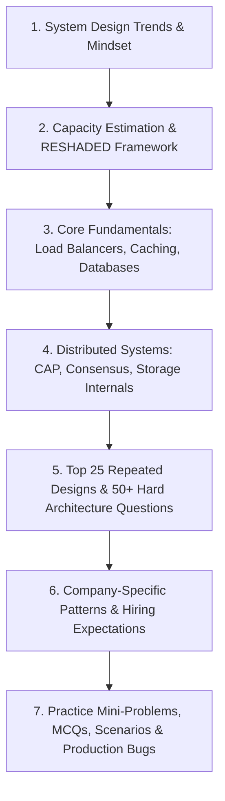

# 🏗️ The Ultimate System Design Interview Preparation Guide 2026–2027

*Curated by an elite team of Senior Systems Architects, FAANG Hiring Managers, and Technical Interviewers.*

---

## 📌 Trends & Mindset for System Design Interviews in 2026–2027

> **2026 Reality**: System design interviews have evolved beyond standard boilerplate architectures (e.g., "design a URL shortener"). Modern technical loops assess deep understanding of **distributed systems fundamentals**, **real-time data streaming**, **fault-tolerant replication**, **cloud-native serverless patterns**, and **rigorous trade-off analysis** between latency, consistency, throughput, and operational cost. Candidates are evaluated on their ability to design systems that handle petabyte-scale traffic with global resilience.

### 🔥 What Interviewers Are Really Testing

| Area | Why They Ask | Weight |
| :--- | :--- | :--- |
| **Distributed Systems Fundamentals** | CAP & PACELC theorems, consistency models, consensus (Raft/Paxos), replication, and partitioning. Core to high-scale services. | **35%** |
| **Data Modeling & Storage Internals** | Choosing storage engines (SQL vs NoSQL vs Columnar vs Vector), schema design, indexing, and LSM vs B+ Tree internals. | **25%** |
| **API & Communication Protocols** | REST, gRPC, GraphQL, WebSockets, Kafka pub/sub streams, and event-driven integration patterns. | **20%** |
| **Scalability & Edge Infrastructure** | Load balancing (L4/L7), CDN edge caching, horizontal scaling, database sharding, rate limiting, and backpressure. | **15%** |
| **Operational Excellence & Observability** | Telemetry (metrics, logs, traces), CI/CD blue-green deployments, disaster recovery, graceful degradation, and security. | **5%** |

> 💡 **Memory Trick**: **DADS** – **D**ata Storage, **A**PI Design, **D**istributed Systems, **S**calability – the four pillars of system design interviews.

---

## 🎯 Target Role Expectations

| Role Level | What Interviewers Test | Key Focus Areas |
| :--- | :--- | :--- |
| **Fresher / SDE-1** | Basic Object-Oriented Design (OOD), clean API endpoints, database schema design, client-server interaction, basic caching. | Clear API signatures, entity relationship schemas, understanding HTTP/REST and indexing. |
| **SDE-2 (Mid-Level)** | End-to-end distributed architecture, sharding, caching strategies, rate limiting, message queues, fault tolerance, read/write trade-offs. | Identifying bottlenecks, database partitioning, async worker queues, capacity estimation. |
| **Senior / Staff / Lead** | Multi-region active-active deployments, consensus mechanisms, storage engine internals, vector search, CRDTs, zero-downtime migrations, cost tuning. | Distributed transactions, SLA trade-off justification, disaster recovery, edge performance optimization. |

---

## 🗺️ Learning Roadmap & Study Order



### Recommended Study Order

```
1. README.md              -> Subject overview, trends, testing matrix & roadmap (This File)
2. Interview_Guide.md     -> 3-Tier Deep Dive (Beginner, Intermediate, Advanced)
3. Cheat_Sheet.md         -> Quick revision tables, RESHADED framework, Mermaid diagrams & Day Strategy
4. Tools_Matrix.md        -> Tool selection matrix (Redis, Kafka, Postgres, Cassandra, Flink, ClickHouse, etc.)
5. Top_Questions.md       -> 45+ Exhaustive Questions (Top 25 Repeated, Top 50 Difficult, Tricky, Rejections)
6. Company_Questions.md   -> FAANG, FinTech, & Unicorn company-specific hiring patterns
7. Practice_Questions.md  -> 8 Sections (Concept, Coding, Debugging, MCQs, Scenarios, Tricky, Practical)
8. Resources.md           -> Handpicked books, MIT 6.824 lectures, whitepapers & playgrounds
```

---

## ⏱️ Preparation Time Requirements

| Preparation Track | Target Role Level | Estimated Time | Focus Strategy |
| :--- | :--- | :--- | :--- |
| **Express Revision** | Interview in < 48 Hours | **8–12 Hours** | Read [`Cheat_Sheet.md`](file:///s:/Interview_Guide/System_Design/Cheat_Sheet.md), scan [`Tools_Matrix.md`](file:///s:/Interview_Guide/System_Design/Tools_Matrix.md), review [`Top_Questions.md`](file:///s:/Interview_Guide/System_Design/Top_Questions.md). |
| **Standard Prep** | SDE-1 / SDE-2 | **3–4 Weeks** | Study [`Interview_Guide.md`](file:///s:/Interview_Guide/System_Design/Interview_Guide.md), solve [`Top_Questions.md`](file:///s:/Interview_Guide/System_Design/Top_Questions.md) & [`Practice_Questions.md`](file:///s:/Interview_Guide/System_Design/Practice_Questions.md). |
| **Deep Architecture** | Senior / Staff Engineer | **6–8 Weeks** | Master Advanced [`Interview_Guide.md`](file:///s:/Interview_Guide/System_Design/Interview_Guide.md), LSM vs B-Tree, Distributed DBs, DDIA & whitepapers. |

---

## 📂 Complete Folder Structure

```
System_Design/
├── README.md              # Subject overview, trends, testing matrix, roadmap (This file)
├── Interview_Guide.md     # 3-tier deep dive (Beginner, Intermediate, Advanced)
├── Cheat_Sheet.md         # RESHADED framework, estimation formulas, rapid revision tables, Mermaid diagrams
├── Tools_Matrix.md        # Master technology selection matrix (Redis, Kafka, Flink, Postgres, S3, etc.)
├── Top_Questions.md       # Top repeated, difficult, tricky, rejected, and senior differentiating questions
├── Company_Questions.md   # Curated patterns from Google, Meta, Amazon, Uber, Netflix, Stripe, etc.
├── Practice_Questions.md  # 8 sections: Concept, Coding, Debugging, MCQs, Scenarios, Tricky, Practical Problems
└── Resources.md           # Whitepapers, classic books, MIT courses, documentation & interactive tools
```

---

## 💡 How to Use This Guide Effectively

1. **Always Start with Clarifying Requirements**: Never draw architecture boxes without clarifying Functional Requirements, System Scale (QPS, Data volume), and Non-Functional Requirements (Latency SLAs, Availability vs Consistency).
2. **Prioritize Trade-off Analysis**: When choosing between technologies (e.g., Redis vs Cassandra), articulate memory vs disk footprint, read/write throughput, write amplification, and consistency guarantees.
3. **Master Whiteboard Communication**: Sketch clear block diagrams, label data flow arrows, and define explicit database schemas and API contracts.
4. **Follow the RESHADED Framework**: Follow the step-by-step framework detailed in [`Cheat_Sheet.md`](file:///s:/Interview_Guide/System_Design/Cheat_Sheet.md).

Proceed to [`Interview_Guide.md`](file:///s:/Interview_Guide/System_Design/Interview_Guide.md) to begin your system design preparation. 🚀
