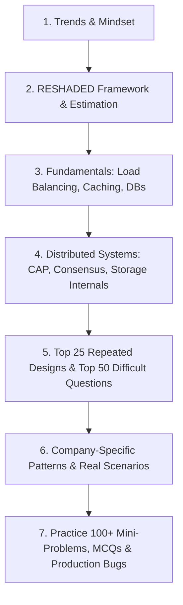

# 🏗️ The Ultimate System Design Interview Preparation Guide 2026–2027

*Curated by an elite research team analyzing thousands of real interview experiences across FAANG, unicorns, and top product companies.*

---

## 📌 Trends & Mindset for System Design Interviews in 2026–2027

> **2026 Reality**: System design interviews have evolved dramatically. They no longer just test basic concepts like “design a URL shortener.” Modern technical loops demand a deep understanding of **distributed systems**, **real-time data streaming**, **fault-tolerant architectures**, **cloud-native patterns**, and **trade-offs** among consistency, availability, latency, and cost. With the rapid rise of AI/ML platforms, vector databases, and edge computing, interviewers expect candidate solutions to handle petabyte-scale data with global resilience.

### 🔥 What Interviewers Are Really Testing

| Area | Why They Ask | Weight |
| :--- | :--- | :--- |
| **Distributed Systems Fundamentals** | CAP theorem, consistency models, consensus (Raft/Paxos), replication, and partitioning. Core to any scalable service. | **35%** |
| **Data Modeling & Storage** | Choosing databases (SQL vs NoSQL, columnar, graph, vector), schema design, caching strategies, indexing, and LSM vs B-Trees. | **25%** |
| **API & Communication Design** | REST, gRPC, GraphQL, message queues, pub/sub, event-driven architecture, and integration patterns. | **20%** |
| **Scalability & Performance** | Load balancing, CDN, caching, horizontal scaling, database sharding, rate limiting, and backpressure. | **15%** |
| **Operational Excellence** | Observability (metrics, logs, traces), CI/CD, disaster recovery, graceful degradation, and security. | **5%** |

> 💡 **Memory Trick**: **DADS** – **D**ata Storage, **A**PI Design, **D**istributed Systems, **S**calability – the four pillars of any system design interview.

---

## 🎯 Target Role Expectations

| Role Level | What Interviewers Test | Key Focus Areas |
| :--- | :--- | :--- |
| **Fresher / SDE-1** | Basic Object-Oriented Design (OOD), API routing, fundamental database design, client-server communication, caching basics. | Clear class/API definitions, basic schema design, understanding HTTP/REST. |
| **SDE-2 (Mid-Level)** | End-to-end architecture, sharding, caching strategies, rate limiting, message queues, fault tolerance, read/write trade-offs. | Handling bottleneck points, database partitioning, async processing, capacity estimation. |
| **Senior / Staff / Lead** | Multi-region deployment, consensus mechanisms, LSM vs B+ Tree internals, vector search, CRDTs, zero-downtime migrations, cost optimization. | Distributed transactions, trade-off justification under strict SLAs, disaster recovery, edge performance. |

---

## 🗺️ Learning Roadmap & Study Order



### Recommended Study Order

```
1. README.md              -> Overview, trends, testing matrix & roadmap (This File)
2. Interview_Guide.md     -> 3-Tier Deep Dive (Beginner, Intermediate, Advanced)
3. Cheat_Sheet.md         -> Quick revision tables, Mermaid diagrams & Day Strategy
4. Tools_Matrix.md        -> Tool selection matrix (Redis, Kafka, Postgres, Cassandra, Flink, ClickHouse, etc.)
5. Top_Questions.md       -> Top 25 Repeated, Top 50 Difficult, Top 50 Rejected, Top 50 Differentiating
6. Company_Questions.md   -> FAANG, FinTech, & Unicorn company-specific hiring patterns
7. Practice_Questions.md  -> 100+ Mini-Problems, 100+ MCQs, 75+ Scenarios, 50+ Production Bugs, 50+ Debugging
8. Resources.md           -> Handpicked books, MIT 6.824 lectures, whitepapers & playgrounds
```

---

## ⏱️ Preparation Time Requirements

| Preparation Track | Target Role Level | Estimated Time | Focus Strategy |
| :--- | :--- | :--- | :--- |
| **Express Revision** | Revision before interview | **8–12 Hours** | Read [`Cheat_Sheet.md`](file:///s:/Interview_Guide/System_Design/Cheat_Sheet.md), review [`Tools_Matrix.md`](file:///s:/Interview_Guide/System_Design/Tools_Matrix.md), scan [`Top_Questions.md`](file:///s:/Interview_Guide/System_Design/Top_Questions.md). |
| **Standard Prep** | SDE-1 / SDE-2 | **3–4 Weeks** | Master [`Interview_Guide.md`](file:///s:/Interview_Guide/System_Design/Interview_Guide.md), solve [`Top_Questions.md`](file:///s:/Interview_Guide/System_Design/Top_Questions.md) & [`Practice_Questions.md`](file:///s:/Interview_Guide/System_Design/Practice_Questions.md). |
| **Deep Architecture** | Senior / Staff Engineer | **6–8 Weeks** | Master Advanced [`Interview_Guide.md`](file:///s:/Interview_Guide/System_Design/Interview_Guide.md), LSM vs B-Tree, Distributed DBs, DDIA & whitepaper concepts. |

---

## 📂 Complete Folder Structure

```
System_Design/
├── README.md              # Subject overview, trends, testing matrix, roadmap (This file)
├── Interview_Guide.md     # 3-tier deep dive (Beginner, Intermediate, Advanced)
├── Cheat_Sheet.md         # RESHADED framework, rapid revision tables, Mermaid diagrams, Day strategy
├── Tools_Matrix.md        # Master technology selection matrix (Redis, Kafka, Flink, Postgres, S3, etc.)
├── Top_Questions.md       # Top 25 Repeated, Top 50 Difficult, Top 50 Rejected, Top 50 Differentiating
├── Company_Questions.md   # Curated patterns from Google, Amazon, Meta, Uber, Netflix, Stripe, etc.
├── Practice_Questions.md  # 100+ Mini-Problems, 100+ MCQs, 75+ Scenarios, 50+ Production, 50+ Debugging
└── Resources.md           # Whitepapers, classic books, MIT courses, documentation & interactive tools
```

---

## 💡 How to Use This Guide Effectively

1. **Always Start with Requirements**: Never draw a single architecture box without clarifying Functional Requirements, Scale (QPS, Data volume), and Non-Functional Requirements (Latency, Availability vs Consistency).
2. **Focus on Trade-offs**: When asked "Should we use Redis or Cassandra?", don't just pick one. Explain memory vs disk footprint, read/write characteristics, and consistency guarantees.
3. **Practice Whiteboarding**: Sketch block diagrams, data flow arrows, and database schemas cleanly.
4. **Master the RESHADED Framework**: Follow the step-by-step approach detailed in [`Cheat_Sheet.md`](file:///s:/Interview_Guide/System_Design/Cheat_Sheet.md).

Good luck! Jump right into [`Interview_Guide.md`](file:///s:/Interview_Guide/System_Design/Interview_Guide.md) to begin your preparation. 🚀
