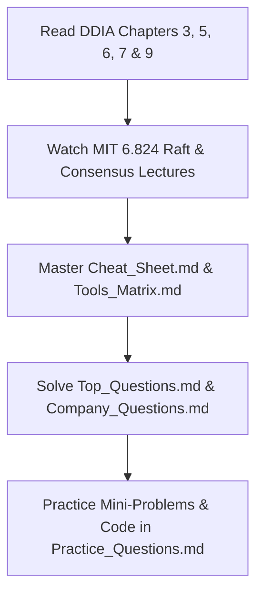

# 📖 Handpicked System Design Learning Resources

*A curated collection of the highest-rated books, landmark whitepapers, courses, documentation, YouTube channels, and interactive practice platforms for System Design.*

---

## 📚 1. Essential Books

### 1. Designing Data-Intensive Applications (DDIA) by Martin Kleppmann
- **Why It's Worth Reading**: The undisputed "Bible" of distributed systems engineering. Provides unmatched depth into database internals (LSM-trees vs B-trees), encoding formats, replication lag, consensus algorithms (Raft/Paxos), and transaction isolation levels.
- **Key Chapters to Master**:
  - Chapter 3: Storage and Retrieval
  - Chapter 5: Replication
  - Chapter 6: Partitioning / Sharding
  - Chapter 7: Transactions & Isolation Levels
  - Chapter 9: Consistency and Consensus

### 2. System Design Interview – An Insider's Guide (Volumes 1 & 2) by Alex Xu
- **Why It's Worth Reading**: Practical, interview-focused step-by-step breakdowns of classic design problems (URL Shortener, Rate Limiter, Payment System, Stock Exchange, S3 storage). Excellent for mastering structural whiteboard presentations.

### 3. System Design Interview – Step-By-Step Guide by ByteByteGo
- **Why It's Worth Reading**: Visual diagrams, real-world trade-off analyses, and architecture templates specifically tailored for FAANG SDE-2 and Senior loops.

### 4. Designing Distributed Systems by Brendan Burns
- **Why It's Worth Reading**: Written by the co-founder of Kubernetes. Explains modern containerized microservice patterns (Sidecar, Ambassador, Adapter, Leader Election).

---

## 📄 2. Landmark Distributed Systems Whitepapers

| Whitepaper | Published By | Key Technical Concepts Covered | Why Read It |
| :--- | :--- | :--- | :--- |
| **Amazon Dynamo (2007)** | Amazon | Consistent Hashing, Vector Clocks, Tunable Quorum, Gossip Protocol | Foundation of modern NoSQL databases (Cassandra, DynamoDB). |
| **Google Spanner (2012)** | Google | TrueTime API (Atomic Clocks + GPS), External Consistency, Paxos | Teaches how global transactions work without lock contention. |
| **Google File System (GFS) (2003)** | Google | ChunkServers, Master Node, Append-only logging | Foundation of modern distributed big data storage (HDFS). |
| **In Search of an Understandable Consensus Algorithm (Raft)** | Stanford | Leader Election, Log Replication, Safety | Clearer explanation of consensus compared to Paxos. |
| **Apache Kafka Paper (2011)** | LinkedIn | Append-only commit log, Zero-Copy `sendfile`, Partitioning | Teaches high-throughput event streaming design. |

---

## 🎓 3. Courses & University Lectures

### 1. MIT 6.824: Distributed Systems (Prof. Robert Morris)
- **Link / Source**: MIT OpenCourseWare & YouTube
- **Why Use It**: World-class university course covering Go implementations of Raft, MapReduce, Spanner, and fault-tolerant storage. Includes hands-on coding labs.

### 2. Princeton Algorithms & Systems Lectures
- **Why Use It**: Deep dive into fundamental computer science structures (Tries, Quadtrees, Hashing algorithms, Graph traversals).

---

## 📺 4. Top YouTube Channels

1. **ByteByteGo (Alex Xu)**: Visual animated system design explanations and architecture breakdowns.
2. **System Design Interview (GKCS - Gaurav Sen)**: Excellent deep dives into distributed locks, rate limiters, message queues, and load balancers.
3. **Hussein Nasser**: Database internals, networking (HTTP/1, HTTP/2, HTTP/3, gRPC, WebSockets), proxy servers, and Linux networking.
4. **Martin Kleppmann Lectures**: Author of DDIA explaining distributed consistency, CRDTs, and event-driven architecture.
5. **Asana Engineering / Tech Dummies (Sathish)**: Real-world engineering blog reviews and system walkthroughs.

---

## 🌐 5. Interactive Practice Platforms & Repositories

### 1. System Design Primer (donnemartin / system-design-primer on GitHub)
- **Why Use It**: Top open-source GitHub repository for system design prep. Features comprehensive flashcards, architecture diagrams, and back-of-the-envelope estimations.

### 2. High Scalability Blog (`highscalability.com`)
- **Why Use It**: Case studies detailing real-world architectural evolutions of tech giants (How Netflix scales to millions of streams, How Uber tracks drivers).

### 3. Exponent (TryExponent.com)
- **Why Use It**: Mock interview videos featuring real FAANG candidates and hiring managers solving system design problems live.

---

## 🎯 6. Recommended Study Order Strategy

Good luck with your System Design Interview Preparation! 🚀
